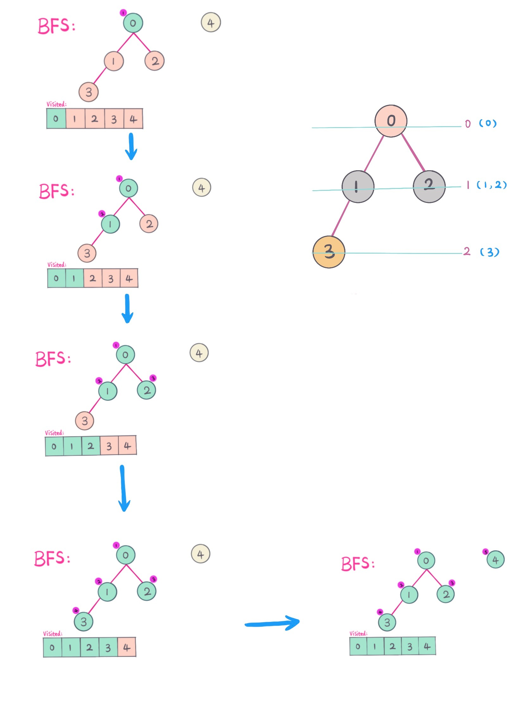

# LeetCode

[简体中文](./README.md) | English

---

This essay records the course of and my emotion to this project from initialisation to 10,000 stars.
[Milestone for 10,000+ stars](./thanksGiving.md)

If you are interested in this project, do not mean your star. This project will be supported for a long enough time by the comminity. Thanks for every audience and contributor.

## Introduction

LeetCode Solutions: A Journey of Problem Solving.

This repository is divided into five parts for now:

- The first part is the solutions to some classic problems on LeetCode, including the idea thinkings, key points and code implementations.

- The second part is a summary of data structures and algorithms.

- The third part is [Anki flashcards](https://apps.ankiweb.net) that organizes the LeetCode problems in a certain way to make it easier to remember.

- The fourth part is daily challenges which were held at group chat. We usually solve one problem altogether to get more feedback. Moreover, the problems can be drafted to add to the problem solving module.

- The fifth part is a future plannning on content that will be introduced into the above parts.

> Only when having mastered the basic data structures and algorithms can you solve complex problems easily.

## About me

I, a programmer, am all passionate about technology.

Used to write `.net` and `Java`, I am a frontend engineer and focused on the engineering, optimization and standardlization for frontend.

If you want to do some contributions or collaborations, just feel free to contact me via [azl397985856@gmail.com].

## Usage Instructions

- For the parts that were added recently, there will be a 🆕 behind.
- For the parts that were updated recently, there will be a 🖊 behind.
- Here will be the place to update Anki Flashcards in the future as well.
- Here is a mind mapping graph showing the summary of categorizations of problems that are questioned frequently in interviews. We could analyze according to the information in the graph.

(Picture credited by [LeetCode-cn](https://www.zhihu.com/question/24964987/answer/586425979).)

The algorithms mainly includes:

- Basic skills: Divide-and-Conquer; Binary; Greedy
- Sorting algorithms: Quicksort; Merge Sort; Counting Sort
- Searching algorithms: Backtracking; Recursion; Depth-First-Search (DFS); Breath-First-Search (BFS); Binary Search Tree; etc.
- Graph theory: Shortest Path Problem; Minimal Spanning Tree
- Dynamic Programming: Knapsack Problem; Longest Common Subsequence (LCS) Problem

The data structures mainly includes:

- Array and linked list: Singly/Doubly-Linked List
- Stack and queue
- Hash table
- Heap: Min-Max Heap
- Tree and Graph: Lowest Common Ancestor (LCA); Disjoint-Set
- String: Prefix Tree (Trie); Suffix Tree

## Previews

[0042.trapping-rain-water](./problems/42.trapping-rain-water.md):

[0547.friend-circles](./problems/547.friend-circles-en.md):

[backtrack problems](./problems/90.subsets-ii.md):

[0198.house-robber](./problems/198.house-robber.md):

[0454.4-sum-ii](./problems/454.4-sum-ii.md):

## Top Problems Progress

- [Top 100 Liked Questions](https://leetcode.com/problemset/top-100-liked-questions/) (79 / 100)

- [Top Interview Questions](https://leetcode.com/problemset/top-interview-questions/) (97 / 145)

## Portals

### Solutions to LeetCode Classic Problems

> Here only lists some representative problems but not all.

#### Easy

- [0020.Valid Parentheses](./problems/20.validParentheses.md)
- [0026.remove-duplicates-from-sorted-array](./problems/26.remove-duplicates-from-sorted-array.md)
- [0088.merge-sorted-array](./problems/88.merge-sorted-array.md)
- [0104.maximum-depth-of-binary-tree](./problems/104.maximum-depth-of-binary-tree.md)
- [0121.best-time-to-buy-and-sell-stock](./problems/121.best-time-to-buy-and-sell-stock.md)
- [0122.best-time-to-buy-and-sell-stock-ii](./problems/122.best-time-to-buy-and-sell-stock-ii.md)
- [0125.valid-palindrome](./problems/125.valid-palindrome.md) 🆕
- [0129.sum-root-to-leaf-numbers](./problems/129.sum-root-to-leaf-numbers.md) 🆕
- [0136.single-number](./problems/136.single-number.md)
- [0155.min-stack](./problems/155.min-stack.md) 🆕
- [0167.two-sum-ii-input-array-is-sorted](./problems/167.two-sum-ii-input-array-is-sorted.md)
- [0172.factorial-trailing-zeroes](./problems/172.factorial-trailing-zeroes.md)
- [0169.majority-element](./problems/169.majority-element.md)
- [0190.reverse-bits](./problems/190.reverse-bits.md)
- [0191.number-of-1-bits](./problems/191.number-of-1-bits.md)
- [0198.house-robber](./problems/198.house-robber.md)
- [0203.remove-linked-list-elements](./problems/203.remove-linked-list-elements.md)
- [0206.reverse-linked-list](./problems/206.reverse-linked-list.md)
- [0219.contains-duplicate-ii](./problems/219.contains-duplicate-ii.md)
- [0226.invert-binary-tree](./problems/226.invert-binary-tree.md)
- [0232.implement-queue-using-stacks](./problems/232.implement-queue-using-stacks.md) 🆕
- [0263.ugly-number](./problems/263.ugly-number.md)
- [0283.move-zeroes](./problems/283.move-zeroes.md)
- [0342.power-of-four](./problems/342.power-of-four.md)
- [0349.intersection-of-two-arrays](./problems/349.intersection-of-two-arrays.md)
- [0437.path-sum-iii](./problems/437.path-sum-iii.md) 🆕
- [0371.sum-of-two-integers](./problems/371.sum-of-two-integers.md)
- [0575.distribute-candies](./problems/575.distribute-candies.md)

#### Medium

- [0002. Add Two Numbers](./problems/2.addTwoNumbers.md)
- [0003. Longest Substring Without Repeating Characters](./problems/3.longestSubstringWithoutRepeatingCharacters.md)
- [0005.longest-palindromic-substring](./problems/5.longest-palindromic-substring.md) 🆕
- [0011.container-with-most-water](./problems/11.container-with-most-water.md)
- [0015.3-sum](./problems/15.3-sum.md)
- [0019. Remove Nth Node From End of List](./problems/19.removeNthNodeFromEndofList.md)
- [0024. Swap Nodes In Pairs](./problems/24.swapNodesInPairs.md)
- [0029.divide-two-integers](./problems/29.divide-two-integers.md) 🆕
- [0031.next-permutation](./problems/31.next-permutation.md) 🆕
- [0033.search-in-rotated-sorted-array](./problems/33.search-in-rotated-sorted-array.md) 🆕
- [0039.combination-sum](./problems/39.combination-sum.md)
- [0040.combination-sum-ii](./problems/40.combination-sum-ii.md)
- [0046.permutations](./problems/46.permutations.md)
- [0047.permutations-ii](./problems/47.permutations-ii.md)
- [0048.rotate-image](./problems/48.rotate-image.md)
- [0049.group-anagrams](./problems/49.group-anagrams.md) 
- [0055.jump-game](./problems/55.jump-game.md)
- [0056.merge-intervals](./problems/56.merge-intervals.md)
- [0062.unique-paths](./problems/62.unique-paths.md )
- [0073.set-matrix-zeroes](./problems/73.set-matrix-zeroes.md )
- [0075.sort-colors](./problems/75.sort-colors.md)
- [0078.subsets](./problems/78.subsets.md)
- [0079.word-search](./problems/79.word-search-en.md)
- [0086.partition-list](./problems/86.partition-list.md)
- [0090.subsets-ii](./problems/90.subsets-ii.md)
- [0091.decode-ways](./problems/91.decode-ways.md)
- [0092.reverse-linked-list-ii](./problems/92.reverse-linked-list-ii.md)
- [0094.binary-tree-inorder-traversal](./problems/94.binary-tree-inorder-traversal.md)
- [0098.validate-binary-search-tree](./problems/98.validate-binary-search-tree.md) 🆕 
- [0102.binary-tree-level-order-traversal](./problems/102.binary-tree-level-order-traversal.md)
- [0103.binary-tree-zigzag-level-order-traversal](./problems/103.binary-tree-zigzag-level-order-traversal.md)
- [0113.path-sum-ii](./problems/113.path-sum-ii.md)
- [0130.surrounded-regions](./problems/130.surrounded-regions.md) 🆕 
- [0131.palindrome-partitioning](./problems/131.palindrome-partitioning.md)
- [0139.word-break](./problems/139.word-break.md)
- [0144.binary-tree-preorder-traversal](./problems/144.binary-tree-preorder-traversal.md)
- [0150.evaluate-reverse-polish-notation](./problems/150.evaluate-reverse-polish-notation.md)
- [0152.maximum-product-subarray](./problems/152.maximum-product-subarray.md)
- [0199.binary-tree-right-side-view](./problems/199.binary-tree-right-side-view.md)
- [0200.number-of-islands](./problems/200.number-of-islands.md) 🆕 
- [0201.bitwise-and-of-numbers-range](./problems/201.bitwise-and-of-numbers-range.md)
- [0208.implement-trie-prefix-tree](./problems/208.implement-trie-prefix-tree.md)
- [0209.minimum-size-subarray-sum](./problems/209.minimum-size-subarray-sum.md)
- [0215.kth-largest-element-in-an-array](./problems/215.kth-largest-element-in-an-array.md) 🆕 
- [0221.maximal-square](./problems/221.maximal-square.md) 🆕 
- [0229.majority-element-ii](./problems/229.majority-element-ii.md) 🆕 
- [0230.kth-smallest-element-in-a-bst](./problems/230.kth-smallest-element-in-a-bst.md)
- [0236.lowest-common-ancestor-of-a-binary-tree](./problems/236.lowest-common-ancestor-of-a-binary-tree.md)🆕 
- [0238.product-of-array-except-self](./problems/238.product-of-array-except-self.md)
- [0240.search-a-2-d-matrix-ii](./problems/240.search-a-2-d-matrix-ii.md)
- [0279.perfect-squares](./problems/279.perfect-squares.md)
- [0309.best-time-to-buy-and-sell-stock-with-cooldown](./problems/309.best-time-to-buy-and-sell-stock-with-cooldown.md) 🆕 
- [0322.coin-change](./problems/322.coin-change.md)
- [0328.odd-even-linked-list](./problems/328.odd-even-linked-list.md)
- [0334.increasing-triplet-subsequence](./problems/334.increasing-triplet-subsequence.md)
- [0365.water-and-jug-problem](./problems/365.water-and-jug-problem.md)
- [0378.kth-smallest-element-in-a-sorted-matrix](./problems/378.kth-smallest-element-in-a-sorted-matrix.md) 🆕 
- [0416.partition-equal-subset-sum](./problems/416.partition-equal-subset-sum.md)
- [0445.add-two-numbers-ii](./problems/445.add-two-numbers-ii.md)
- [0454.4-sum-ii](./problems/454.4-sum-ii.md)
- [0494.target-sum](./problems/494.target-sum.md)
- [0516.longest-palindromic-subsequence](./problems/516.longest-palindromic-subsequence.md)
- [0518.coin-change-2](./problems/518.coin-change-2.md)
- [0547.friend-circles](./problems/547.friend-circles-en.md) 🆕
- [0609.find-duplicate-file-in-system](./problems/609.find-duplicate-file-in-system.md)
- [0875.koko-eating-bananas](./problems/875.koko-eating-bananas.md)
- [0877.stone-game](./problems/877.stone-game.md)
- [0887.super-egg-drop](./problems/887.super-egg-drop.md)
- [0900.rle-iterator](./problems/900.rle-iterator.md)
- [1031.maximum-sum-of-two-non-overlapping-subarrays](./problems/1031.maximum-sum-of-two-non-overlapping-subarrays.md) 🆕

#### Hard

- [0004.median-of-two-sorted-array](./problems/4.median-of-two-sorted-array.md) 🆕
- [0023.merge-k-sorted-lists](./problems/23.merge-k-sorted-lists.md)
- [0032.longest-valid-parentheses](./problems/32.longest-valid-parentheses.md) 🆕
- [0042.trapping-rain-water](./problems/42.trapping-rain-water.md)
- [0124.binary-tree-maximum-path-sum](./problems/124.binary-tree-maximum-path-sum.md)
- [0128.longest-consecutive-sequence](./problems/128.longest-consecutive-sequence.md)
- [0145.binary-tree-postorder-traversal](./problems/145.binary-tree-postorder-traversal.md)
- [0146.lru-cache](./problems/146.lru-cache.md)
- [0239.sliding-window-maximum](./problems/239.sliding-window-maximum.md)
- [0295.find-median-from-data-stream](./problems/295.find-median-from-data-stream.md) 🆕
- [0301.remove-invalid-parentheses](./problems/301.remove-invalid-parentheses.md)
- [0460.lfu-cache](./problems/460.lfu-cache.md) 🆕

### Summary of Data Structures and Algorithms

- [Data Structure](./thinkings/basic-data-structure-en.md) (Drafts)
- [Basic Algorithm](./thinkings/basic-algorithm-en.md)Drafts
- [Binary Tree Traversal](./thinkings/binary-tree-traversal-en.md)
- [Dynamic Programming](./thinkings/dynamic-programming-en.md)
- [Huffman Encode and Run Length Encode](./thinkings/run-length-encode-and-huffman-encode-en.md)
- [Bloom Filter](./thinkings/bloom-filter-en.md)
- [String Problems](./thinkings/string-problems-en.md)

### Anki Flashcards

Anki falshcards would be mainly two parts: the mappings from key points to problems; the mappings from problems to idea thinks, key points and code implementations.

All flashcards are put in [anki-card](./assets/anki/leetcode.apkg).

> Please check [here](https://apps.ankiweb.net/) for more about the usage of Anki.

Latest updated flashcards (only lists the front page):

- What is the key point of the binary search algorithm? Related problems?
- How to simplify the operations using the features of stacks? Related problems?
- The thinkings and related problems of double-pointers problems?
- The thinkings and related problems of sliding window problems?
- The thinkings and related problems of backtracking?
- The thinkings and related problems of number theory?
- The thinkings and related problems of bit operations?

> WIP: the translation of the flashcards are on the way.

> problems added：#2 #3 #11

### Daily Problems

- [summary](./daily/)

- [project](https://github.com/azl397985856/leetcode/projects/1)

### Future Plans

- [Complete Anki Flashcards](./assets/anki/)

- [Collection of String Problem](./todo/str/)

## Community Chat Groups

We're still on the early stage, so feedback from community is very welcome. For sake of reducing the costs of communication, I created some chat groups.

### Telegram

[http://t.me/leetcode_intl](http://t.me/leetcode_intl)

### QQ (For China Region)

### WeChat (For China Region)

(Add this bot and reply "leetcode" to join the group.)

## Contribution

- If you have any ideas, [Issues](https://github.com/azl397985856/leetcode/issues) or chat in groups.
- If you want to commit to the repository, Pull Request is welcome.
- If you want to edit images resources in this project, [here](./assets/drawio/) lists the files that can be edited on [draw.io](https://www.draw.io/).

## Thank you

A big Thank you to every [contributor](https://github.com/azl397985856/leetcode/graphs/contributors) of this project.

## License

[Apache-2.0](./LICENSE.txt)
