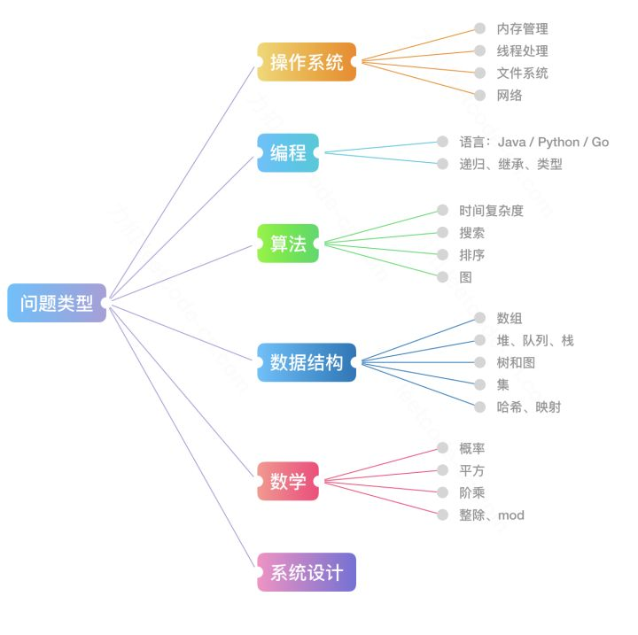

# 介绍

leetcode 题解，记录自己的 leecode 解题之路。

本仓库目前分为四个部分：

- 第一个部分是 leetcode 经典题目的解析，包括思路，关键点和具体的代码实现。

- 第二部分是对于数据结构与算法的总结

- 第三部分是 anki 卡片， 将 leetcode 题目按照一定的方式记录在 anki 中，方便大家记忆。

- 第四部分是计划， 这里会记录将来要加入到以上三个部分内容

> 只有熟练掌握基础的数据结构与算法，才能对复杂问题迎刃有余

## 食用指南

- 对于最近添加的部分， 前面会有 🆕 标注
- 对于最近更新的部分， 前面会有 🖊 标注
- 将来会在这里更新anki卡片
- 这里有一份leetcode官方账号在知乎上给出的一个《互联网公司最常见的面试算法题有哪些？》的答案，我这里尽量去覆盖回答中的题目和知识点
原文地址： https://www.zhihu.com/question/24964987/answer/586425979

- 这里有一张互联网公司面试中经常考察的问题类型总结的思维导图，我们可以结合图片中的信息分析一下。

(图片来自leetcode)

其中算法，主要是以下几种：

- 基础技巧：分治、二分、贪心
- 排序算法：快速排序、归并排序、计数排序
- 搜索算法：回溯、递归、深度优先遍历，广度优先遍历，二叉搜索树等
- 图论：最短路径、最小生成树
- 动态规划：背包问题、最长子序列

数据结构，主要有如下几种：

- 数组与链表：单 / 双向链表
- 栈与队列
- 哈希表
- 堆：最大堆 ／ 最小堆
- 树与图：最近公共祖先、并查集
- 字符串：前缀树（字典树） ／ 后缀树

## 精彩预告

301. remove-invalid-parentheses:

浏览器中的栈：

再看动态规划:

875. koko-eating-bananas:

## 传送门

### leetcode 经典题目的解析

#### 简单难度

- [20. Valid Parentheses](./problems/validParentheses.md)
- [26.remove-duplicates-from-sorted-array](./problems/26.remove-duplicates-from-sorted-array.md)
- [136.single-number](./problems/136.single-number.md)
- [167.two-sum-ii-input-array-is-sorted](./problems/167.two-sum-ii-input-array-is-sorted.md)
- 🆕 [169.majority-element](./problems/169.majority-element.md)
- [190.reverse-bits](./problems/190.reverse-bits.md)
- [191.number-of-1-bits](./problems/191.number-of-1-bits.md)
- [203.remove-linked-list-elements](./problems/203.remove-linked-list-elements.md)
- [206.reverse-linked-list](./problems/206.reverse-linked-list.md)
- [219.contains-duplicate-ii](./problems/219.contains-duplicate-ii.md)
- 🆕 [226.invert-binary-tree](./problems/226.invert-binary-tree.md)
- [283.move-zeroes](./problems/283.move-zeroes.md)
- [349.intersection-of-two-arrays](./problems/349.intersection-of-two-arrays.md)

#### 中等难度

- [2. Add Two Numbers](./problems/addTwoNumbers.md)
- [3. Longest Substring Without Repeating Characters](./problems/longestSubstringWithoutRepeatingCharacters.md)
- [5. Longest Palindromic Substring](./problems/longestPalindromicSubstring.md)
- 🆕 [11.container-with-most-water](./problems/11.container-with-most-water.md)
- [19. Remove Nth Node From End of List](./problems/removeNthNodeFromEndofList.md)
- [24. Swap Nodes In Pairs](./problems/swapNodesInPairs.md)
- [75.sort-colors.md](./problems/75.sort-colors.md)
- [86.partition-list](./problems/86.partition-list.md)
- [92.reverse-linked-list-ii](./problems/92.reverse-linked-list-ii.md)
- [94.binary-tree-inorder-traversal](./problems/94.binary-tree-inorder-traversal.md)
- [102.binary-tree-level-order-traversal](./problems/102.binary-tree-level-order-traversal.md)
- [103.binary-tree-zigzag-level-order-traversal](./problems/103.binary-tree-zigzag-level-order-traversal.md)
- [144.binary-tree-preorder-traversal](./problems/144.binary-tree-preorder-traversal.md)
- [150.evaluate-reverse-polish-notation](./problems/150.evaluate-reverse-polish-notation.md)
- [199.binary-tree-right-side-view](./problems/199.binary-tree-right-side-view.md)
- [201.bitwise-and-of-numbers-range](./problems/201.bitwise-and-of-numbers-range.md)
- [209.minimum-size-subarray-sum](./problems/209.minimum-size-subarray-sum.md)
- 🆕 [240.search-a-2-d-matrix-ii](./problems/240.search-a-2-d-matrix-ii.md)
- [279.perfect-squares](./problems/279.perfect-squares.md)
- [322.coin-change](./problems/322.coin-change.md)
- [328.odd-even-linked-list](./problems/328.odd-even-linked-list.md)
- [445.add-two-numbers-ii](./problems/445.add-two-numbers-ii.md)
- [518.coin-change-2](./problems/518.coin-change-2.md)
- 🆕 [875.koko-eating-bananas](./problems/875.koko-eating-bananas.md)
- [877.stone-game](./problems/877.stone-game.md)
- 🆕 [887.super-egg-drop](./problems/887.super-egg-drop.md)
- [900.rle-iterator](./problems/900.rle-iterator.md)

#### 困难难度

- [145.binary-tree-postorder-traversal](./problems/145.binary-tree-postorder-traversal.md)
- [146.lru-cache](./problems/146.lru-cache.md)
- [301.remove-invalid-parentheses](./problems/301.remove-invalid-parentheses.md)

### 数据结构与算法的总结

- 🖊 [basic-data-structure](./thinkings/basic-data-structure.md)（草稿）
- 🖊 [binary-tree-traversal](./thinkings/binary-tree-traversal.md)
- [dynamic-programming](./thinkings/dynamic-programming.md)
- [哈夫曼编码和游程编码](./thinkings/run-length-encode-and-huffman-encode.md)
- [布隆过滤器](./thinkings/bloom-filter.md)

### anki 卡片

TODO

### 计划

- [494.target-sum]

- [609.find-duplicate-file-in-system]

- anki 卡片

## 交流群

现在还是初级阶段，需要大家的意见和反馈，为了减少沟通成本，我组建了交流群。大家可以扫码进入

(qq 群)

(微信群， 由于微信的限制，只可以七天之内才能加入)
