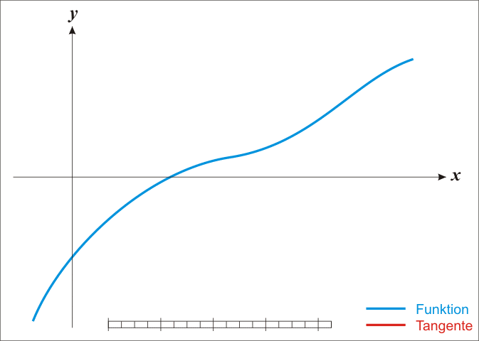

## 每日一题 - my-sqrt

### 信息卡片

- 时间：2019-06-21
- 题目链接：无 
> leetcode 上有一个相似的[题目](https://leetcode.com/problems/sqrtx/)
- tag：`binary search` `math`

### 题目描述

```
要求不用数学库，求 sqrt(2)精确到小数点后 10 位
```

### 参考答案

1. 二分法

这个解法比较直接，就是普通的二分。
通过每次取中间值进行比较，我们可以舍去一半的结果。时间复杂度logn

参考代码：

```js
function sqrt(num) {
  if (num < 0) return num;
  let start = 0;
  let end = num;
  let mid = num >> 1;
  const DIGIT_COUNT = 10;
  const PRECISION = Math.pow(0.1, DIGIT_COUNT);
  while (Math.abs(+(num - mid * mid).toFixed(DIGIT_COUNT)) > PRECISION) {
    mid = start + (end - start) / 2.0;
    if (mid * mid < num) {
      start = mid;
    } else {
      end = mid;
    }
  }

  return mid;
}
```

2. 牛顿迭代法

这种方法是牛顿发明的，比较巧妙。
其实上述问题可以转化为x^2-a = 0，求x的值。其实也就是曲线和y轴交点的横坐标。
我们可以不断用f(x)的切线来逼近方程 x^2-a = 0的根。
根号a实际上就是x^2-a=0的一个正实根，由于这个函数的导数是2x。
也就是说，函数上任一点(x,f(x))处的切线斜率是2x。
那么，x-f(x)/(2x)就是一个比x更接近的近似值。代入 f(x)=x^2-a得到x-(x^2-a)/(2x)，也就是(x+a/x)/2。



(图片来自Wikipedia)

参考代码：

```js
function sqrtNewton(n) {
  if (n <= 0) return n;

  let res;
  let last;
  const DIGIT_COUNT = 10;
  const PRECISION = Math.pow(0.1, DIGIT_COUNT);

  res = n;

  while (Math.abs(last - res) > PRECISION) {
    last = res;
    res = (res + n / res) / 2;
  }

  return res;
}
```

### 其他优秀解答

```
暂无
```
