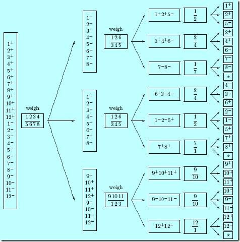

## 每日一题 - 称球问题

### 信息卡片

- 时间：2019-07-10
- 题目链接：无
- tag：`math`

### 题目描述

```

12个小球，其中有一个是坏球。有一架天平。需要你用最少的称次数来确定哪个小球是坏的并且它到底是轻还是重。

```

### 参考答案

3次。

我们先来分析一下：


由于天平的输出结果有三种“平衡、左倾、右倾”，这就相当于我们的问题有三个答案，即可以将所有的可能性切成三份，
根据猜数字游戏的启发，我们应当尽量让这三个分支概率均等，即平均切分所有的可能性为三等份。
如此一来的话一次称量就可以将答案的可能性缩减为原来的1/3，三次就能缩减为1/27。而总共才有24种可能性，所以理论上是完全可以3次称出来的。


这个题目解释起来比较费劲，我在网上找了一个现成的图来解释一下：



图中“1+”是指“1号小球为重”这一可能性。“1-”是指“1号小球为轻”这一可能性。
一开始一共有24种可能性。

4、4称了之后不管哪种情况（分支），剩下来的可能性总是4种。这是一个完美的三分。

然后对每个分支构造第二次称法，这里你只要稍加演算就可以发现，分支1上的第二次称法，即“1、2、6对3、4、5”这种称法，天平输出三种结果的可能性是均等的（严格来说是几乎均等）。

这就是为什么这个称法能够在最坏的情况下也能表现最好的原因，没有哪个分支是它的弱点，它必然能将情况缩小到原来的1/3。

### 其他优秀解答

```
暂无
```

### 参考

- [学之美番外篇：快排为什么那样快](http://mindhacks.cn/2008/06/13/why-is-quicksort-so-quick/)