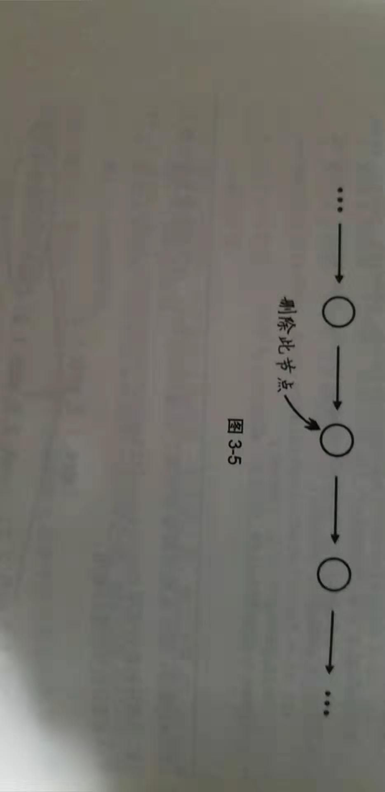

# 毎日一题 - 删除没有头节点的单链表中的指定项

## 信息卡片

- 时间：2019-07-23
- 题目链接：无（来自编程之美）
- tag：`Linked List`

## 题目描述

```
假设有一个没有头指针的单链表，一个指针指向该单链表中间的一个节点(不是第一个，也不是最后一个节点)，
请将该节点从单链表中删除。

```



## 参考答案


我们可以“移花接木”， 将要删除的节点的后面的节点的值给当前节点，然后删除后面的节点即可。


## 优秀解答

> 暂缺
