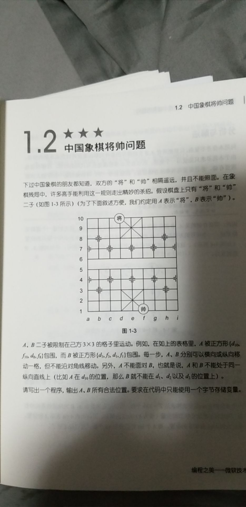

# 毎日一题 - 将帅问题

## 信息卡片

- 时间：2019-07-26
- 题目链接：无（来自编程之美）
- tag：`数据压缩`

## 题目描述



## 参考答案

这是数据压缩问题中的一种。

类似的问题有， 如果将 IP 地址用 4 个字节来表示等等。

这道题的思路，如果我们不考虑用一个字节去存储的话，我们通过观察
坐标，发现“坐标和 3 取余的结果相同的就是同一列”，因此我们可以根据
这个来判断位置是否合法。

我们容易写出类似下面的代码：

```js
for (let i = 0; i < 9; i++) {
  for (let j = 0; j < 9; j++) {
    if (i % 3 !== j % 3) {
      console.log(`${i + 1}, ${j + 1}`);
    }
  }
}
```

可以看出上面的写法用到了两个字节去表示，如何将上面的写法压缩到一个字节呢？

仔细观察我们发现，内存循环和外层循环的长度是一样的，
其实我们内外循环用一个变量表示。


内外循环总共执行了81次。 我们定义一个变量为81.
然后用i / 9 来表示外层循环的值。 用 i % 9 来表示内层循环的值。

可以看出，i增加9次之后，内存循环会增加9，外层增加1，整个过程类似上面。

代码如下：

```js
let i = 81;

while (i-- > 0) {
  if (((i / 9) >> 0) % 3 !== (i % 9) % 3) {
    console.log(`${((i / 9) >> 0) + 1}, ${(i % 9) + 1}`);
  }
}
```

## 优秀解答

> 暂缺
