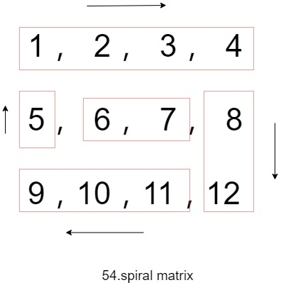

# 毎日一题 - 54.Spiral Matrix

## 信息卡片

- 时间：2019-07-29
- 题目链接：https://leetcode.com/problems/spiral-matrix/
- tag：`Array` `Matrix`

## 题目描述

```
Given a matrix of m x n elements (m rows, n columns), return all elements of the matrix in spiral order.

Example 1:

  Input:
    [
      [ 1, 2, 3 ],
      [ 4, 5, 6 ],
      [ 7, 8, 9 ]
    ]
  Output: [1,2,3,6,9,8,7,4,5]
Example 2:

  Input:
    [
      [1, 2, 3, 4],
      [5, 6, 7, 8],
      [9,10,11,12]
    ]
  Output: [1,2,3,4,8,12,11,10,9,5,6,7]
```

## 参考答案

1. 剥洋葱，row->col->row->col 为一次；
2. row->col、col->row 的切换都伴随读取的初始位置的变化；
3. 结束条件是row头>row尾或者col顶>col底



时间复杂度O(m*n), 空间复杂度O(1)

参考JavaScript代码：

```js
/**
 * @param {number[][]} matrix
 * @return {number[]}
 */
var spiralOrder = function(matrix) {
    if(matrix.length === 0) return [];
    let rowT = 0; // 行顶
    let rowB = matrix.length - 1; // 行底
    let colL = 0; // 列左
    let colR = matrix[0].length - 1; // 列右
    let result =  [];
    // 顺序是行、列、行、列；每次切换，读取的初始位置都会变化1(+/- 1)
    while (colL <= colR && rowT <= rowB) {
      for (let a = colL; a <= colR; a++) {
        result.push(matrix[rowT][a]);
      }
      rowT++;
      for (let b = rowT; b <= rowB; b++) {
        result.push(matrix[b][colR]);
      }
      colR--;
      for (let c = colR; c >= colL && rowB >= rowT; c--) {
        result.push(matrix[rowB][c]);
      }
      rowB--;
      for (let d = rowB; d >= rowT && colR >= colL; d--) {
        result.push(matrix[d][colL]);
      }
      colL++;
    }
    return result;
};
```

代码只有一个for循环的方式，操作方向
例如
>  1  2  3  4  5
>  6  7  8  9 10
> 11 12 13 14 15
>
> 对上面矩阵遍历时的操作
>
> 向右5次(算上从左侧第一次进入)
> 向下2次
> 向左4次
> 向上1次
> 向右3次
> 向下0次 -- 结束

方向有四个，right、down、left、up
四个方向又分两类，水平(right,left)和垂直(down，up)
而在两类方向上的移动最值是 水平n, 垂直m;
在遍历过程中，根据`方向切换`来减小n/m从而缩小两类方向的移动最值直到结束
四个方向可以用二维数组来表示[ [0, 1], [1, 0], [0, -1], [-1, 0] ]
两类方向各自的初始最大值是[n, m-1]
当 n == 0 || m == 0 表示元素已经全部遍历完

这种写法省去了代码中的for循环，但是while循环次数却增多了；复杂度没有变化
时间复杂度O(m*n), 空间复杂度O(1)

参考JavaScript代码：

```js
/**
 * @param {number[][]} matrix
 * @return {number[]}
 * 一个for循环,但while变多了
 */
var spiralOrder = function(matrix) {
    if(matrix.length === 0) return [];
    let m = matrix.length;
    let n = matrix[0].length;
    let result = [];
    const dirs = [[0, 1], [1, 0], [0, -1], [-1, 0]] // 控制方向的数组
    // 元素坐标row,col;
    let row = 0;
    let col = -1;
    let steps = [n, m-1]
    let dir = 0; // 初始方向
    while(steps[dir%2]) {
      for(let i = 0; i < steps[dir%2]; i++) {
        // 方向的改变的效果，row/col能增能减
        row += dirs[dir][0]; col += dirs[dir][1];
        result.push(matrix[row][col])
      }
      steps[dir%2]--; // 移动极值缩小
      dir = (dir+1)%4; // 方向改变
    }
    return result;
};
```

## 优秀解答

> 暂缺

## 参考
- @stellari [A concise C++ implementation based on Directions](https://leetcode.com/problems/spiral-matrix/discuss/20573/A-concise-C%2B%2B-implementation-based-on-Directions)
