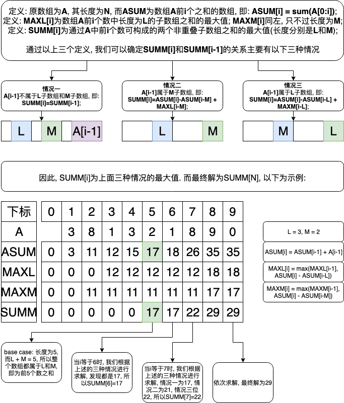

## 题目地址
https://leetcode.com/problems/maximum-sum-of-two-non-overlapping-subarrays/

## 题目描述

```
Given an array A of non-negative integers, return the maximum sum of elements in two non-overlapping (contiguous) subarrays, which have lengths L and M.  (For clarification, the L-length subarray could occur before or after the M-length subarray.)

Formally, return the largest V for which V = (A[i] + A[i+1] + ... + A[i+L-1]) + (A[j] + A[j+1] + ... + A[j+M-1]) and either:

0 <= i < i + L - 1 < j < j + M - 1 < A.length, or
0 <= j < j + M - 1 < i < i + L - 1 < A.length.
 

Example 1:

Input: A = [0,6,5,2,2,5,1,9,4], L = 1, M = 2
Output: 20
Explanation: One choice of subarrays is [9] with length 1, and [6,5] with length 2.
Example 2:

Input: A = [3,8,1,3,2,1,8,9,0], L = 3, M = 2
Output: 29
Explanation: One choice of subarrays is [3,8,1] with length 3, and [8,9] with length 2.
Example 3:

Input: A = [2,1,5,6,0,9,5,0,3,8], L = 4, M = 3
Output: 31
Explanation: One choice of subarrays is [5,6,0,9] with length 4, and [3,8] with length 3.
 

Note:

L >= 1
M >= 1
L + M <= A.length <= 1000
0 <= A[i] <= 1000
```

## 思路(动态规划)

题目中要求在前N(数组长度)个数中找出长度分别为L和M的非重叠子数组之和的最大值, 因此, 我们可以定义数组A中前i个数可构成的非重叠子数组L和M的最大值为SUMM[i], 并找到SUMM[i]和SUMM[i-1]的关系, 那么最终解就是SUMM[N]. 以下为图解:



## 关键点解析

1. 注意图中描述的都是A[i-1], 而不是A[i], 因为base case为空数组, 而不是A[0];
2. 求解图中ASUM数组的时候, 注意定义的是ASUM[i] = sum(A[0:i]), 因此当i等于0时, A[0:0]为空数组, 即: ASUM[0]为0, 而ASUM[1]才等于A[0];
3. 求解图中MAXL数组时, 注意i < L时, 没有意义, 因为长度不够, 所以从i = L时才开始求解;
4. 求解图中MAXM数组时, 也一样, 要从i = M时才开始求解;
5. 求解图中SUMM数组时, 因为我们需要一个L子数组和一个M子数组, 因此长度要大于等于L+M才有意义, 所以要从i = L + M时开始求解.

## 代码

* 语言支持: Python

Python Code:
```python
class Solution:
    def maxSumTwoNoOverlap(self, a: List[int], l: int, m: int) -> int:
        """

        define asum[i] as the sum of subarray, a[0:i]
        define maxl[i] as the maximum sum of l-length subarray in a[0:i]
        define maxm[i] as the maximum sum of m-length subarray in a[0:i]
        define msum[i] as the maximum sum of non-overlap l-length subarray and m-length subarray

        case 1: a[i] is both not in l-length subarray and m-length subarray, then msum[i] = msum[i - 1]
        case 2: a[i] is in l-length subarray, then msum[i] = asum[i] - asum[i-l] + maxm[i-l]
        case 3: a[i] is in m-length subarray, then msum[i] = asum[i] - asum[i-m] + maxl[i-m]

        so, msum[i] = max(msum[i - 1], asum[i] - asum[i-l] + maxl[i-l], asum[i] - asum[i-m] + maxm[i-m])
        """

        alen, tlen = len(a), l + m
        asum = [0] * (alen + 1)
        maxl = [0] * (alen + 1)
        maxm = [0] * (alen + 1)
        msum = [0] * (alen + 1)

        for i in range(tlen):
            if i == 1:
                asum[i] = a[i - 1]
            elif i > 1:
                asum[i] = asum[i - 1] + a[i - 1]
            if i >= l:
                maxl[i] = max(maxl[i - 1], asum[i] - asum[i - l])
            if i >= m:
                maxm[i] = max(maxm[i - 1], asum[i] - asum[i - m])

        for i in range(tlen, alen + 1):
            asum[i] = asum[i - 1] + a[i - 1]
            suml = asum[i] - asum[i - l]
            summ = asum[i] - asum[i - m]
            maxl[i] = max(maxl[i - 1], suml)
            maxm[i] = max(maxm[i - 1], summ)
            msum[i] = max(msum[i - 1], suml + maxm[i - l], summ + maxl[i - m])

        return msum[-1]
```

## 扩展

1. 代码中, 求解了4个动态规划数组来求解最终值, 有没有可能只用两个数组来求解该题, 可以的话, 需要保留的又是哪两个数组?
2. 代码中, 求解的4动态规划数组的顺序能否改变, 哪些能改, 哪些不能改?
