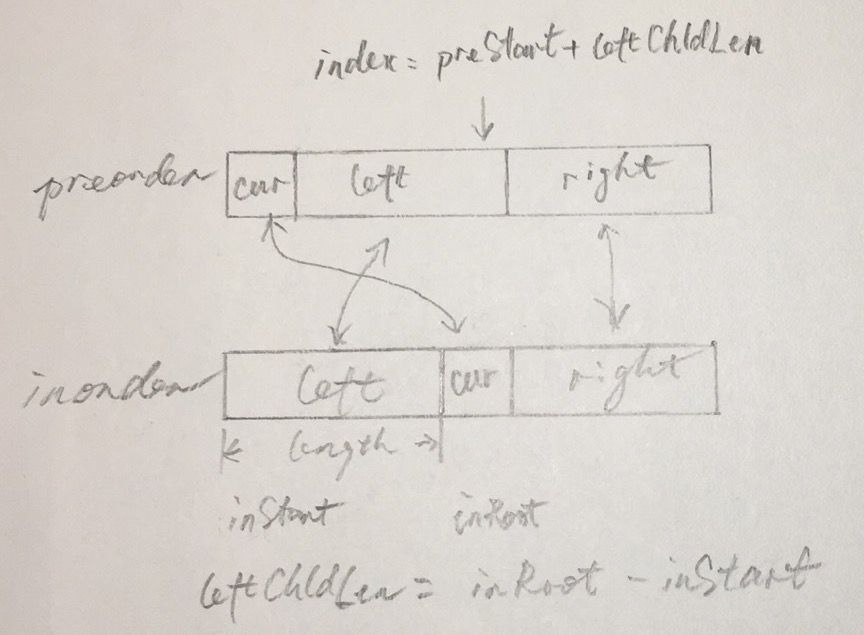

## 问题地址/Problem URL

https://leetcode.com/problems/construct-binary-tree-from-preorder-and-inorder-traversal/

## 问题介绍/Problem Description

Given preorder and inorder traversal of a tree, construct the binary tree.

Note:
You may assume that duplicates do not exist in the tree.

For example, given

```java
preorder = [3,9,20,15,7]
inorder = [9,3,15,20,7]
```

Return the following binary tree:

```bash
    3
   / \
  9  20
    /  \
   15   7
```

## 前置知识

- 二叉树

## 思路/Thinking Path

目标是构造二叉树。

构造二叉树需要根的值、左子树和右子树。

此问题可被抽象为：从前序遍历和中序遍历中找到根节点、左子树和右子树。

先找根：
由前序遍历的性质，第`0`个节点为当前树的根节点。
再找左右子树：
在中序遍历中找到这个根节点，设其下标为`i`。由中序遍历的性质，`0 ~ i-1` 是左子树的中序遍历，`i+1 ~ inorder.length-1`是右子树的中序遍历。

然后递归求解，终止条件是左右子树为`null`。

We are going to construct a binary tree from its preorder and inorder traversal.

To build a binary tree, it requires us to creact a new `TreeNode` as the root with filling in the root value. And then, find its left child and right child recursively until the left or right child is `null`.

Now this problem is abstracted as how to find the root node, left child and right child from the preorder traversal and inorder traversal.

In preorder traversal, the first node (`preorder[0]`) is the root of current binary tree. In inorder traversal, find the location of this root which is `i`. The left sub-tree is `0 to i-1` and the right sub-tree is `i+1 to inorder.length-1` in inorder traversal.

Then applying the previous operation to the left and right sub-trees.

## 关键解析/Key Points

如何在前序遍历的数组里找到左右子树的：
- 根据前序遍历的定义可知，每个当前数组的第一个元素就是当前子树的根节点的值
- 在中序遍历数组中找到这个值，设其下标为`inRoot`
  - 当前中序遍历数组的起点`inStart`到`inRoot`之间就是左子树，其长度`leftChldLen`为`inRoot-inStart`
  - 当前中序遍历数组的终点`inEnd`和`inRoot`之间就是右子树
- 前序遍历和中序遍历中左子树的长度是相等的，所以在前序遍历数组中，根节点下标`preStart`往后数`leftChldLen`即为左子树的最后一个节点，其下标为`preStart+leftChldLen`，右子树的第一个节点下标为`preStart+leftChldLen+1`。

**PLEASE READ THE CODE BEFORE READING THIS PART**

If you can't figure out how to get the index of the left and right child, please read this.

- index of current node in preorder array is preStart(or whatever your call it), it's the root of a subtree.
- according to the properties of preoder traversal, all right sub-tree nodes are behine all left sub-tree nodes. The length of left sub-tree can help us to divide left and right sub-trees.
- the length of left sub-tree can be find in the inorder traversal. The location of current node is `inRoot`(or whatever your call it). The start index of current inorder array is `inStart`(or whatever your call it). So, the lenght of the left sub-tree is `leftChldLen = inRoot - inStart`.



## 代码/Code

- Java

```java
/**
 * Definition for a binary tree node.
 * public class TreeNode {
 *     int val;
 *     TreeNode left;
 *     TreeNode right;
 *     TreeNode(int x) { val = x; }
 * }
 */
class Solution {
  public TreeNode buildTree(int[] preorder, int[] inorder) {
    if (preorder.length != inorder.length) return null;
    
    HashMap<Integer, Integer> map = new HashMap<> ();

    for (int i=0; i<inorder.length; i++) {
      map.put(inorder[i], i);
    }

    return helper(preorder, 0, preorder.length-1, inorder, 0, inorder.length-1, map);
  }

  public TreeNode helper(int[] preorder, int preStart, int preEnd, int[] inorder, int inStart, int inEnd, HashMap<Integer, Integer> map) {
    if (preStart>preEnd || inStart>inEnd) return null;
    
    TreeNode root = new TreeNode(preorder[prestart]);
    int inRoot = map.get(preorder[preStart]);
    int leftChldLen = inRoot - inStart;

    root.left = helper(preorder, preStart+1, preStart+leftChldLen, inorder, inStart, inRoot-1, map);
    root.left = helper(preorder, preStart+leftChldLen+1, preEnd, inorder, inRoot+1, inEnd, map);

    return root;
  }
}
```