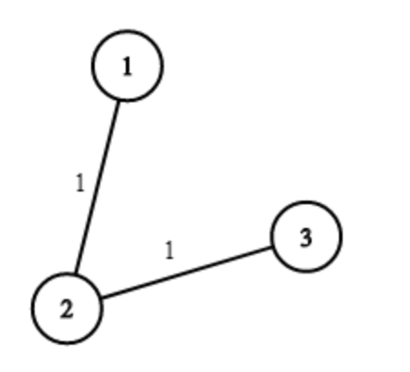
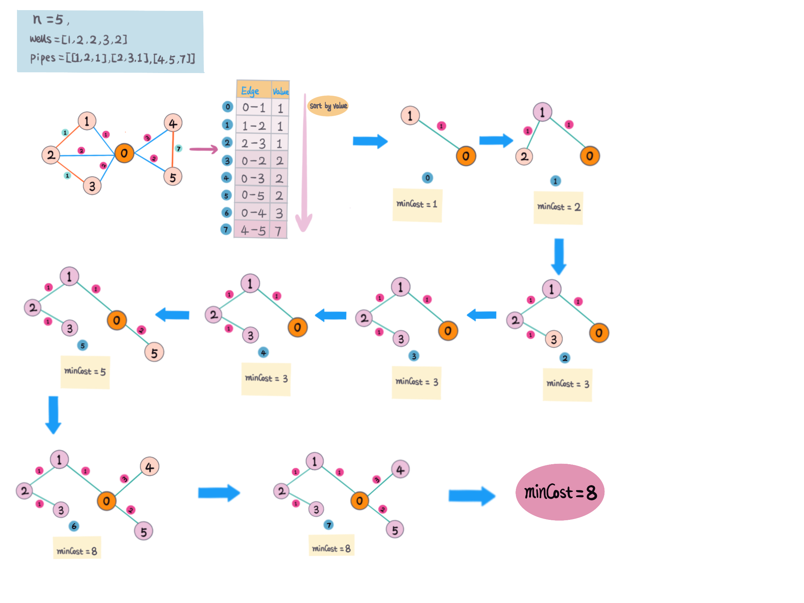

## 题目地址
https://leetcode.com/problems/optimize-water-distribution-in-a-village/

## 题目描述
```
There are n houses in a village. We want to supply water for all the houses by building wells and laying pipes.

For each house i, we can either build a well inside it directly with cost wells[i], or pipe in water from another well to it. The costs to lay pipes between houses are given by the array pipes, where each pipes[i] = [house1, house2, cost] represents the cost to connect house1 and house2 together using a pipe. Connections are bidirectional.

Find the minimum total cost to supply water to all houses.

Example 1:

Input: n = 3, wells = [1,2,2], pipes = [[1,2,1],[2,3,1]]
Output: 3
Explanation: 
The image shows the costs of connecting houses using pipes.
The best strategy is to build a well in the first house with cost 1 and connect the other houses to it with cost 2 so the total cost is 3.

Constraints:

1 <= n <= 10000
wells.length == n
0 <= wells[i] <= 10^5
1 <= pipes.length <= 10000
1 <= pipes[i][0], pipes[i][1] <= n
0 <= pipes[i][2] <= 10^5
pipes[i][0] != pipes[i][1]
```

## 前置知识

- 图
- 最小生成树

example 1 pic:



## 思路
题意，在每个城市打井需要一定的花费，也可以用其他城市的井水，城市之间建立连接管道需要一定的花费，怎么样安排可以花费最少的前灌溉所有城市。

这是一道连通所有点的最短路径/最小生成树问题，把城市看成图中的点，管道连接城市看成是连接两个点之间的边。这里打井的花费是直接在点上，而且并不是所有
点之间都有边连接，为了方便，我们可以假想一个点`（root）0`，这里自身点的花费可以与 `0` 连接，花费可以是 `0-i` 之间的花费。这样我们就可以构建一个连通图包含所有的点和边。
那在一个连通图中求最短路径/最小生成树的问题. 

参考延伸阅读中，维基百科针对这类题给出的几种解法。

解题步骤：
1. 创建 `POJO EdgeCost(node1, node2, cost) - 节点1 和 节点2 连接边的花费`。
2. 假想一个`root` 点 `0`，构建图
3. 连通所有节点和 `0`，`[0,i] - i 是节点 [1,n]`，`0-1` 是节点 `0` 和 `1` 的边，边的值是节点 `i` 上打井的花费 `wells[i]`;
4. 把打井花费和城市连接点转换成图的节点和边。
5. 对图的边的值排序（从小到大）
6. 遍历图的边，判断两个节点有没有连通 （`Union-Find`），
    - 已连通就跳过，继续访问下一条边
    - 没有连通，记录花费，连通节点
7. 若所有节点已连通，求得的最小路径即为最小花费，返回
8. 对于每次`union`, 节点数 `n-1`, 如果 `n==0` 说明所有节点都已连通，可以提前退出，不需要继续访问剩余的边。

> 这里用加权Union-Find 判断两个节点是否连通，和连通未连通的节点。

举例：`n = 5, wells=[1,2,2,3,2], pipes=[[1,2,1],[2,3,1],[4,5,7]]`

如图：



从图中可以看到，最后所有的节点都是连通的。

#### 复杂度分析
- *时间复杂度:* `O(ElogE) - E 是图的边的个数`
- *空间复杂度:* `O(E)`

> 一个图最多有 `n(n-1)/2 - n 是图中节点个数` 条边 （完全连通图）

## 关键点分析
1. 构建图，得出所有边
2. 对所有边排序
3. 遍历所有的边（从小到大）
4. 对于每条边，检查是否已经连通，若没有连通，加上边上的值，连通两个节点。若已连通，跳过。

## 代码 (`Java/Python3`)
*Java code*
```java
  class OptimizeWaterDistribution {
    public int minCostToSupplyWater(int n, int[] wells, int[][] pipes) {
      List<EdgeCost> costs = new ArrayList<>();
      for (int i = 1; i <= n; i++) {
        costs.add(new EdgeCost(0, i, wells[i - 1]));
      }
      for (int[] p : pipes) {
        costs.add(new EdgeCost(p[0], p[1], p[2]));
      }
      Collections.sort(costs);
      int minCosts = 0;
      UnionFind uf = new UnionFind(n);
      for (EdgeCost edge : costs) {
        int rootX = uf.find(edge.node1);
        int rootY = uf.find(edge.node2);
        if (rootX == rootY) continue;
        minCosts += edge.cost;
        uf.union(edge.node1, edge.node2);
        // for each union, we connnect one node
        n--;
        // if all nodes already connected, terminate early
        if (n == 0) {
          return minCosts;
        }
      }
      return minCosts;
    }
  
    class EdgeCost implements Comparable<EdgeCost> {
      int node1;
      int node2;
      int cost;
      public EdgeCost(int node1, int node2, int cost) {
        this.node1 = node1;
        this.node2 = node2;
        this.cost = cost;
      }
  
      @Override
      public int compareTo(EdgeCost o) {
        return this.cost - o.cost;
      }
    }
    
    class UnionFind {
      int[] parent;
      int[] rank;
      public UnionFind(int n) {
        parent = new int[n + 1];
        for (int i = 0; i <= n; i++) {
          parent[i] = i;
        }
        rank = new int[n + 1];
      }
      public int find(int x) {
        return x == parent[x] ? x : find(parent[x]);
      }
      public void union(int x, int y) {
        int px = find(x);
        int py = find(y);
        if (px == py) return;
        if (rank[px] >= rank[py]) {
          parent[py] = px;
          rank[px] += rank[py];
        } else {
          parent[px] = py;
          rank[py] += rank[px];
        }
      }
    }
  }
```
*Pythong3 code*
```python
class Solution:
    def minCostToSupplyWater(self, n: int, wells: List[int], pipes: List[List[int]]) -> int:
        union_find = {i: i for i in range(n + 1)}
        
        def find(x):
            return x if x == union_find[x] else find(union_find[x])
        
        def union(x, y):
            px = find(x)
            py = find(y)
            union_find[px] = py
            
        graph_wells = [[cost, 0, i] for i, cost in enumerate(wells, 1)]
        graph_pipes = [[cost, i, j] for i, j, cost in pipes]
        min_costs = 0
        for cost, x, y in sorted(graph_wells + graph_pipes):
            if find(x) == find(y):
                continue
            union(x, y)
            min_costs += cost
            n -= 1
            if n == 0:
                return min_costs
```

## 延伸阅读

1. [最短路径问题](https://www.wikiwand.com/zh-hans/%E6%9C%80%E7%9F%AD%E8%B7%AF%E9%97%AE%E9%A2%98)
2. [Dijkstra算法](https://www.wikiwand.com/zh-hans/戴克斯特拉算法)
3. [Floyd-Warshall算法](https://www.wikiwand.com/zh-hans/Floyd-Warshall%E7%AE%97%E6%B3%95)
4. [Bellman-Ford算法](https://www.wikiwand.com/zh-hans/%E8%B4%9D%E5%B0%94%E6%9B%BC-%E7%A6%8F%E7%89%B9%E7%AE%97%E6%B3%95)
5. [Kruskal算法](https://www.wikiwand.com/zh-hans/%E5%85%8B%E9%B2%81%E6%96%AF%E5%85%8B%E5%B0%94%E6%BC%94%E7%AE%97%E6%B3%95)
6. [Prim's 算法](https://www.wikiwand.com/zh-hans/%E6%99%AE%E6%9E%97%E5%A7%86%E7%AE%97%E6%B3%95)
7. [最小生成树](https://www.wikiwand.com/zh/%E6%9C%80%E5%B0%8F%E7%94%9F%E6%88%90%E6%A0%91)