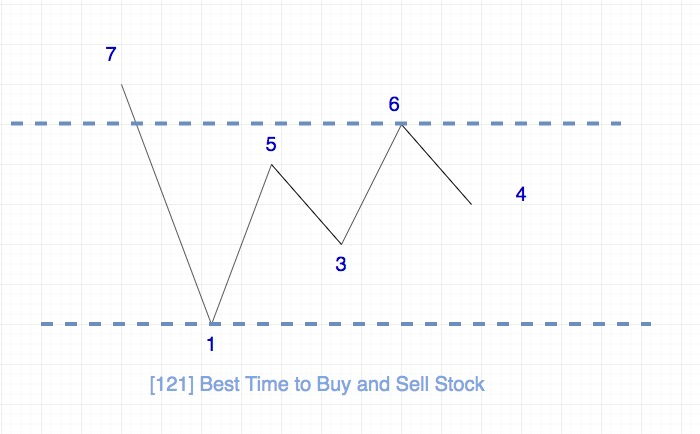

## 题目地址
https://leetcode.com/problems/best-time-to-buy-and-sell-stock/description/

## 题目描述

```
Say you have an array for which the ith element is the price of a given stock on day i.

If you were only permitted to complete at most one transaction (i.e., buy one and sell one share of the stock), design an algorithm to find the maximum profit.

Note that you cannot sell a stock before you buy one.

Example 1:

Input: [7,1,5,3,6,4]
Output: 5
Explanation: Buy on day 2 (price = 1) and sell on day 5 (price = 6), profit = 6-1 = 5.
             Not 7-1 = 6, as selling price needs to be larger than buying price.
Example 2:

Input: [7,6,4,3,1]
Output: 0
Explanation: In this case, no transaction is done, i.e. max profit = 0.
```

## 思路

由于我们是想获取到最大的利润，我们的策略应该是低点买入，高点卖出。

由于题目对于交易次数有限制，只能交易一次，因此问题的本质其实就是求波峰浪谷的差值的最大值。

用图表示的话就是这样：



## 关键点解析

- 这类题只要你在心中（或者别的地方）画出上面这种图就很容易解决

## 代码

语言支持：JS，Python，C++

JS Code:

```js
/*
 * @lc app=leetcode id=121 lang=javascript
 *
 * [121] Best Time to Buy and Sell Stock
 *
 * https://leetcode.com/problems/best-time-to-buy-and-sell-stock/description/
 *
 * algorithms
 * Easy (46.34%)
 * Total Accepted:    480.5K
 * Total Submissions: 1M
 * Testcase Example:  '[7,1,5,3,6,4]'
 *
 * Say you have an array for which the i^th element is the price of a given
 * stock on day i.
 *
 * If you were only permitted to complete at most one transaction (i.e., buy
 * one and sell one share of the stock), design an algorithm to find the
 * maximum profit.
 *
 * Note that you cannot sell a stock before you buy one.
 *
 * Example 1:
 *
 *
 * Input: [7,1,5,3,6,4]
 * Output: 5
 * Explanation: Buy on day 2 (price = 1) and sell on day 5 (price = 6), profit
 * = 6-1 = 5.
 * Not 7-1 = 6, as selling price needs to be larger than buying price.
 *
 *
 * Example 2:
 *
 *
 * Input: [7,6,4,3,1]
 * Output: 0
 * Explanation: In this case, no transaction is done, i.e. max profit = 0.
 *
 *
 */
/**
 * @param {number[]} prices
 * @return {number}
 */
var maxProfit = function(prices) {
    let min = prices[0];
    let profit = 0;
    // 7 1 5 3 6 4
    for(let i = 1; i < prices.length; i++) {
        if (prices[i] > prices[i -1]) {
            profit = Math.max(profit, prices[i] - min);
        } else {
            min = Math.min(min, prices[i]);;
        }
    }

    return profit;
};
```


Python Code:

```python
class Solution:
    def maxProfit(self, prices: 'List[int]') -> int:
        if not prices: return 0

        min_price = float('inf')
        max_profit = 0

        for price in prices:
            if price < min_price:
                min_price = price
            elif max_profit < price - min_price:
                max_profit = price - min_price
        return max_profit
```

C++ Code:
```c++
/**
 * 系统上C++的测试用例中的输入有[]，因此需要加一个判断
 */
class Solution {
public:
    int maxProfit(vector<int>& prices) {
        if (prices.empty()) return 0;
        auto min = prices[0];
        auto profit = 0;
        for (auto i = 1; i < prices.size(); ++i) {
            if (prices[i] > prices[i -1]) {
                profit = max(profit, prices[i] - min);
            } else {
                min = std::min(min, prices[i]);;
            }
        }
        return profit;
    }
};
```


## 相关题目

- [122.best-time-to-buy-and-sell-stock-ii](./122.best-time-to-buy-and-sell-stock-ii.md)
- [309.best-time-to-buy-and-sell-stock-with-cooldown](./309.best-time-to-buy-and-sell-stock-with-cooldown.md)
