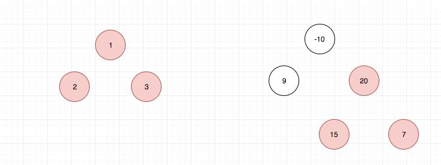
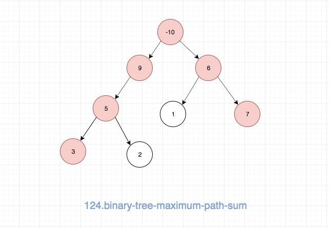

## 题目地址
https://leetcode.com/problems/binary-tree-maximum-path-sum/description/

## 题目描述

```
Given a non-empty binary tree, find the maximum path sum.

For this problem, a path is defined as any sequence of nodes from some starting node to any node in the tree along the parent-child connections. The path must contain at least one node and does not need to go through the root.

Example 1:

Input: [1,2,3]

       1
      / \
     2   3

Output: 6
Example 2:

Input: [-10,9,20,null,null,15,7]

   -10
   / \
  9  20
    /  \
   15   7

Output: 42
```

## 前置知识

- 递归

## 思路

 这道题目的path让我误解了，然后浪费了很多时间来解这道题
 我觉得leetcode给的demo太少了，不足以让我理解path的概念
 因此我这里自己画了一个图，来补充一下，帮助大家理解path的概念，不要像我一样理解错啦。

 首先是官网给的两个例子：

 

  接着是我自己画的一个例子：

 

大家可以结合上面的demo来继续理解一下path， 除非你理解了path，否则不要往下看。

 
 树的题目，基本都是考察递归思想的。因此我们需要思考如何去定义我们的递归函数，
 在这里我定义了一个递归函数，它的功能是，`返回以当前节点为根节点的MathPath`
 但是有两个条件:
 
 1. 第一是跟节点必须选择
 2. 第二是左右子树只能选择一个

 为什么要有这两个条件?

 我的想法是原问题可以转化为：

 以每一个节点为根节点，我们分别求出max path，最后计算最大值,因此第一个条件需要满足.

 对于第二个，由于递归函数子节点的返回值会被父节点使用，因此我们如果两个孩子都选择了
 就不符合max path的定义了，这也是我没有理解题意，绕了很大弯子的原因。


 因此我的做法就是不断调用递归函数，然后在调用过程中不断计算和更新max，最后在主函数中将max返回即可。

## 关键点解析

- 递归
- 理解题目中的path定义

## 代码

代码支持：JavaScript，Java，Python

- JavaScript

```js


/*
 * @lc app=leetcode id=124 lang=javascript
 *
 * [124] Binary Tree Maximum Path Sum
 */
/**
 * Definition for a binary tree node.
 * function TreeNode(val) {
 *     this.val = val;
 *     this.left = this.right = null;
 * }
 */
function helper(node, payload) {
  if (node === null) return 0;

  const l = helper(node.left, payload);
  const r = helper(node.right, payload);

  payload.max = Math.max(
    node.val + Math.max(0, l) + Math.max(0, r),
    payload.max
  );

  return node.val + Math.max(l, r, 0);
}
/**
 * @param {TreeNode} root
 * @return {number}
 */
var maxPathSum = function(root) {
  if (root === null) return 0;
  const payload = {
    max: root.val
  };
  helper(root, payload);
  return payload.max;
};
```

- Java

```java
/**
 * Definition for a binary tree node.
 * public class TreeNode {
 *     int val;
 *     TreeNode left;
 *     TreeNode right;
 *     TreeNode(int x) { val = x; }
 * }
 */
class Solution {
  int ans;
  public int maxPathSum(TreeNode root) {
    ans = Integer.MIN_VALUE;
    helper(root);   // recursion
    return ans;
  }

  public int helper(TreeNode root) {
    if (root == null) return 0;
    int leftMax = Math.max(0, helper(root.left));     // find the max sub-path sum in left sub-tree
    int rightMax = Math.max(0, helper(root.right));   // find the max sub-path sum in right sub-tree
    ans = Math.max(ans, leftMax+rightMax+root.val);   // find the max path sum at current node
    return max(leftMax, rightMax) + root.val;         // according to the definition of path, the return value of current node can only be that the sum of current node value plus either left or right max path sum.
  }
}
```

- Python

```py

class Solution:
    ans = float('-inf')
    def maxPathSum(self, root: TreeNode) -> int:
        def helper(node):
            if not node: return 0
            l = helper(node.left)
            r = helper(node.right)
            self.ans = max(self.ans, max(l,0) + max(r, 0) + node.val)
            return max(l, r, 0) + node.val
        helper(root)
        return self.ans
 ```

## 相关题目
- [113.path-sum-ii](./113.path-sum-ii.md)

## 扩展

实际上这道题，当遍历到某一个节点的时候，我们需要子节点的信息，然后同时结合自身的 val 来决定要不要选取左右子树。 因此这个过程本质上就是`后序遍历`。
