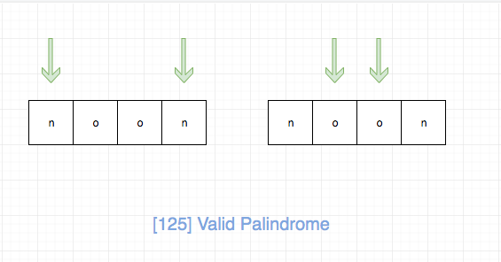

## 题目地址

https://leetcode.com/problems/valid-palindrome/description/

## 题目描述

```
Given a string, determine if it is a palindrome, considering only alphanumeric characters and ignoring cases.

Note: For the purpose of this problem, we define empty string as valid palindrome.

Example 1:

Input: "A man, a plan, a canal: Panama"
Output: true
Example 2:

Input: "race a car"
Output: false

```

## 前置知识

- 回文
- 双指针

## 思路

这是一道考察回文的题目，而且是最简单的形式，即判断一个字符串是否是回文。

针对这个问题，我们可以使用头尾双指针，

- 如果两个指针的元素不相同，则直接返回false,
- 如果两个指针的元素相同，我们同时更新头尾指针，循环。 直到头尾指针相遇。

时间复杂度为O(n).

拿“noon”这样一个回文串来说，我们的判断过程是这样的：



拿“abaa”这样一个不是回文的字符串来说，我们的判断过程是这样的：


## 关键点解析

- 双指针

## 代码

* 语言支持：JS，C++，Python

JavaScript Code:

```js

/*
 * @lc app=leetcode id=125 lang=javascript
 *
 * [125] Valid Palindrome
 */
// 只处理英文字符（题目忽略大小写，我们前面全部转化成了小写， 因此这里我们只判断小写）和数字
function isValid(c) {
  const charCode = c.charCodeAt(0);
  const isDigit =
    charCode >= "0".charCodeAt(0) && charCode <= "9".charCodeAt(0);
  const isChar = charCode >= "a".charCodeAt(0) && charCode <= "z".charCodeAt(0);

  return isDigit || isChar;
}
/**
 * @param {string} s
 * @return {boolean}
 */
var isPalindrome = function(s) {
  s = s.toLowerCase();
  let left = 0;
  let right = s.length - 1;

  while (left < right) {
    if (!isValid(s[left])) {
      left++;
      continue;
    }
    if (!isValid(s[right])) {
      right--;
      continue;
    }

    if (s[left] === s[right]) {
      left++;
      right--;
    } else {
      break;
    }
  }

  return right <= left;
};
```
C++ Code:
```C++
class Solution {
public:
    bool isPalindrome(string s) {
        if (s.empty())
            return true;
        const char* s1 = s.c_str();
        const char* e = s1 + s.length() - 1;
        while (e > s1) {
            if (!isalnum(*s1)) {++s1; continue;}
            if (!isalnum(*e)) {--e; continue;}
            if (tolower(*s1) != tolower(*e)) return false;
            else {--e; ++s1;}
        }
        return true;
    }
};
```

Python Code:

```python
class Solution:
    def isPalindrome(self, s: str) -> bool:
        left, right = 0, len(s) - 1
        while left < right:
            if not s[left].isalnum():
                left += 1
                continue
            if not s[right].isalnum():
                right -= 1
                continue
            if s[left].lower() == s[right].lower():
                left += 1
                right -= 1
            else:
                break
        return right <= left

    def isPalindrome2(self, s: str) -> bool:
        """
        使用语言特性进行求解
        """
        s = ''.join(i for i in s if i.isalnum()).lower()
        return s == s[::-1]
```
