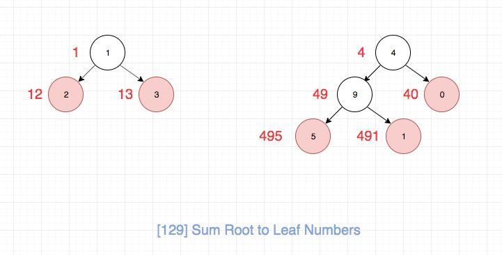
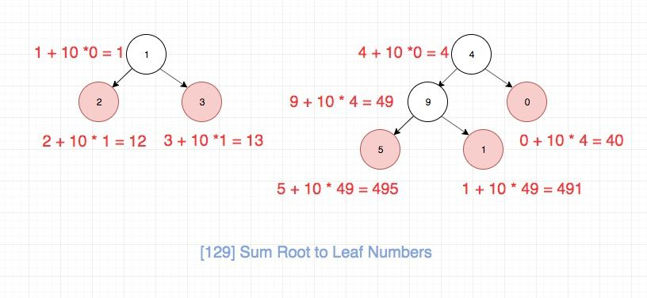

## 题目地址

https://leetcode.com/problems/sum-root-to-leaf-numbers/description/

## 题目描述

```
Given a binary tree containing digits from 0-9 only, each root-to-leaf path could represent a number.

An example is the root-to-leaf path 1->2->3 which represents the number 123.

Find the total sum of all root-to-leaf numbers.

Note: A leaf is a node with no children.

Example:

Input: [1,2,3]
    1
   / \
  2   3
Output: 25
Explanation:
The root-to-leaf path 1->2 represents the number 12.
The root-to-leaf path 1->3 represents the number 13.
Therefore, sum = 12 + 13 = 25.
Example 2:

Input: [4,9,0,5,1]
    4
   / \
  9   0
 / \
5   1
Output: 1026
Explanation:
The root-to-leaf path 4->9->5 represents the number 495.
The root-to-leaf path 4->9->1 represents the number 491.
The root-to-leaf path 4->0 represents the number 40.
Therefore, sum = 495 + 491 + 40 = 1026.

```

## 前置知识

- 递归

## 思路

这是一道非常适合训练递归的题目。虽然题目不难，但是要想一次写正确，并且代码要足够优雅却不是很容易。

这里我们的思路是定一个递归的helper函数，用来帮助我们完成递归操作。
递归函数的功能是将它的左右子树相加，注意这里不包括这个节点本身，否则会多加，
我们其实关注的就是叶子节点的值，然后通过层层回溯到root，返回即可。

整个过程如图所示：




那么数字具体的计算逻辑，如图所示，相信大家通过这个不难发现规律：



## 关键点解析

- 递归分析

## 代码

* 语言支持：JS，C++，Python

JavaScipt Code：

```js
/*
 * @lc app=leetcode id=129 lang=javascript
 *
 * [129] Sum Root to Leaf Numbers
 */
function helper(node, cur) {
  if (node === null) return 0;
  const next = node.val + cur * 10;

  if (node.left === null && node.right === null) return next;

  const l = helper(node.left, next);
  const r = helper(node.right, next);

  return l + r;
}
/**
 * Definition for a binary tree node.
 * function TreeNode(val) {
 *     this.val = val;
 *     this.left = this.right = null;
 * }
 */
/**
 * @param {TreeNode} root
 * @return {number}
 */
var sumNumbers = function(root) {
  // tag: `tree` `dfs` `math`
  return helper(root, 0);
};
```

C++ Code：
```C++
/**
 * Definition for a binary tree node.
 * struct TreeNode {
 *     int val;
 *     TreeNode *left;
 *     TreeNode *right;
 *     TreeNode(int x) : val(x), left(NULL), right(NULL) {}
 * };
 */
class Solution {
public:
    int sumNumbers(TreeNode* root) {
        return helper(root, 0);
    }
private:
    int helper(const TreeNode* root, int val) {
        if (root == nullptr) return 0;
        auto ret = root->val + val * 10;
        if (root->left == nullptr && root->right == nullptr)
            return ret;
        auto l = helper(root->left, ret);
        auto r = helper(root->right, ret);
        return l + r;
    }
};
```

Python Code:

```python
# class TreeNode:
#     def __init__(self, x):
#         self.val = x
#         self.left = None
#         self.right = None

class Solution:
    def sumNumbers(self, root: TreeNode) -> int:

        def helper(node, cur_val):
            if not node: return 0
            next_val = cur_val * 10 + node.val

            if not (node.left or node.right):
                return next_val

            left_val = helper(node.left, next_val)
            right_val = helper(node.right, next_val)

            return left_val + right_val

        return helper(root, 0)
```

## 拓展

通常来说，可以利用队列、栈等数据结构将递归算法转为递推算法。

### 描述

使用两个队列：
1. 当前和队列：保存上一层每个结点的当前和（比如49和40）
2. 结点队列：保存当前层所有的非空结点

每次循环按层处理结点队列。处理步骤：
1. 从结点队列取出一个结点
2. 从当前和队列将上一层对应的当前和取出来
3. 若左子树非空，则将该值乘以10加上左子树的值，并添加到当前和队列中
4. 若右子树非空，则将该值乘以10加上右子树的值，并添加到当前和队列中
5. 若左右子树均为空时，将该节点的当前和加到返回值中

## 实现

* 语言支持：C++，Python

C++ Code：

```C++
class Solution {
public:
    int sumNumbers(TreeNode* root) {
        if (root == nullptr) return 0;
        auto ret = 0;
        auto runningSum = vector<int>{root->val};
        auto queue = vector<const TreeNode*>{root};
        while (!queue.empty()) {
            auto sz = queue.size();
            for (auto i = 0; i < sz; ++i) {
                auto n = queue.front();
                queue.erase(queue.begin());
                auto tmp = runningSum.front();
                runningSum.erase(runningSum.begin());
                if (n->left != nullptr) {
                    runningSum.push_back(tmp * 10 + n->left->val);
                    queue.push_back(n->left);
                }
                if (n->right != nullptr) {
                    runningSum.push_back(tmp * 10 + n->right->val);
                    queue.push_back(n->right);
                }
                if (n->left == nullptr && n->right == nullptr) {
                    ret += tmp;
                }
            }
        }
        return ret;
    }
};
```

Python Code:

```python
class Solution:
    def sumNumbers(self, root: TreeNode) -> int:
        if not root: return 0
        result = 0
        node_queue, sum_queue = [root], [root.val]
        while node_queue:
            for i in node_queue:
                cur_node = node_queue.pop(0)
                cur_val = sum_queue.pop(0)
                if cur_node.left:
                    node_queue.append(cur_node.left)
                    sum_queue.append(cur_val * 10 + cur_node.left.val)
                if cur_node.right:
                    node_queue.append(cur_node.right)
                    sum_queue.append(cur_val * 10 + cur_node.right.val)
                if not (cur_node.left or cur_node.right):
                    result += cur_val
        return result
```

## 相关题目

- [sum-of-root-to-leaf-binary-numbers](https://leetcode.com/problems/sum-of-root-to-leaf-binary-numbers/)

> 这道题和本题太像了，跟一道题没啥区别
