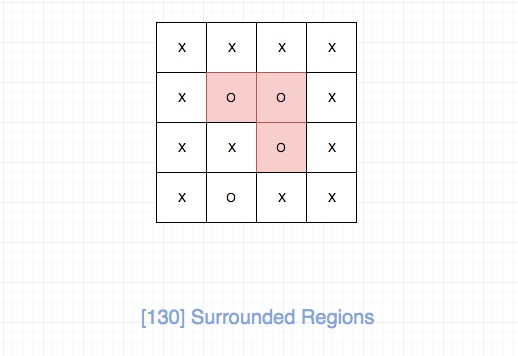
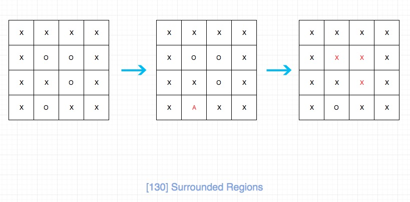

## 题目地址

https://leetcode.com/problems/surrounded-regions/description/

## 题目描述

```
Given a 2D board containing 'X' and 'O' (the letter O), capture all regions surrounded by 'X'.

A region is captured by flipping all 'O's into 'X's in that surrounded region.

Example:

X X X X
X O O X
X X O X
X O X X
After running your function, the board should be:

X X X X
X X X X
X X X X
X O X X
Explanation:

Surrounded regions shouldn’t be on the border, which means that any 'O' on the border of the board are not flipped to 'X'. Any 'O' that is not on the border and it is not connected to an 'O' on the border will be flipped to 'X'. Two cells are connected if they are adjacent cells connected horizontally or vertically.

```

## 思路

我们需要将所有被X包围的O变成X，并且题目明确说了边缘的所有O都是不可以变成X的。



其实我们观察会发现，我们除了边缘的O以及和边缘O连通的O是不需要变成X的，其他都要变成X。

经过上面的思考，问题转化为连通区域问题。 这里我们需要标记一下`边缘的O以及和边缘O连通的O`。
我们当然可以用额外的空间去存，但是对于这道题目而言，我们完全可以mutate。这样就空间复杂度会好一点。

整个过程如图所示：

> 我将`边缘的O以及和边缘O连通的O` 标记为了 "A"




## 关键点解析

- 二维数组DFS解题模板
- 转化问题为`连通区域问题`
- 直接mutate原数组，节省空间

## 代码

```js


/*
 * @lc app=leetcode id=130 lang=javascript
 *
 * [130] Surrounded Regions
 */
// 将O以及周边的O转化为A
function mark(board, i, j, rows, cols) {
  if (i < 0 || i > rows - 1 || j < 0 || j > cols - 1 || board[i][j] !== "O")
    return;

  board[i][j] = "A";
  mark(board, i + 1, j, rows, cols);
  mark(board, i - 1, j, rows, cols);
  mark(board, i, j + 1, rows, cols);
  mark(board, i, j - 1, rows, cols);
}
/**
 * @param {character[][]} board
 * @return {void} Do not return anything, modify board in-place instead.
 */
var solve = function(board) {
  const rows = board.length;
  if (rows === 0) return [];
  const cols = board[0].length;

  for (let i = 0; i < rows; i++) {
    for (let j = 0; j < cols; j++) {
      if (i === 0 || i == rows - 1 || j === 0 || j === cols - 1) {
        mark(board, i, j, rows, cols);
      }
    }
  }

  for (let i = 0; i < rows; i++) {
    for (let j = 0; j < cols; j++) {
      if (board[i][j] === "O") {
        board[i][j] = "X";
      } else if (board[i][j] === "A") {
        board[i][j] = "O";
      }
    }
  }

  return board;
};
```

## 相关题目

- [200.number-of-islands](./200.number-of-islands.md)

> 解题模板是一样的


