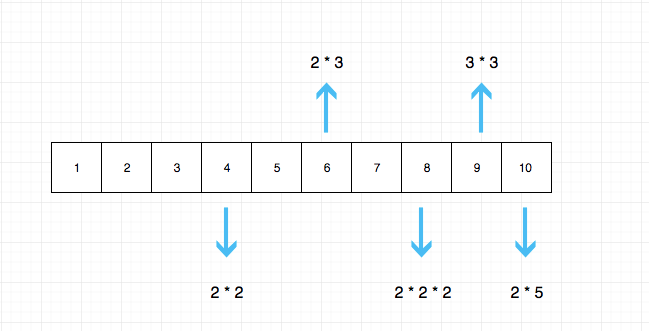
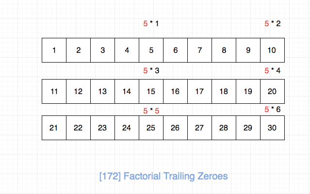

## 题目地址
https://leetcode.com/problems/factorial-trailing-zeroes/description/

## 题目描述

```
Given an integer n, return the number of trailing zeroes in n!.

Example 1:

Input: 3
Output: 0
Explanation: 3! = 6, no trailing zero.
Example 2:

Input: 5
Output: 1
Explanation: 5! = 120, one trailing zero.
Note: Your solution should be in logarithmic time complexity.

```

## 思路

我们需要求解这n个数字相乘的结果末尾有多少个0，由于题目要求log的复杂度，因此暴力求解是不行的。

通过观察，我们发现如果想要结果末尾是0，必须是分解质因数之后，2 和 5 相乘才行，同时因数分解之后发现5的个数远小于2，
因此我们只需要求解这n数字分解质因数之后一共有多少个5即可.



如图如果n为30，那么结果应该是图中红色5的个数，即7。



我们的结果并不是直接f(n) = n / 5, 比如n为30， 25中是有两个5的。
类似，n为150，会有7个这样的数字，通过观察我们发现规律`f(n) = n/5 + n/5^2 + n/5^3 + n/5^4 + n/5^5+..`


如果可以发现上面的规律，用递归还是循环实现这个算式就看你的了。
## 关键点解析

- 数论

## 代码

* 语言支持：JS，Python

Javascript Code:

```js
/*
 * @lc app=leetcode id=172 lang=javascript
 *
 * [172] Factorial Trailing Zeroes
 */
/**
 * @param {number} n
 * @return {number}
 */
var trailingZeroes = function(n) {
  // tag: 数论

  // if (n === 0) return n;

  // 递归： f(n) = n / 5 + f(n / 5)
  // return Math.floor(n / 5)  + trailingZeroes(Math.floor(n / 5));
  let count = 0;
  while (n >= 5) {
    count += Math.floor(n / 5);
    n = Math.floor(n / 5);
  }
  return count;
};
```

Python Code:

```python
class Solution:
    def trailingZeroes(self, n: int) -> int:
        count = 0
        while n >= 5:
            n = n // 5
            count += n
        return count


# 递归
class Solution:
    def trailingZeroes(self, n: int) -> int:
        if n == 0: return 0
        return n // 5 + self.trailingZeroes(n // 5)
```
