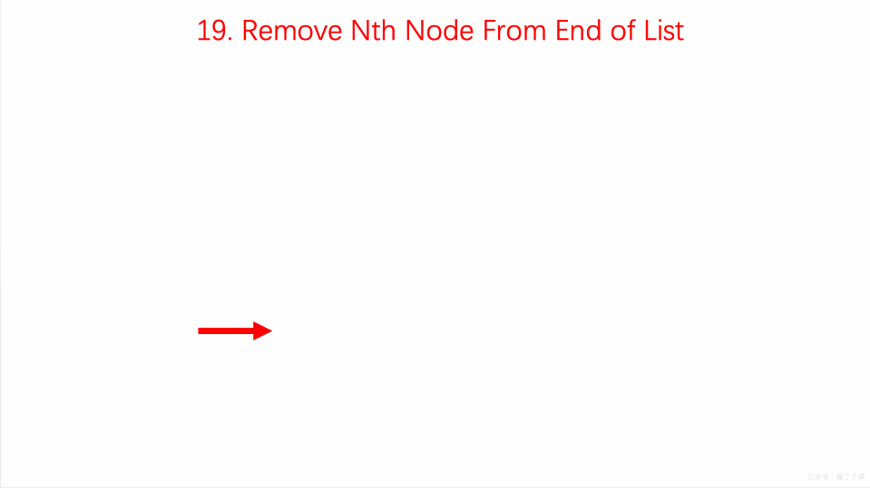

## 题目地址
https://leetcode.com/problems/remove-nth-node-from-end-of-list/description

## 题目描述
Given a linked list, remove the n-th node from the end of list and return its head.

Example:

Given linked list: 1->2->3->4->5, and n = 2.

After removing the second node from the end, the linked list becomes 1->2->3->5.
Note:

Given n will always be valid.

Follow up:

Could you do this in one pass?

## 思路

双指针，指针A先移动n次， 指针B再开始移动。当A到达null的时候， 指针b的位置正好是倒数n

我们可以设想假设设定了双指针p和q的话，当q指向末尾的NULL，p与q之间相隔的元素个数为n时，那么删除掉p的下一个指针就完成了要求。

设置虚拟节点dummyHead指向head

设定双指针p和q，初始都指向虚拟节点dummyHead

移动q，直到p与q之间相隔的元素个数为n

同时移动p与q，直到q指向的为NULL

将p的下一个节点指向下下个节点




(图片来自： https://github.com/MisterBooo/LeetCodeAnimation)

## 关键点解析

1. 链表这种数据结构的特点和使用

2. 使用双指针

3. 使用一个dummyHead简化操作

## 代码


```js
/*
 * @lc app=leetcode id=19 lang=javascript
 *
 * [19] Remove Nth Node From End of List
 *
 * https://leetcode.com/problems/remove-nth-node-from-end-of-list/description/
 *
 * algorithms
 * Medium (34.03%)
 * Total Accepted:    360.1K
 * Total Submissions: 1.1M
 * Testcase Example:  '[1,2,3,4,5]\n2'
 *
 * Given a linked list, remove the n-th node from the end of list and return
 * its head.
 * 
 * Example:
 * 
 * 
 * Given linked list: 1->2->3->4->5, and n = 2.
 * 
 * After removing the second node from the end, the linked list becomes
 * 1->2->3->5.
 * 
 * 
 * Note:
 * 
 * Given n will always be valid.
 * 
 * Follow up:
 * 
 * Could you do this in one pass?
 * 
 */
/**
 * Definition for singly-linked list.
 * function ListNode(val) {
 *     this.val = val;
 *     this.next = null;
 * }
 */
/**
 * @param {ListNode} head
 * @param {number} n
 * @return {ListNode}
 */
var removeNthFromEnd = function(head, n) {
  let i = -1;
  const noop = {
    next: null
  };

  const dummyHead = new ListNode(); // 增加一个dummyHead 简化操作
  dummyHead.next = head;

  let currentP1 = dummyHead;
  let currentP2 = dummyHead;

  
  while (currentP1) {

    if (i === n) {
      currentP2 = currentP2.next;
    }

    if (i !== n) {
        i++;
    }
    
    currentP1 = currentP1.next;
  }

  currentP2.next = ((currentP2 || noop).next || noop).next;

  return dummyHead.next;
};

```