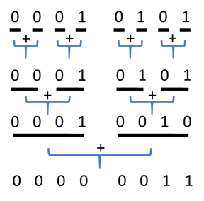

## 题目地址
https://leetcode.com/problems/number-of-1-bits/description/

## 题目描述

```
Write a function that takes an unsigned integer and return the number of '1' bits it has (also known as the Hamming weight).

 

Example 1:

Input: 00000000000000000000000000001011
Output: 3
Explanation: The input binary string 00000000000000000000000000001011 has a total of three '1' bits.
Example 2:

Input: 00000000000000000000000010000000
Output: 1
Explanation: The input binary string 00000000000000000000000010000000 has a total of one '1' bit.
Example 3:

Input: 11111111111111111111111111111101
Output: 31
Explanation: The input binary string 11111111111111111111111111111101 has a total of thirty one '1' bits.
 

Note:

Note that in some languages such as Java, there is no unsigned integer type. In this case, the input will be given as signed integer type and should not affect your implementation, as the internal binary representation of the integer is the same whether it is signed or unsigned.
In Java, the compiler represents the signed integers using 2's complement notation. Therefore, in Example 3 above the input represents the signed integer -3.

```

## 思路

这个题目的大意是： 给定一个无符号的整数， 返回其用二进制表式的时候的1的个数。

这里用一个trick， 可以轻松求出。 就是`n & (n - 1)` 可以`消除` n 最后的一个1的原理。 

> 为什么能消除最后一个1， 其实也比较简单，大家自己想一下

这样我们可以不断进行`n = n & (n - 1)`直到n === 0 ， 说明没有一个1了。 
这个时候`我们消除了多少1变成一个1都没有了， 就说明n有多少个1了`。

## 关键点解析

1. `n & (n - 1)` 可以`消除` n 最后的一个1的原理 简化操作

2. bit 运算


## 代码

语言支持：JS, C++

JavaScript Code:

```js
/*
 * @lc app=leetcode id=191 lang=javascript
 *
 * [191] Number of 1 Bits
 *
 * https://leetcode.com/problems/number-of-1-bits/description/
 *
 * algorithms
 * Easy (42.10%)
 * Total Accepted:    247.4K
 * Total Submissions: 583.3K
 * Testcase Example:  '00000000000000000000000000001011'
 *
 * Write a function that takes an unsigned integer and return the number of '1'
 * bits it has (also known as the Hamming weight).
 *
 *
 *
 * Example 1:
 *
 *
 * Input: 00000000000000000000000000001011
 * Output: 3
 * Explanation: The input binary string 00000000000000000000000000001011 has a
 * total of three '1' bits.
 *
 *
 * Example 2:
 *
 *
 * Input: 00000000000000000000000010000000
 * Output: 1
 * Explanation: The input binary string 00000000000000000000000010000000 has a
 * total of one '1' bit.
 *
 *
 * Example 3:
 *
 *
 * Input: 11111111111111111111111111111101
 * Output: 31
 * Explanation: The input binary string 11111111111111111111111111111101 has a
 * total of thirty one '1' bits.
 *
 *
 *
 * Note:
 *
 *
 * Note that in some languages such as Java, there is no unsigned integer type.
 * In this case, the input will be given as signed integer type and should not
 * affect your implementation, as the internal binary representation of the
 * integer is the same whether it is signed or unsigned.
 * In Java, the compiler represents the signed integers using 2's complement
 * notation. Therefore, in Example 3 above the input represents the signed
 * integer -3.
 *
 *
 *
 *
 * Follow up:
 *
 * If this function is called many times, how would you optimize it?
 *
 */
/**
 * @param {number} n - a positive integer
 * @return {number}
 */
var hammingWeight = function(n) {
  let count = 0;
  while (n !== 0) {
    n = n & (n - 1);
    count++;
  }

  return count;
};

```
C++ code:
```c++
class Solution {
public:
    int hammingWeight(uint32_t v) {
        auto count = 0;
        while (v != 0) {
            v &= (v - 1);
            ++count;
        }
        return count;
    }
};
```

## 扩展
可以使用位操作来达到目的。例如8位的整数21:



C++ Code：
```c++
const uint32_t ODD_BIT_MASK = 0xAAAAAAAA;
const uint32_t EVEN_BIT_MASK = 0x55555555;
const uint32_t ODD_2BIT_MASK = 0xCCCCCCCC;
const uint32_t EVEN_2BIT_MASK = 0x33333333;
const uint32_t ODD_4BIT_MASK = 0xF0F0F0F0;
const uint32_t EVEN_4BIT_MASK = 0x0F0F0F0F;
const uint32_t ODD_8BIT_MASK = 0xFF00FF00;
const uint32_t EVEN_8BIT_MASK = 0x00FF00FF;
const uint32_t ODD_16BIT_MASK = 0xFFFF0000;
const uint32_t EVEN_16BIT_MASK = 0x0000FFFF;

class Solution {
public:

    int hammingWeight(uint32_t v) {
        v = (v & EVEN_BIT_MASK) + ((v & ODD_BIT_MASK) >> 1);
        v = (v & EVEN_2BIT_MASK) + ((v & ODD_2BIT_MASK) >> 2);
        v = (v & EVEN_4BIT_MASK) + ((v & ODD_4BIT_MASK) >> 4);
        v = (v & EVEN_8BIT_MASK) + ((v & ODD_8BIT_MASK) >> 8);
        return (v & EVEN_16BIT_MASK) + ((v & ODD_16BIT_MASK) >> 16);
    }
};
```
