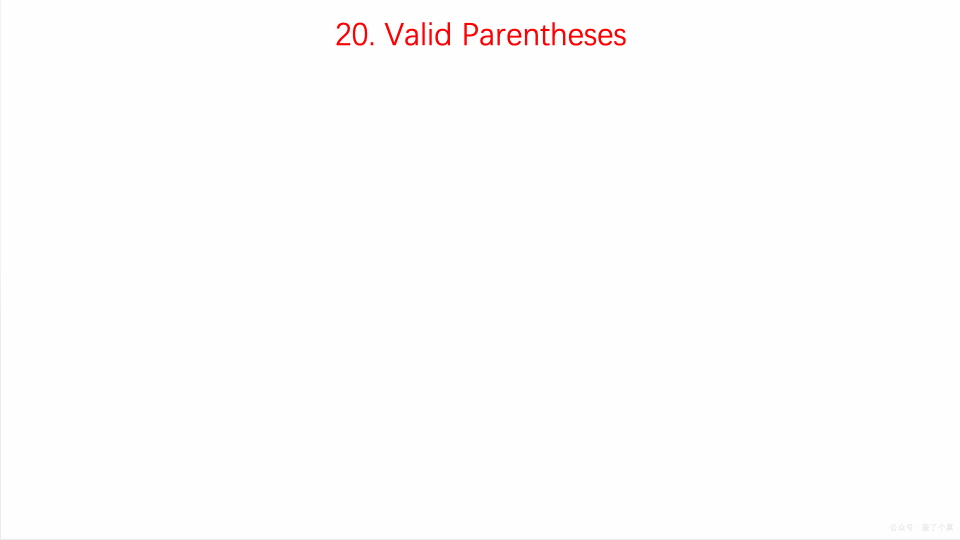

## 题目地址
https://leetcode.com/problems/valid-parentheses/description

## 题目描述

```
Given a string containing just the characters '(', ')', '{', '}', '[' and ']', determine if the input string is valid.

An input string is valid if:

Open brackets must be closed by the same type of brackets.
Open brackets must be closed in the correct order.
Note that an empty string is also considered valid.

Example 1:

Input: "()"
Output: true
Example 2:

Input: "()[]{}"
Output: true
Example 3:

Input: "(]"
Output: false
Example 4:

Input: "([)]"
Output: false
Example 5:

Input: "{[]}"
Output: true
```

## 思路

关于这道题的思路，邓俊辉讲的非常好，没有看过的同学可以看一下, [视频地址](http://www.xuetangx.com/courses/course-v1:TsinghuaX+30240184+sp/courseware/ad1a23c053df4501a3facd66ef6ccfa9/8d6f450e7f7a445098ae1d507fda80f6/)。

使用栈,遍历输入字符串

如果当前字符为左半边括号时，则将其压入栈中

如果遇到右半边括号时，分类讨论：

1）如栈不为空且为对应的左半边括号，则取出栈顶元素，继续循环  

2）若此时栈为空，则直接返回false

3）若不为对应的左半边括号，反之返回false




(图片来自： https://github.com/MisterBooo/LeetCodeAnimation)

> 值得注意的是，如果题目要求只有一种括号，那么我们其实可以使用更简洁，更省内存的方式 - 计数器来进行求解，而
不必要使用栈。

> 事实上，这类问题还可以进一步扩展，我们可以去解析类似HTML等标记语法， 比如 <p></p> <body></body>

## 关键点解析

1. 栈的基本特点和操作
2. 如果你用的是JS没有现成的栈，可以用数组来模拟
入： push  出:  pop

> 入： push  出 shift 就是队列
## 代码

* 语言支持：JS，Python

Javascript Code:
```js
/*
 * @lc app=leetcode id=20 lang=javascript
 *
 * [20] Valid Parentheses
 *
 * https://leetcode.com/problems/valid-parentheses/description/
 *
 * algorithms
 * Easy (35.97%)
 * Total Accepted:    530.2K
 * Total Submissions: 1.5M
 * Testcase Example:  '"()"'
 *
 * Given a string containing just the characters '(', ')', '{', '}', '[' and
 * ']', determine if the input string is valid.
 * 
 * An input string is valid if:
 * 
 * 
 * Open brackets must be closed by the same type of brackets.
 * Open brackets must be closed in the correct order.
 * 
 * 
 * Note that an empty string is also considered valid.
 * 
 * Example 1:
 * 
 * 
 * Input: "()"
 * Output: true
 * 
 * 
 * Example 2:
 * 
 * 
 * Input: "()[]{}"
 * Output: true
 * 
 * 
 * Example 3:
 * 
 * 
 * Input: "(]"
 * Output: false
 * 
 * 
 * Example 4:
 * 
 * 
 * Input: "([)]"
 * Output: false
 * 
 * 
 * Example 5:
 * 
 * 
 * Input: "{[]}"
 * Output: true
 * 
 * 
 */
/**
 * @param {string} s
 * @return {boolean}
 */
var isValid = function(s) {
    let valid = true;
    const stack = [];
    const mapper = {
        '{': "}",
        "[": "]",
        "(": ")"
    }
    
    for(let i in s) {
        const v = s[i];
        if (['(', '[', '{'].indexOf(v) > -1) {
            stack.push(v);
        } else {
            const peak = stack.pop();
            if (v !== mapper[peak]) {
                return false;
            }
        }
    }

    if (stack.length > 0) return false;

    return valid;
};
```
Python Code:
```
    class Solution:
        def isValid(self,s):
          stack = []
          map = {
            "{":"}",
            "[":"]",
            "(":")"
          }
          for x in s:
            if x in map:
              stack.append(map[x])
            else:
              if len(stack)!=0:
                top_element = stack.pop()
                if x != top_element:
                  return False
                else:
                  continue
              else:
                return False
          return len(stack) == 0
```

## 扩展
如果让你检查XML标签是否闭合如何检查， 更进一步如果要你实现一个简单的XML的解析器，应该怎么实现？
