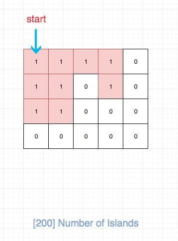

## 题目地址

https://leetcode.com/problems/number-of-islands/description/

## 题目描述

```
Given a 2d grid map of '1's (land) and '0's (water), count the number of islands. An island is surrounded by water and is formed by connecting adjacent lands horizontally or vertically. You may assume all four edges of the grid are all surrounded by water.

Example 1:

Input:
11110
11010
11000
00000

Output: 1
Example 2:

Input:
11000
11000
00100
00011

Output: 3

```

## 前置知识

- DFS
  
## 思路

如图，我们其实就是要求红色区域的个数，换句话说就是求连续区域的个数。



符合直觉的做法是用DFS来解：

- 我们需要建立一个 visited 数组用来记录某个位置是否被访问过。
- 对于一个为 `1` 且未被访问过的位置，我们递归进入其上下左右位置上为 `1` 的数，将其 visited 变成 true。
- 重复上述过程
- 找完相邻区域后，我们将结果 res 自增1，然后我们在继续找下一个为 `1` 且未被访问过的位置，直至遍历完.

但是这道题目只是让我们求连通区域的个数，因此我们其实不需要额外的空间去存储visited信息。
注意到上面的过程，我们对于数字为0的其实不会进行操作的，也就是对我们“没用”。 因此对于已经访问的元素，
我们可以将其置为0即可。


## 关键点解析

- 二维数组DFS解题模板
- 将已经访问的元素置为0，省去visited的空间开销

## 代码

* 语言支持：JS, python3，Java

Java Code：

```java
   public int numIslands(char[][] grid) {
        if (grid == null || grid.length == 0 || grid[0].length == 0) return 0;

        int count = 0;
        for (int row = 0; row < grid.length; row++) {
            for (int col = 0; col < grid[0].length; col++) {
                if (grid[row][col] == '1') {
                    dfs(grid, row, col);
                    count++;
                }
            }
        }
        return count;
    }

    private void dfs(char[][] grid,int row,int col) {
        if (row<0||row== grid.length||col<0||col==grid[0].length||grid[row][col]!='1') {
            return;
        }
        grid[row][col] = '0';
        dfs(grid, row-1, col);
        dfs(grid, row+1, col);
        dfs(grid, row, col+1);
        dfs(grid, row, col-1);
    }
```

Javascript Code:
```js
/*
 * @lc app=leetcode id=200 lang=javascript
 *
 * [200] Number of Islands
 */
function helper(grid, i, j, rows, cols) {
  if (i < 0 || j < 0 || i > rows - 1 || j > cols - 1 || grid[i][j] === "0")
    return;

  grid[i][j] = "0";

  helper(grid, i + 1, j, rows, cols);
  helper(grid, i, j + 1, rows, cols);
  helper(grid, i - 1, j, rows, cols);
  helper(grid, i, j - 1, rows, cols);
}
/**
 * @param {character[][]} grid
 * @return {number}
 */
var numIslands = function(grid) {
  let res = 0;
  const rows = grid.length;
  if (rows === 0) return 0;
  const cols = grid[0].length;
  for (let i = 0; i < rows; i++) {
    for (let j = 0; j < cols; j++) {
      if (grid[i][j] === "1") {
        helper(grid, i, j, rows, cols);
        res++;
      }
    }
  }
  return res;
};
```

python code:

``` python
class Solution:
    def numIslands(self, grid: List[List[str]]) -> int:
        if not grid: return 0
        
        count = 0
        for i in range(len(grid)):
            for j in range(len(grid[0])):
                if grid[i][j] == '1':
                    self.dfs(grid, i, j)
                    count += 1
                    
        return count
    
    def dfs(self, grid, i, j):
        if i < 0 or j < 0 or i >= len(grid) or j >= len(grid[0]) or grid[i][j] != '1':
            return 
        grid[i][j] = '0'
        self.dfs(grid, i + 1, j)
        self.dfs(grid, i - 1, j)
        self.dfs(grid, i, j + 1)
        self.dfs(grid, i, j - 1)

```

**复杂度分析**
- 时间复杂度：$O(m * n)$
- 空间复杂度：$O(m * n)$

欢迎关注我的公众号《脑洞前端》获取更多更新鲜的LeetCode题解


## 相关题目

- [695. 岛屿的最大面积](https://leetcode-cn.com/problems/max-area-of-island/solution/695-dao-yu-de-zui-da-mian-ji-dfspython3-by-fe-luci/)
