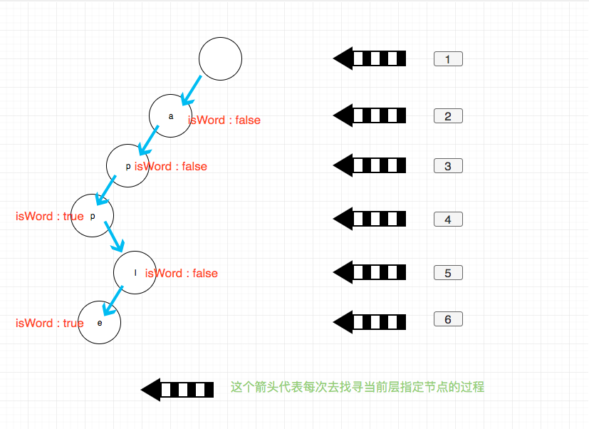

## 题目地址

https://leetcode.com/problems/implement-trie-prefix-tree/description/

## 题目描述

```
Implement a trie with insert, search, and startsWith methods.

Example:

Trie trie = new Trie();

trie.insert("apple");
trie.search("apple");   // returns true
trie.search("app");     // returns false
trie.startsWith("app"); // returns true
trie.insert("app");
trie.search("app");     // returns true
Note:

You may assume that all inputs are consist of lowercase letters a-z.
All inputs are guaranteed to be non-empty strings.

```

## 思路

这是一道很直接的题目，上来就让你实现`前缀树（字典树）`。这算是基础数据结构中的
知识了，不清楚什么是字典树的可以查阅相关资料。

我们看到题目给出的使用方法`new Trie`, `insert`,`search`和`startWith`.

为了区分`search`和`startWith`我们需要增加一个标示来区分当前节点是否是某个单词的结尾。
因此节点的数据结构应该是:

```js
function TrieNode(val) {
  this.val = val; // 当前的字母
  this.children = []; // 题目要求字典仅有a-z，那么其长度最大为26（26个字母）
  this.isWord = false;
}
```

每次 insert 我们其实都是从根节点出发，一个一个找到我们需要添加的节点，修改 children 的值.

我们应该修改哪一个 child 呢？ 我们需要一个函数来计算索引

```js
function computeIndex(c) {
  return c.charCodeAt(0) - "a".charCodeAt(0);
}
```

其实不管 insert， search 和 startWith 的逻辑都是差不多的，都是从 root 出发，
找到我们需要操作的 child， 然后进行相应操作（添加，修改，返回）。



## 关键点解析

- 前缀树

- 核心逻辑

```js
 const c = word[i];
 const current = computeIndex(c)
if (!ws.children[current]) {
    ws.children[current] = new TrieNode(c);
  }
  ws = ws.children[current]; // 深度递增
}

```

## 代码

```js
/*
 * @lc app=leetcode id=208 lang=javascript
 *
 * [208] Implement Trie (Prefix Tree)
 *
 * https://leetcode.com/problems/implement-trie-prefix-tree/description/
 *
 * algorithms
 * Medium (36.93%)
 * Total Accepted:    172K
 * Total Submissions: 455.5K
 * Testcase Example:  '["Trie","insert","search","search","startsWith","insert","search"]\n[[],["apple"],["apple"],["app"],["app"],["app"],["app"]]'
 *
 * Implement a trie with insert, search, and startsWith methods.
 *
 * Example:
 *
 *
 * Trie trie = new Trie();
 *
 * trie.insert("apple");
 * trie.search("apple");   // returns true
 * trie.search("app");     // returns false
 * trie.startsWith("app"); // returns true
 * trie.insert("app");
 * trie.search("app");     // returns true
 *
 *
 * Note:
 *
 *
 * You may assume that all inputs are consist of lowercase letters a-z.
 * All inputs are guaranteed to be non-empty strings.
 *
 *
 */
function TrieNode(val) {
  this.val = val;
  this.children = [];
  this.isWord = false;
}

function computeIndex(c) {
  return c.charCodeAt(0) - "a".charCodeAt(0);
}
/**
 * Initialize your data structure here.
 */
var Trie = function() {
  this.root = new TrieNode(null);
};

/**
 * Inserts a word into the trie.
 * @param {string} word
 * @return {void}
 */
Trie.prototype.insert = function(word) {
  let ws = this.root;
  for (let i = 0; i < word.length; i++) {
    const c = word[i];
    const current = computeIndex(c);
    if (!ws.children[current]) {
      ws.children[current] = new TrieNode(c);
    }
    ws = ws.children[current];
  }
  ws.isWord = true;
};

/**
 * Returns if the word is in the trie.
 * @param {string} word
 * @return {boolean}
 */
Trie.prototype.search = function(word) {
  let ws = this.root;
  for (let i = 0; i < word.length; i++) {
    const c = word[i];
    const current = computeIndex(c);
    if (!ws.children[current]) return false;
    ws = ws.children[current];
  }
  return ws.isWord;
};

/**
 * Returns if there is any word in the trie that starts with the given prefix.
 * @param {string} prefix
 * @return {boolean}
 */
Trie.prototype.startsWith = function(prefix) {
  let ws = this.root;
  for (let i = 0; i < prefix.length; i++) {
    const c = prefix[i];
    const current = computeIndex(c);
    if (!ws.children[current]) return false;
    ws = ws.children[current];
  }
  return true;
};

/**
 * Your Trie object will be instantiated and called as such:
 * var obj = new Trie()
 * obj.insert(word)
 * var param_2 = obj.search(word)
 * var param_3 = obj.startsWith(prefix)
 */
```
