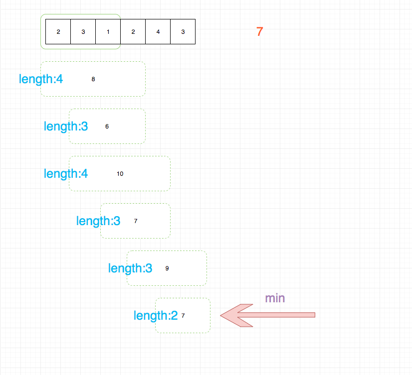

## 题目地址

https://leetcode.com/problems/minimum-size-subarray-sum/description/

## 题目描述

```
Given an array of n positive integers and a positive integer s, find the minimal length of a contiguous subarray of which the sum ≥ s. If there isn't one, return 0 instead.

Example:

Input: s = 7, nums = [2,3,1,2,4,3]
Output: 2
Explanation: the subarray [4,3] has the minimal length under the problem constraint.
Follow up:
If you have figured out the O(n) solution, try coding another solution of which the time complexity is O(n log n).

```

## 前置知识

- 滑动窗口
  
## 思路

用滑动窗口来记录序列， 每当滑动窗口中的 sum 超过 s， 就去更新最小值，并根据先进先出的原则更新滑动窗口，直至 sum 刚好小于 s



> 这道题目和 leetcode 3 号题目有点像，都可以用滑动窗口的思路来解决

## 关键点

- 滑动窗口简化操作(滑窗口适合用于求解这种要求`连续`的题目)

## 代码

- 语言支持：JS，C++，Python

Python Code：

```python

class Solution:
    def minSubArrayLen(self, s: int, nums: List[int]) -> int:
        l = total = 0
        ans = len(nums) + 1
        for r in range(len(nums)):
            total += nums[r]
            while total >= s:
                ans = min(ans, r - l + 1)
                total -= nums[l]
                l += 1
        return  0 if ans == len(nums) + 1 else ans
```


JavaScript Code：

```js
/*
 * @lc app=leetcode id=209 lang=javascript
 *
 * [209] Minimum Size Subarray Sum
 *
 */
/**
 * @param {number} s
 * @param {number[]} nums
 * @return {number}
 */
var minSubArrayLen = function(s, nums) {
  if (nums.length === 0) return 0;
  const slideWindow = [];
  let acc = 0;
  let min = null;

  for (let i = 0; i < nums.length + 1; i++) {
    const num = nums[i];

    while (acc >= s) {
      if (min === null || slideWindow.length < min) {
        min = slideWindow.length;
      }
      acc = acc - slideWindow.shift();
    }

    slideWindow.push(num);

    acc = slideWindow.reduce((a, b) => a + b, 0);
  }

  return min || 0;
};
```

C++ Code：

```C++
class Solution {
public:
    int minSubArrayLen(int s, vector<int>& nums) {
        int num_len= nums.size();
        int left=0, right=0, total=0, min_len= num_len+1;
        while (right < num_len) {
            do {
                total += nums[right++];
            } while (right < num_len && total < s);
            while (left < right && total - nums[left] >= s) total -= nums[left++];
            if (total >=s && min_len > right - left)
                min_len = right- left;
        }
        return min_len <= num_len ? min_len: 0;
    }
};
```

**复杂度分析**
- 时间复杂度：$O(N)$，其中 N 为数组大小。
- 空间复杂度：$O(1)$

欢迎关注我的公众号《脑洞前端》获取更多更新鲜的LeetCode题解


## 扩展

如果题目要求是 sum = s, 而不是 sum >= s 呢？

eg:

```js
var minSubArrayLen = function(s, nums) {
  if (nums.length === 0) return 0;
  const slideWindow = [];
  let acc = 0;
  let min = null;

  for (let i = 0; i < nums.length + 1; i++) {
    const num = nums[i];

    while (acc > s) {
      acc = acc - slideWindow.shift();
    }
    if (acc === s) {
      if (min === null || slideWindow.length < min) {
        min = slideWindow.length;
      }
      slideWindow.shift();
    }

    slideWindow.push(num);

    acc = slideWindow.reduce((a, b) => a + b, 0);
  }

  return min || 0;
};
```


