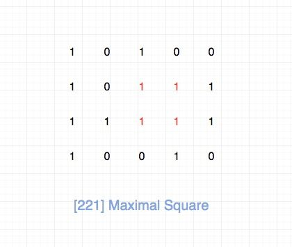
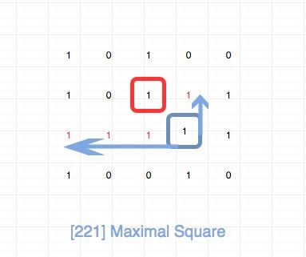
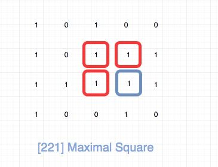

## 题目地址

https://leetcode.com/problems/maximal-square/

## 题目描述


```
Given a 2D binary matrix filled with 0's and 1's, find the largest square containing only 1's and return its area.

Example:

Input: 

1 0 1 0 0
1 0 1 1 1
1 1 1 1 1
1 0 0 1 0

Output: 4
```

## 前置知识

- 动态规划
- 递归
  
## 思路



符合直觉的做法是暴力求解处所有的正方形，逐一计算面积，然后记录最大的。这种时间复杂度很高。

我们考虑使用动态规划，我们使用dp[i][j]表示以matrix[i][j]为右下角的顶点的可以组成的最大正方形的边长。
那么我们只需要计算所有的i，j组合，然后求出最大值即可。

我们来看下dp[i][j] 怎么推导。 首先我们要看matrix[i][j], 如果matrix[i][j]等于0，那么就不用看了，直接等于0。
如果matrix[i][j]等于1，那么我们将matrix[[i][j]分别往上和往左进行延伸，直到碰到一个0为止。  

如图 dp[3][3] 的计算。 matrix[3][3]等于1，我们分别往上和往左进行延伸，直到碰到一个0为止，上面长度为1，左边为3。
dp[2][2]等于1（之前已经计算好了），那么其实这里的瓶颈在于三者的最小值, 即`Min(1, 1, 3)`, 也就是`1`。 那么dp[3][3] 就等于
`Min(1, 1, 3) + 1`。



dp[i - 1][j - 1]我们直接拿到，关键是`往上和往左进行延伸`, 最直观的做法是我们内层加一个循环去做就好了。
但是我们仔细观察一下，其实我们根本不需要这样算。 我们可以直接用dp[i - 1][j]和dp[i][j -1]。
具体就是`Min(dp[i - 1][j - 1], dp[i][j - 1], dp[i - 1][j]) + 1`。



事实上，这道题还有空间复杂度O(N)的解法，其中N指的是列数。
大家可以去这个[leetcode讨论](https://leetcode.com/problems/maximal-square/discuss/61803/C%2B%2B-space-optimized-DP)看一下。
## 关键点解析

- DP
- 递归公式可以利用dp[i - 1][j]和dp[i][j -1]的计算结果，而不用重新计算
- 空间复杂度可以降低到O(n), n为列数

## 代码

代码支持：Python，JavaScript：

Python Code：

```python
class Solution:
    def maximalSquare(self, matrix: List[List[str]]) -> int:
        res = 0
        m = len(matrix)
        if m == 0:
            return 0
        n = len(matrix[0])
        dp = [[0] * (n + 1) for _ in range(m + 1)]

        for i in range(1, m + 1):
            for j in range(1, n + 1):
                dp[i][j] = min(dp[i - 1][j], dp[i][j - 1], dp[i - 1][j - 1]) + 1 if matrix[i - 1][j - 1] == "1" else 0
                res = max(res, dp[i][j])
        return res ** 2
```


JavaScript Code：

```js

/*
 * @lc app=leetcode id=221 lang=javascript
 *
 * [221] Maximal Square
 */
/**
 * @param {character[][]} matrix
 * @return {number}
 */
var maximalSquare = function(matrix) {
  if (matrix.length === 0) return 0;
  const dp = [];
  const rows = matrix.length;
  const cols = matrix[0].length;
  let max = Number.MIN_VALUE;

  for (let i = 0; i < rows + 1; i++) {
    if (i === 0) {
      dp[i] = Array(cols + 1).fill(0);
    } else {
      dp[i] = [0];
    }
  }

  for (let i = 1; i < rows + 1; i++) {
    for (let j = 1; j < cols + 1; j++) {
      if (matrix[i - 1][j - 1] === "1") {
        dp[i][j] = Math.min(dp[i - 1][j - 1], dp[i - 1][j], dp[i][j - 1]) + 1;
        max = Math.max(max, dp[i][j]);
      } else {
        dp[i][j] = 0;
      }
    }
  }

  return max * max;
};
```


***复杂度分析***

- 时间复杂度：$O(M * N)$，其中M为行数，N为列数。
- 空间复杂度：$O(M * N)$，其中M为行数，N为列数。
