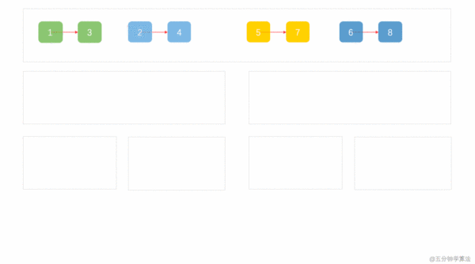

## 题目地址
https://leetcode.com/problems/merge-k-sorted-lists/description

## 题目描述

```
Merge k sorted linked lists and return it as one sorted list. Analyze and describe its complexity.

Example:

Input:
[
  1->4->5,
  1->3->4,
  2->6
]
Output: 1->1->2->3->4->4->5->6

```

## 思路

这道题目是合并k个已排序的链表，号称leetcode目前`最难`的链表题。 和之前我们解决的[88.merge-sorted-array](./88.merge-sorted-array.md)很像。
他们有两点区别：

1. 这道题的数据结构是链表，那道是数组。这个其实不复杂，毕竟都是线性的数据结构。

2. 这道题需要合并k个元素，那道则只需要合并两个。这个是两题的关键差别，也是这道题难度为`hard`的原因。

因此我们可以看出，这道题目是`88.merge-sorted-array`的进阶版本。其实思路也有点像，我们来具体分析下第二条。
如果你熟悉合并排序的话，你会发现它就是`合并排序的一部分`。

具体我们可以来看一个动画



（动画来自 https://zhuanlan.zhihu.com/p/61796021）
## 关键点解析

- 分治
- 合并排序(merge sort)

## 代码
```js
/*
 * @lc app=leetcode id=23 lang=javascript
 *
 * [23] Merge k Sorted Lists
 *
 * https://leetcode.com/problems/merge-k-sorted-lists/description/
 *
 * algorithms
 * Hard (33.14%)
 * Total Accepted:    373.7K
 * Total Submissions: 1.1M
 * Testcase Example:  '[[1,4,5],[1,3,4],[2,6]]'
 *
 * Merge k sorted linked lists and return it as one sorted list. Analyze and
 * describe its complexity.
 *
 * Example:
 *
 *
 * Input:
 * [
 * 1->4->5,
 * 1->3->4,
 * 2->6
 * ]
 * Output: 1->1->2->3->4->4->5->6
 *
 *
 */
function mergeTwoLists(l1, l2) {
  const dummyHead = {};
  let current = dummyHead;
  // l1: 1 -> 3 -> 5
  // l2: 2 -> 4 -> 6
  while (l1 !== null && l2 !== null) {
    if (l1.val < l2.val) {
      current.next = l1; // 把小的添加到结果链表
      current = current.next; // 移动结果链表的指针
      l1 = l1.next; // 移动小的那个链表的指针
    } else {
      current.next = l2;
      current = current.next;
      l2 = l2.next;
    }
  }

  if (l1 === null) {
    current.next = l2;
  } else {
    current.next = l1;
  }
  return dummyHead.next;
}
/**
 * Definition for singly-linked list.
 * function ListNode(val) {
 *     this.val = val;
 *     this.next = null;
 * }
 */
/**
 * @param {ListNode[]} lists
 * @return {ListNode}
 */
var mergeKLists = function(lists) {
  // 图参考： https://zhuanlan.zhihu.com/p/61796021
  if (lists.length === 0) return null;
  if (lists.length === 1) return lists[0];
  if (lists.length === 2) {
    return mergeTwoLists(lists[0], lists[1]);
  }

  const mid = lists.length >> 1;
  const l1 = [];
  for (let i = 0; i < mid; i++) {
    l1[i] = lists[i];
  }

  const l2 = [];
  for (let i = mid, j = 0; i < lists.length; i++, j++) {
    l2[j] = lists[i];
  }

  return mergeTwoLists(mergeKLists(l1), mergeKLists(l2));
};
```

## 相关题目

-[88.merge-sorted-array](./88.merge-sorted-array.md)
