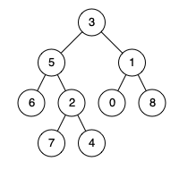
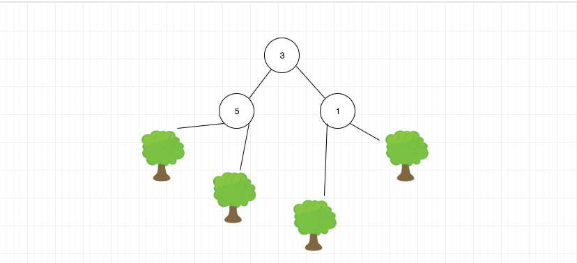

## 题目地址

https://leetcode.com/problems/lowest-common-ancestor-of-a-binary-tree/description/

## 题目描述

```
Given a binary tree, find the lowest common ancestor (LCA) of two given nodes in the tree.

According to the definition of LCA on Wikipedia: “The lowest common ancestor is defined between two nodes p and q as the lowest node in T that has both p and q as descendants (where we allow a node to be a descendant of itself).”

Given the following binary tree:  root = [3,5,1,6,2,0,8,null,null,7,4]

```


```
Example 1:

Input: root = [3,5,1,6,2,0,8,null,null,7,4], p = 5, q = 1
Output: 3
Explanation: The LCA of nodes 5 and 1 is 3.
Example 2:

Input: root = [3,5,1,6,2,0,8,null,null,7,4], p = 5, q = 4
Output: 5
Explanation: The LCA of nodes 5 and 4 is 5, since a node can be a descendant of itself according to the LCA definition.
 

Note:

All of the nodes' values will be unique.
p and q are different and both values will exist in the binary tree.
```

## 前置知识

- 递归
  
## 思路

这道题目是求解二叉树中，两个给定节点的最近的公共祖先。是一道非常经典的二叉树题目。

我们之前说过树是一种递归的数据结构，因此使用递归方法解决二叉树问题从写法上来看是最简单的，这道题目也不例外。

用递归的思路去思考树是一种非常重要的能力。


如果大家这样去思考的话，问题就会得到简化，我们的目标就是分别在左右子树进行查找p和q。 如果p没有在左子树，那么它一定在右子树（题目限定p一定在树中），
反之亦然。

对于具体的代码而言就是，我们假设这个树就一个结构，然后尝试去解决，然后在适当地方去递归自身即可。 如下图所示：



我们来看下核心代码：

```js
  // 如果我们找到了p，直接进行返回，那如果下面就是q呢？ 其实这没有影响，但是还是要多考虑一下
  if (!root || root === p || root === q) return root;
  const left = lowestCommonAncestor(root.left, p, q); // 去左边找，我们期望返回找到的节点
  const right = lowestCommonAncestor(root.right, p, q);// 去右边找，我们期望返回找到的节点
  if (!left) return right; // 左子树找不到，返回右子树
  if (!right) return left; // 右子树找不到，返回左子树
  return root; // 左右子树分别有一个，则返回root

```

> 如果没有明白的话，请多花时间消化一下

## 关键点解析

- 用递归的思路去思考树

## 代码

代码支持： JavaScript， Python3

- JavaScript Code:

```js
/**
 * Definition for a binary tree node.
 * function TreeNode(val) {
 *     this.val = val;
 *     this.left = this.right = null;
 * }
 */
/**
 * @param {TreeNode} root
 * @param {TreeNode} p
 * @param {TreeNode} q
 * @return {TreeNode}
 */
var lowestCommonAncestor = function(root, p, q) {
  if (!root || root === p || root === q) return root;
  const left = lowestCommonAncestor(root.left, p, q);
  const right = lowestCommonAncestor(root.right, p, q);
  if (!left) return right; // 左子树找不到，返回右子树
  if (!right) return left; // 右子树找不到，返回左子树
  return root; // 左右子树分别有一个，则返回root
};
```

- Python Code:

``` python
# Definition for a binary tree node.
# class TreeNode:
#     def __init__(self, x):
#         self.val = x
#         self.left = None
#         self.right = None

class Solution:
    def lowestCommonAncestor(self, root: 'TreeNode', p: 'TreeNode', q: 'TreeNode') -> 'TreeNode':
        if not root or root == p or root == q:
            return root
        left = self.lowestCommonAncestor(root.left, p, q)
        right = self.lowestCommonAncestor(root.right, p, q)
        
        if not left:
            return right
        if not right:
            return left
        else:
            return root

```

## 扩展
如果递归的结束条件改为`if (!root || root.left === p || root.right === q) return root;` 代表的是什么意思，对结果有什么样的影响？

