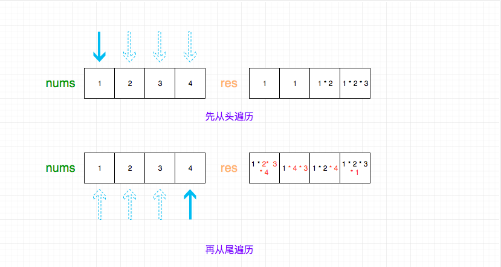

## 题目地址（238. 除自身以外数组的乘积）

https://leetcode.com/problems/product-of-array-except-self/description/

## 题目描述

```
给你一个长度为 n 的整数数组 nums，其中 n > 1，返回输出数组 output ，其中 output[i] 等于 nums 中除 nums[i] 之外其余各元素的乘积。

 

示例:

输入: [1,2,3,4]
输出: [24,12,8,6]
 

提示：题目数据保证数组之中任意元素的全部前缀元素和后缀（甚至是整个数组）的乘积都在 32 位整数范围内。

说明: 请不要使用除法，且在 O(n) 时间复杂度内完成此题。

进阶：
你可以在常数空间复杂度内完成这个题目吗？（ 出于对空间复杂度分析的目的，输出数组不被视为额外空间。）


```

## 前置知识

- 数组
  
## 思路

这道题的意思是给定一个数组，返回一个新的数组，这个数组每一项都是其他项的乘积。 
符合直觉的思路是两层循环，时间复杂度是O(n^2),但是题目要求`Please solve it without division and in O(n)`。

因此我们需要换一种思路，由于输出的每一项都需要用到别的元素，因此一次遍历是绝对不行的。 
考虑我们先进行一次遍历， 然后维护一个数组，第i项代表前i个元素（不包括i）的乘积。
然后我们反向遍历一次，然后维护另一个数组，同样是第i项代表前i个元素（不包括i）的乘积。



有意思的是第一个数组和第二个数组的反转（reverse）做乘法（有点像向量运算）就是我们想要的运算。

其实我们进一步观察，我们不需要真的创建第二个数组（第二个数组只是做中间运算使用），而是直接修改第一个数组即可。

## 关键点解析

- 两次遍历， 一次正向，一次反向。
- 维护一个数组，第i项代表前i个元素（不包括i）的乘积

## 代码

```js
/**
 * @param {number[]} nums
 * @return {number[]}
 */
var productExceptSelf = function(nums) {
  const ret = [];

  for (let i = 0, temp = 1; i < nums.length; i++) {
    ret[i] = temp;
    temp *= nums[i];
  }
  // 此时ret[i]存放的是前i个元素相乘的结果(不包含第i个)

  // 如果没有上面的循环的话，
  // ret经过下面的循环会变成ret[i]存放的是后i个元素相乘的结果(不包含第i个)

  // 我们的目标是ret[i]存放的所有数字相乘的结果(不包含第i个)

  // 因此我们只需要对于上述的循环产生的ret[i]基础上运算即可
  for (let i = nums.length - 1, temp = 1; i >= 0; i--) {
    ret[i] *= temp;
    temp *= nums[i];
  }
  return ret;
};
```

***复杂度分析***
- 时间复杂度：$O(N)$
- 空间复杂度：$O(N)$

更多题解可以访问我的LeetCode题解仓库：https://github.com/azl397985856/leetcode  。 目前已经30K star啦。

大家也可以关注我的公众号《力扣加加》获取更多更新鲜的LeetCode题解
