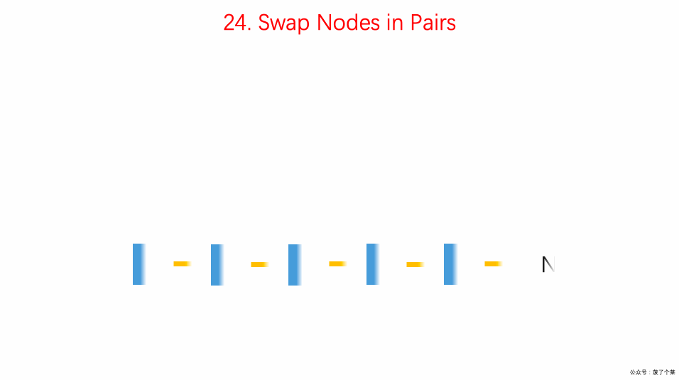

## 题目地址
https://leetcode.com/problems/swap-nodes-in-pairs/description/

## 题目描述
Given a linked list, swap every two adjacent nodes and return its head.

You may not modify the values in the list's nodes, only nodes itself may be changed.

 

Example:

Given 1->2->3->4, you should return the list as 2->1->4->3.
## 思路

设置一个dummy 节点简化操作,dummy next 指向head。  

1. 初始化first为第一个节点
2. 初始化second为第二个节点
3. 初始化current为dummy
4. first.next = second.next
5. second.next = first
6. current.next = second
7. current 移动两格
8. 重复



(图片来自： https://github.com/MisterBooo/LeetCodeAnimation)

## 关键点解析

1. 链表这种数据结构的特点和使用

2. dummyHead简化操作

## 代码

* 语言支持：JS，Python3

```js
/*
 * @lc app=leetcode id=24 lang=javascript
 *
 * [24] Swap Nodes in Pairs
 *
 * https://leetcode.com/problems/swap-nodes-in-pairs/description/
 *
 * algorithms
 * Medium (43.33%)
 * Total Accepted:    287.2K
 * Total Submissions: 661.3K
 * Testcase Example:  '[1,2,3,4]'
 *
 * Given a linked list, swap every two adjacent nodes and return its head.
 *
 * You may not modify the values in the list's nodes, only nodes itself may be
 * changed.
 *
 *
 *
 * Example:
 *
 *
 * Given 1->2->3->4, you should return the list as 2->1->4->3.
 *
 */
/**
 * Definition for singly-linked list.
 * function ListNode(val) {
 *     this.val = val;
 *     this.next = null;
 * }
 */
/**
 * @param {ListNode} head
 * @return {ListNode}
 */
var swapPairs = function(head) {
  const dummy = new ListNode(0);
  dummy.next = head;
  let current = dummy;
  while (current.next != null && current.next.next != null) {
    // 初始化双指针
    const first = current.next;
    const second = current.next.next;
    
    // 更新双指针和current指针
    first.next = second.next;
    second.next = first;
    current.next = second;

    // 更新指针
    current = current.next.next;
  }
  return dummy.next;
};

```
Python3 Code:
```python
class Solution:
    def swapPairs(self, head: ListNode) -> ListNode:
        """
        用递归实现链表相邻互换：
        第一个节点的next是第三、第四个节点交换的结果，第二个节点的next是第一个节点；
        第三个节点的next是第五、第六个节点交换的结果，第四个节点的next是第三个节点；
        以此类推
        :param ListNode head
        :return ListNode
        """
        # 如果为None或next为None，则直接返回
        if not head or not head.next:
            return head

        _next = head.next
        head.next = self.swapPairs(_next.next)
        _next.next = head
        return _next
```
