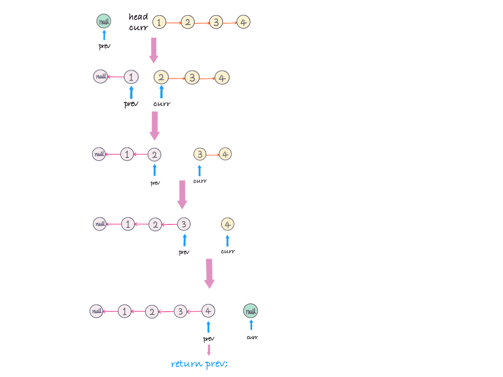
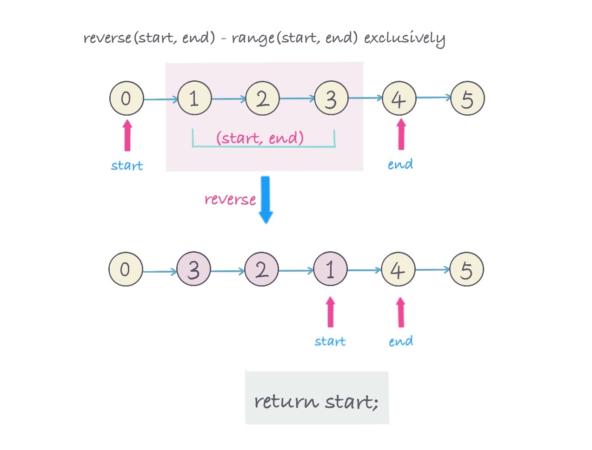
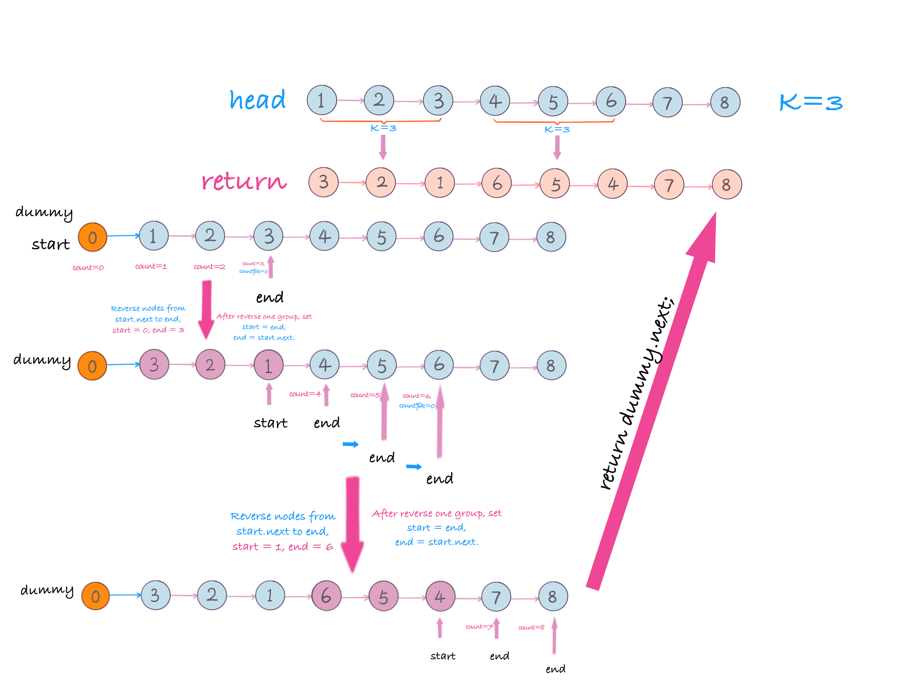

## Problem
https://leetcode.com/problems/reverse-nodes-in-k-group/

## Problem Description
```
Given a linked list, reverse the nodes of a linked list k at a time and return its modified list.

k is a positive integer and is less than or equal to the length of the linked list. If the number of nodes is not a multiple of k then left-out nodes in the end should remain as it is.

Example:

Given this linked list: 1->2->3->4->5

For k = 2, you should return: 2->1->4->3->5

For k = 3, you should return: 3->2->1->4->5

Note:

Only constant extra memory is allowed.
You may not alter the values in the list's nodes, only nodes itself may be changed.

```

## Solution
Traverse `linked list` from left to right, during traverse, group nodes in k, then reverse each group. 
How to reverse a linked list given start, end node?

Reverse linked list:

1. Initial a prev node `null`

2. For each move, use temp node to keep current next node.

3. During traverse, update current node pointing to previous node, update previous pointing to current node

4. Update current to temp

```
ListNode temp = curr.next;
curr.next = prev;
prev = curr;
curr = temp;
```

For example(as below pic): reverse the whole linked list `1->2->3->4->null` -> `4->3->2->1->null`



Here Reverse each group(`k nodes`):

1. First group, use `count` keep track linked list counts when traverse linked list

2. Use `start` to keep track each group start node position.

3. Use `end ` to keep track each group end node position

4. Reverse（`k nodes`）AKA: `(start, end) - start and end exclusively`.

5. After reverse, update `start` point to reversed group last node.

6. If `counts % k != 0`, then `end` move to next(`end=end.next`), for each move`count+1`.

As below pic show steps 4 and 5, reverse linked list in range `（start， end）`:




For example(as below pic)，`head=[1,2,3,4,5,6,7,8], k = 3`





>**NOTE**: Usually we create a `dummy node` to solve linked list problem, because head node may be changed during operation.
for example: here `head updated from 1->3`, and `dummy (List(0)) ` keep the same.

#### Complexity Analysis
- *Time Complexity:* `O(n) - n is number of Linked List`
- *Space Complexity:* `O(1)`

## Key Points
1. create a dummy node, `dummy = ListNode(0)`
2. Group linked list as `k=3`, keep track of start and end node for each group.
3. Reverse each group, update start and end node references
4. return `dummy.next`.

## Code (`Java/Python3`)
*Java Code*
```java
class ReverseKGroupsLinkedList {
  public ListNode reverseKGroup(ListNode head, int k) {
      if (head == null || k == 1) {
        return head;
      }
      ListNode dummy = new ListNode(0);
      dummy.next = head;
  
      ListNode start = dummy;
      ListNode end = head;
      int count = 0;
      while (end != null) {
        count++;
        // group
        if (count % k == 0) {
          // reverse linked list (start, end]
          start = reverse(start, end.next);
          end = start.next;
        } else {
          end = end.next;
        }
      }
      return dummy.next;
    }
  
     /** 
     * reverse linked list from range (start, end), return last node.
     * for example: 
     * 0->1->2->3->4->5->6->7->8
     * |           |
     * start       end
     * 
     * After call start = reverse(start, end)
     * 
     * 0->3->2->1->4->5->6->7->8
     *          |  |
     *       start end
     *       
     * @return the reversed list's 'start' node, which is the precedence of node end
     */
    private ListNode reverse(ListNode start, ListNode end) {
      ListNode curr = start.next;
      ListNode prev = start;
      ListNode first = curr;
      while (curr != end){
        ListNode temp = curr.next;
        curr.next = prev;
        prev = curr;
        curr = temp;
      }
      start.next = prev;
      first.next = curr;
      return first;
    }
}
```

*Python3 Cose*
```python
class Solution:
    def reverseKGroup(self, head: ListNode, k: int) -> ListNode:
        if head is None or k < 2:
            return head
        dummy = ListNode(0)
        dummy.next = head
        start = dummy
        end = head
        count = 0
        while end:
            count += 1
            if count % k == 0:
                start = self.reverse(start, end.next)
                end = start.next
            else:
                end = end.next
        return dummy.next
    
    def reverse(self, start, end):
        prev, curr = start, start.next
        first = curr
        while curr != end:
            temp = curr.next
            curr.next = prev
            prev = curr
            curr = temp
        start.next = prev
        first.next = curr
        return first
```

## References
- [Leetcode Discussion (yellowstone)](https://leetcode.com/problems/reverse-nodes-in-k-group/discuss/11440/Non-recursive-Java-solution-and-idea)

## Extension

- Require from right to left reverse nodes in k groups. **(ByteDance Interview)**

    Example，`1->2->3->4->5->6->7->8, k = 3`, 
    
    From right to left, group as `k=3`:
    - `6->7->8` reverse to `8->7->6`， 
    - `3->4->5` reverse to `5->4->3`. 
    - `1->2` only has 2 nodes, which less than `k=3`, do nothing.
    
    return： `1->2->5->4->3->8->7->6`

Here, we pre-process linked list, reverse it first, then using Reverse nodes in K groups solution:

1. Reverse linked list

2. From left to right, reverse linked list group as k nodes.

3. Reverse step #2 linked list

For example:`1->2->3->4->5->6->7->8, k = 3`

1. Reverse linked list: `8->7->6->5->4->3->2->1`

2. Reverse nodes in k groups: `6->7->8->3->4->5->2->1`

3. Reverse step#2 linked list: `1->2->5->4->3->8->7->6`

## Similar Problems
- [Swap Nodes in Pairs](https://leetcode.com/problems/swap-nodes-in-pairs/)