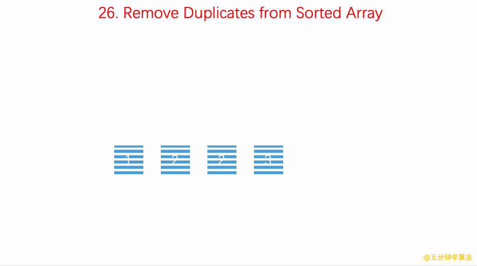

## 题目地址
https://leetcode.com/problems/remove-duplicates-from-sorted-array/description/

## 题目描述
Given a sorted array nums, remove the duplicates in-place such that each element appear only once and return the new length.

Do not allocate extra space for another array, you must do this by modifying the input array in-place with O(1) extra memory.

Example 1:

Given nums = [1,1,2],

Your function should return length = 2, with the first two elements of nums being 1 and 2 respectively.

It doesn't matter what you leave beyond the returned length.
Example 2:

Given nums = [0,0,1,1,1,2,2,3,3,4],

Your function should return length = 5, with the first five elements of nums being modified to 0, 1, 2, 3, and 4 respectively.

It doesn't matter what values are set beyond the returned length.
Clarification:

Confused why the returned value is an integer but your answer is an array?

Note that the input array is passed in by reference, which means modification to the input array will be known to the caller as well.

Internally you can think of this:

```
// nums is passed in by reference. (i.e., without making a copy)
int len = removeDuplicates(nums);

// any modification to nums in your function would be known by the caller.
// using the length returned by your function, it prints the first len elements.
for (int i = 0; i < len; i++) {
    print(nums[i]);
}
```

## 前置知识

- 数组
- 双指针

## 思路

使用快慢指针来记录遍历的坐标。

- 开始时这两个指针都指向第一个数字

- 如果两个指针指的数字相同，则快指针向前走一步

- 如果不同，则两个指针都向前走一步

- 当快指针走完整个数组后，慢指针当前的坐标加 1 就是数组中不同数字的个数



（图片来自： https://github.com/MisterBooo/LeetCodeAnimation)

## 关键点解析

- 双指针

这道题如果不要求，O(n) 的时间复杂度， O(1) 的空间复杂度的话，会很简单。
但是这道题是要求的，这种题的思路一般都是采用双指针

- 如果是数据是无序的，就不可以用这种方式了，从这里也可以看出排序在算法中的基础性和重要性。

- 注意nums为空时的边界条件。

## 代码

* 语言支持：JS，Python，C++

Javascript Code:
```js
/**
 * @param {number[]} nums
 * @return {number}
 */
var removeDuplicates = function(nums) {
    const size = nums.length;
    if(size==0) return 0;
    let slowP = 0;
    for (let fastP = 0; fastP < size; fastP++) {
        if (nums[fastP] !== nums[slowP]) {
            slowP++;
            nums[slowP] = nums[fastP]
        }
    }
    return slowP + 1;
};
```

Python Code:
```python
class Solution:
    def removeDuplicates(self, nums: List[int]) -> int:
        if nums:
            slow = 0
            for fast in range(1, len(nums)):
                if nums[fast] != nums[slow]:
                    slow += 1
                    nums[slow] = nums[fast]
            return slow + 1
        else:
            return 0
```

C++ Code:
```cpp
class Solution {
public:
    int removeDuplicates(vector<int>& nums) {
        if(nums.empty()) return 0;
        int fast,slow;
        fast=slow=0;
        while(fast!=nums.size()){
            if(nums[fast]==nums[slow]) fast++;
            else {
                slow++;
                nums[slow]=nums[fast];
                fast++;
            }
        }
        return slow+1;
    }
};
```
