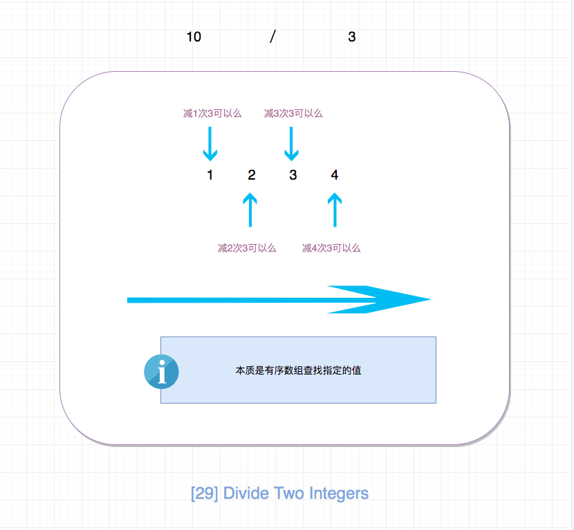

## 题目地址
https://leetcode.com/problems/divide-two-integers/description/

## 题目描述
```
Given two integers dividend and divisor, divide two integers without using multiplication, division and mod operator.

Return the quotient after dividing dividend by divisor.

The integer division should truncate toward zero.

Example 1:

Input: dividend = 10, divisor = 3
Output: 3
Example 2:

Input: dividend = 7, divisor = -3
Output: -2
Note:

Both dividend and divisor will be 32-bit signed integers.
The divisor will never be 0.
Assume we are dealing with an environment which could only store integers within the 32-bit signed integer range: [−231,  231 − 1]. For the purpose of this problem, assume that your function returns 231 − 1 when the division result overflows.

```

## 思路

符合直觉的做法是，减数一次一次减去被减数，不断更新差，直到差小于0，我们减了多少次，结果就是多少。

核心代码：

```js
  let acc = divisor;
  let count = 0;

  while (dividend - acc >= 0) {
    acc += divisor;
    count++;
  }

  return count;

```

这种做法简单直观，但是性能却比较差. 下面来介绍一种性能更好的方法。



通过上面这样的分析，我们直到可以使用二分法来解决，性能有很大的提升。

## 关键点解析

- 二分查找

- 正负数的判断中，这样判断更简单。

```js
const isNegative = dividend > 0 !== divisor > 0;
```


## 代码

```js


/*
 * @lc app=leetcode id=29 lang=javascript
 *
 * [29] Divide Two Integers
 */
/**
 * @param {number} dividend
 * @param {number} divisor
 * @return {number}
 */
var divide = function(dividend, divisor) {
  if (divisor === 1) return dividend;

  // 这种方法很巧妙，即符号相同则为正，不同则为负
  const isNegative = dividend > 0 !== divisor > 0;

  const MAX_INTERGER = Math.pow(2, 31);

  const res = helper(Math.abs(dividend), Math.abs(divisor));

  // overflow
  if (res > MAX_INTERGER - 1 || res < -1 * MAX_INTERGER) {
    return MAX_INTERGER - 1;
  }

  return isNegative ? -1 * res : res;
};

function helper(dividend, divisor) {
  // 二分法
  if (dividend <= 0) return 0;
  if (dividend < divisor) return 0;
  if (divisor === 1) return dividend;

  let acc = 2 * divisor;
  let count = 1;

  while (dividend - acc > 0) {
    acc += acc;
    count += count;
  }
  // 直接使用位移运算，比如acc >> 1会有问题
  const last = dividend - Math.floor(acc / 2);

  return count + helper(last, divisor);
}
```

## 相关题目
- [875.koko-eating-bananas](./875.koko-eating-bananas.md)
