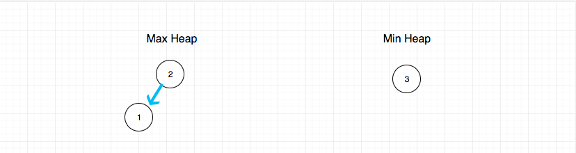
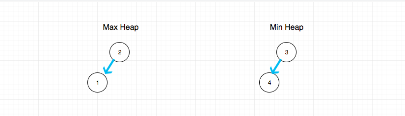
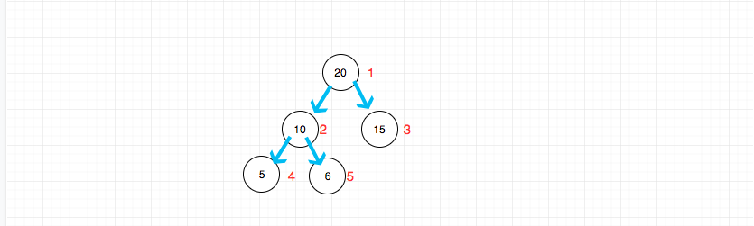

## 题目地址

https://leetcode.com/problems/find-median-from-data-stream/description/

## 题目描述

```
Median is the middle value in an ordered integer list. If the size of the list is even, there is no middle value. So the median is the mean of the two middle value.

For example,
[2,3,4], the median is 3

[2,3], the median is (2 + 3) / 2 = 2.5

Design a data structure that supports the following two operations:

void addNum(int num) - Add a integer number from the data stream to the data structure.
double findMedian() - Return the median of all elements so far.


Example:

addNum(1)
addNum(2)
findMedian() -> 1.5
addNum(3)
findMedian() -> 2


Follow up:

If all integer numbers from the stream are between 0 and 100, how would you optimize it?
If 99% of all integer numbers from the stream are between 0 and 100, how would you optimize it?

```

## 前置知识

- 堆
- 队列
  
## 思路

这道题目是求动态数据的中位数，在 leetcode 难度为`hard`. 如果这道题是求静态数据的中位数，我们用数组去存储，
空间复杂度 O(1), 时间复杂度 O(1)

> 空间复杂度指的是除了存储数据之外额外开辟的用于计算等任务的内存空间

代码也比较简单

```js
function findMedian(a) {
  return a.length % 2 === 0
    ? (a[a.length >> 1] + a[a.length >> (1 + 1)]) / 2
    : a[a.length >> 1];
}
```

但是题目要求是动态数据， 那么是否可以每次添加数据的时候，都去排一次序呢？
假如我们每次插入都用`快速排序`进行排序的话，那么时间复杂度是 O(nlogn) + O(1)

> O(nlogn) 是排序的时间复杂度 O(1)是查询中位数的时间复杂度

如果你用这种思路进行的话， 恐怕 leetcode 会超时。

那么如何优化呢？ 答案是使用堆， Java， C++等语言都有`优先级队列`中这种数据结构，
优先级队列本质上就是一个堆。 关于堆和优先级队列的关系，我会放在《数据结构和算法》部分讲解。这里不赘述

如果借助堆这种数据结构， 就可以轻易实现了。

具体的做法是，建立两个堆，这两个堆需要满足:

1. 大顶堆元素都比小顶堆小（由于堆的特点其实只要比较堆顶即可）
2. 大顶堆元素不小于小顶堆，且最多比小顶堆多一个元素

满足上面两个条件的话，如果想要找到中位数，就比较简单了

- 如果两个堆数量相等（本质是总数为偶数）, 就两个堆顶元素的平均数
- 如果两个堆数量不相等（本质是总数为奇数）， 就取大顶堆的堆顶元素

比如对于[1,2,3] 求中位数：



再比如对于[1,2,3, 4] 求中位数：


## 关键点解析

- 用两个堆（一个大顶堆，一个小顶堆）来简化时间复杂度
- 用优先级队列简化操作

> JavaScript 不像 Java， C++等语言都有`优先级队列`中这种数据结构， 因此大家可以使用社区的实现
> 个人认为没有非要纠结于优先级队列怎么实现， 至少这道题不是考这个的
> 优先级队列的实现个人认为已经超过了这道题想考察的范畴
## 代码

如果不使用现成的`优先级队列`这种数据结构，代码可能是这样的：

```js
/**
 * initialize your data structure here.
 */
var MedianFinder = function() {
  this.maxHeap = [];
  this.minHeap = [];
};

function minHeapify() {
  this.minHeap.unshift(null);
  const a = this.minHeap;

  // 为了方便大家理解，这里选用了粗暴的实现
  // 时间复杂度为O(n)
  // 其实可以降到O(logn)， 具体细节我不想在这里讲解和实现
  for (let i = a.length - 1; i >> 1 > 0; i--) {
    // 自下往上堆化
    if (a[i] < a[i >> 1]) { // 如果子元素更小，则交换位置
      const temp = a[i];
      this.minHeap[i] = a[i >> 1];
      this.minHeap[i >> 1] = temp;
    }
  }
  this.minHeap.shift(null);
}

function maxHeapify() {
  this.maxHeap.unshift(null);
  const a = this.maxHeap;

  // 为了方便大家理解，这里选用了粗暴的实现
  // 时间复杂度为O(n)
  // 其实可以降到O(logn)， 具体细节我不想在这里讲解和实现
  for (let i = a.length - 1; i >> 1 > 0; i--) {
    // 自下往上堆化
    if (a[i] > a[i >> 1]) { // 如果子元素更大，则交换位置
      const temp = a[i];
      this.maxHeap[i] = a[i >> 1];
      this.maxHeap[i >> 1] = temp;
    }
  }
  this.maxHeap.shift(null);
}

/**
 * @param {number} num
 * @return {void}
 */
MedianFinder.prototype.addNum = function(num) {
  // 为了大家容易理解，这部分代码写的比较冗余

  // 插入
  if (num >= (this.minHeap[0] || Number.MIN_VALUE)) {
    this.minHeap.push(num);
  } else {
    this.maxHeap.push(num);
  }
  // 调整两个堆的节点数量平衡
  // 使得大顶堆的数量最多大于小顶堆一个， 且一定不小于小顶堆数量
  if (this.maxHeap.length > this.minHeap.length + 1) {
    // 大顶堆的堆顶元素移动到小顶堆
    this.minHeap.push(this.maxHeap.shift());
  }

  if (this.minHeap.length > this.maxHeap.length) {
    // 小顶堆的堆顶元素移动到大顶堆
    this.maxHeap.push(this.minHeap.shift());
  }

  // 调整堆顶元素
  if (this.maxHeap[0] > this.minHeap[0]) {
    const temp = this.maxHeap[0];
    this.maxHeap[0] = this.minHeap[0];
    this.minHeap[0] = temp;
  }

  // 堆化
  maxHeapify.call(this);
  minHeapify.call(this);
};

/**
 * @return {number}
 */
MedianFinder.prototype.findMedian = function() {
  if ((this.maxHeap.length + this.minHeap.length) % 2 === 0) {
    return (this.minHeap[0] + this.maxHeap[0]) / 2;
  } else {
    return this.maxHeap[0];
  }
};

/**
 * Your MedianFinder object will be instantiated and called as such:
 * var obj = new MedianFinder()
 * obj.addNum(num)
 * var param_2 = obj.findMedian()
 */
```

其中`minHeapify` 和  `maxHeapify` 的过程都有一个hack操作，就是：

```js

this.heap.unshift(null);
// ....
this.heap.shift(null);

```

其实就是为了存储的数据从1开始，这样方便计算。 即对于下标为i的元素， `i >> 1` 一定是父节点的下标。



> 这是因为我用满二叉树来存储的堆

这个实现比较繁琐，下面介绍一种优雅的方式，假设JS和Java和C++等语言一样有`PriorityQueue`这种数据结构，那么我们实现就比较简单了。

代码：

> 关于PriorityQueue的实现，感兴趣的可以看下 https://github.com/janogonzalez/priorityqueuejs

```js
/*
 * @lc app=leetcode id=295 lang=javascript
 *
 * [295] Find Median from Data Stream
 *
 * https://leetcode.com/problems/find-median-from-data-stream/description/
 *
 * algorithms
 * Hard (35.08%)
 * Total Accepted:    101.2K
 * Total Submissions: 282.4K
 * Testcase Example:  '["MedianFinder","addNum","addNum","findMedian","addNum","findMedian"]\n[[],[1],[2],[],[3],[]]'
 *
 * Median is the middle value in an ordered integer list. If the size of the
 * list is even, there is no middle value. So the median is the mean of the two
 * middle value.
 * For example,
 *
 * [2,3,4], the median is 3
 *
 * [2,3], the median is (2 + 3) / 2 = 2.5
 *
 * Design a data structure that supports the following two operations:
 *
 *
 * void addNum(int num) - Add a integer number from the data stream to the data
 * structure.
 * double findMedian() - Return the median of all elements so far.
 *
 *
 *
 *
 * Example:
 *
 *
 * addNum(1)
 * addNum(2)
 * findMedian() -> 1.5
 * addNum(3)
 * findMedian() -> 2
 *
 *
 *
 *
 * Follow up:
 *
 *
 * If all integer numbers from the stream are between 0 and 100, how would you
 * optimize it?
 * If 99% of all integer numbers from the stream are between 0 and 100, how
 * would you optimize it?
 *
 *
 */
/**
 * initialize your data structure here.
 */
var MedianFinder = function() {
  this.maxHeap = new PriorityQueue((a, b) => a - b);
  this.minHeap = new PriorityQueue((a, b) => b - a);
};

/**
 * @param {number} num
 * @return {void}
 */
MedianFinder.prototype.addNum = function(num) {
    // 我们的目标就是建立两个堆，一个大顶堆，一个小顶堆
    // 结合中位数的特点
    // 这两个堆需要满足:
    // 1. 大顶堆元素都比小顶堆小（由于堆的特点其实只要比较堆顶即可）
    // 2. 大顶堆元素不小于小顶堆，且最多比小顶堆多一个元素

    // 满足上面两个条件的话，如果想要找到中位数，就比较简单了
    // 如果两个堆数量相等（本质是总数为偶数）, 就两个堆顶元素的平均数
    // 如果两个堆数量不相等（本质是总数为奇数）， 就取大顶堆的堆顶元素

    // 问题如果保证满足上述两个特点

    // 1. 保证第一点
    this.maxHeap.enq(num);
    // 由于小顶堆的所有数都来自大顶堆的堆顶元素（最大值）
    // 因此可以保证第一点
    this.minHeap.enq(this.maxHeap.deq());

    // 2. 保证第二点
    if (this.maxHeap.size() < this.minHeap.size()){
        this.maxHeap.enq(this.minHeap.deq());
    }
};

/**
 * @return {number}
 */
MedianFinder.prototype.findMedian = function() {
    if (this.maxHeap.size() == this.minHeap.size()) return (this.maxHeap.peek() + this.minHeap.peek()) /  2.0;
    else return this.maxHeap.peek();
};

/**
 * Your MedianFinder object will be instantiated and called as such:
 * var obj = new MedianFinder()
 * obj.addNum(num)
 * var param_2 = obj.findMedian()
 */

```
