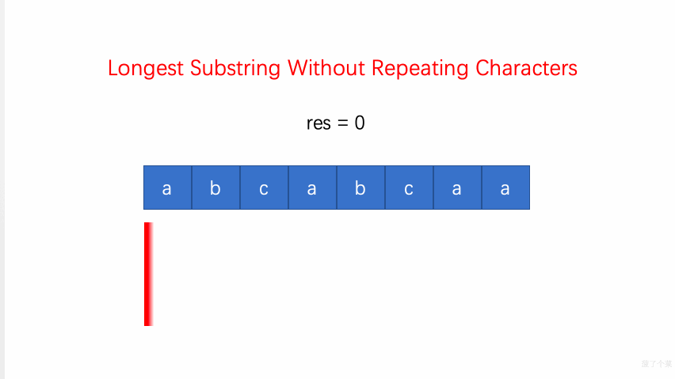

## 题目地址

https://leetcode.com/problems/longest-substring-without-repeating-characters/description/

## 题目描述

Given a string, find the length of the longest substring without repeating characters.

Examples:

```
Given "abcabcbb", the answer is "abc", which the length is 3.

Given "bbbbb", the answer is "b", with the length of 1.

Given "pwwkew", the answer is "wke", with the length of 3. Note that the answer must be a substring, "pwke" is a subsequence and not a substring.
```

## 前置知识

- 哈希表
- [滑动窗口](https://github.com/azl397985856/leetcode/blob/master/thinkings/slide-window.md)

## 思路

用一个 hashmap 来建立字符和其出现位置之间的映射。同时维护一个滑动窗口，窗口内的都是没有重复的字符，去尽可能的扩大窗口的大小，窗口不停的向右滑动。

（1）如果当前遍历到的字符从未出现过，那么直接扩大右边界；

（2）如果当前遍历到的字符出现过，则缩小窗口（左边索引向右移动），然后继续观察当前遍历到的字符；

（3）重复（1）（2），直到左边索引无法再移动；

（4）维护一个结果 res，每次用出现过的窗口大小来更新结果 res，最后返回 res 获取结果。



(图片来自： https://github.com/MisterBooo/LeetCodeAnimation)

## 关键点

1. 用一个 mapper 记录出现过并且没有被删除的字符
2. 用一个滑动窗口记录当前 index 开始的最大的不重复的字符序列
3. 用 res 去记录目前位置最大的长度，每次滑动窗口更新就去决定是否需要更新 res

## 代码

代码支持：Python3

Python3 Code:

```python
from collections import defaultdict


class Solution:
    def lengthOfLongestSubstring(self, s: str) -> int:
        l = 0
        ans = 0
        counter = defaultdict(lambda: 0)

        for r in range(len(s)):
            while counter.get(s[r], 0) != 0:
                counter[s[l]] = counter.get(s[l], 0) - 1
                l += 1
            counter[s[r]] += 1
            ans = max(ans, r - l + 1)

        return ans
```

**复杂度分析**

- 时间复杂度：$O(N)$
- 空间复杂度：$O(N)$

更多题解可以访问我的 LeetCode 题解仓库：https://github.com/azl397985856/leetcode 。 目前已经 30K star 啦。

大家也可以关注我的公众号《力扣加加》获取更多更新鲜的 LeetCode 题解


