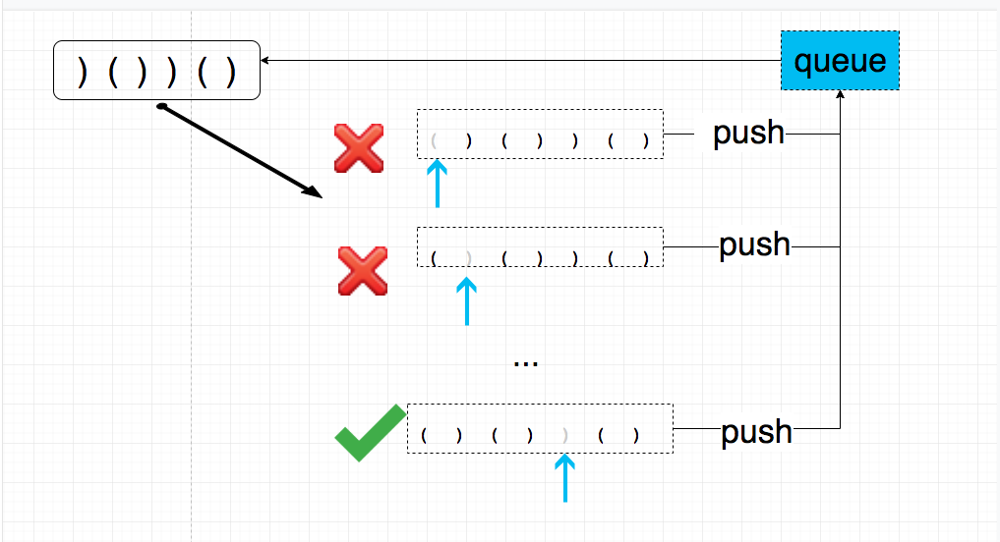

## 题目地址
https://leetcode.com/problems/remove-invalid-parentheses/description/

## 题目描述
```
Remove the minimum number of invalid parentheses in order to make the input string valid. Return all possible results.

Note: The input string may contain letters other than the parentheses ( and ).

Example 1:

Input: "()())()"
Output: ["()()()", "(())()"]
Example 2:

Input: "(a)())()"
Output: ["(a)()()", "(a())()"]
Example 3:

Input: ")("
Output: [""]

```

## 思路

我们的思路是先写一个函数用来判断给定字符串是否是有效的。 然后再写一个函数，这个函数
依次删除第i个字符，判断是否有效，有效则添加进最终的返回数组。

这样的话实现的功能就是， 删除`一个` 小括号使之有效的所有可能。因此只需要递归调用`依次删除第i个字符`的功能就可以了。

而且由于题目要求是要删除最少的小括号，因此我们的思路是使用广度优先遍历，而不是深度有限的遍历。



> 没有动图，请脑补

## 关键点解析

- 广度优先遍历

- 使用队列简化操作

- 使用一个visited的mapper， 来避免遍历同样的字符串


## 代码
```js
/*
 * @lc app=leetcode id=301 lang=javascript
 *
 * [301] Remove Invalid Parentheses
 *
 * https://leetcode.com/problems/remove-invalid-parentheses/description/
 *
 * algorithms
 * Hard (38.52%)
 * Total Accepted:    114.3K
 * Total Submissions: 295.4K
 * Testcase Example:  '"()())()"'
 *
 * Remove the minimum number of invalid parentheses in order to make the input
 * string valid. Return all possible results.
 *
 * Note: The input string may contain letters other than the parentheses ( and
 * ).
 *
 * Example 1:
 *
 *
 * Input: "()())()"
 * Output: ["()()()", "(())()"]
 *
 *
 * Example 2:
 *
 *
 * Input: "(a)())()"
 * Output: ["(a)()()", "(a())()"]
 *
 *
 * Example 3:
 *
 *
 * Input: ")("
 * Output: [""]
 *
 */
var isValid = function(s) {
  let openParenthes = 0;
  for(let i = 0; i < s.length; i++) {
    if (s[i] === '(') {
      openParenthes++;
    } else if (s[i] === ')') {
      if (openParenthes === 0) return false;
      openParenthes--;
    }
  }
  return openParenthes === 0;
};
/**
 * @param {string} s
 * @return {string[]}
 */
var removeInvalidParentheses = function(s) {
  if (!s || s.length === 0) return [""];
  const ret = [];
  const queue = [s];
  const visited = {};
  let current = null;
  let removedParentheses = 0; // 只记录最小改动

  while ((current = queue.shift())) {
    let hit = isValid(current);
    if (hit) {
      if (!removedParentheses) {
       removedParentheses =  s.length - current.length
      }
      if (s.length - current.length > removedParentheses) return ret.length === 0 ? [""] : ret;;
      ret.unshift(current);
      continue;
    }
    for (let i = 0; i < current.length; i++) {
      if (current[i] !== ')' && current[i] !== '(') continue;
      const subString = current.slice(0, i).concat(current.slice(i + 1));
      if (visited[subString]) continue;
      visited[subString] = true;
      queue.push(subString);
    }
  }

  return ret.length === 0 ? [""] : ret;
};
```

## 扩展

相似问题:

[validParentheses](./validParentheses.md)
