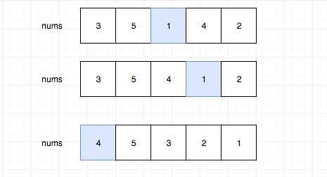
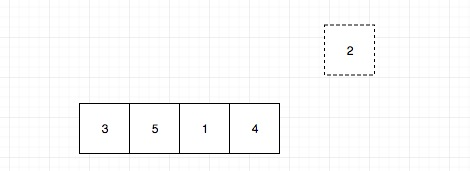
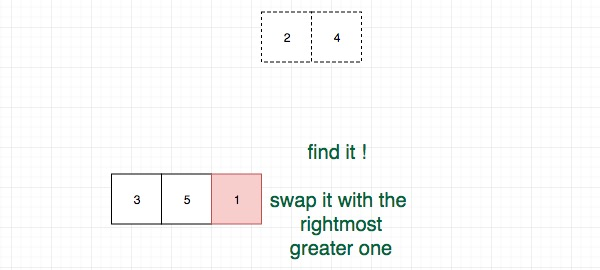
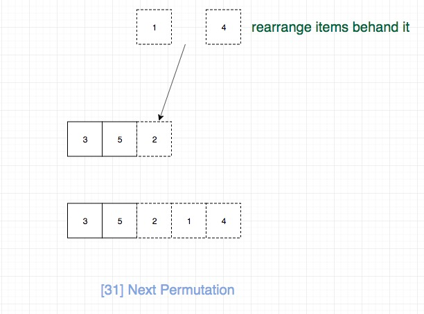

## 题目地址

https://leetcode.com/problems/next-permutation/description/

## 题目描述

```
Implement next permutation, which rearranges numbers into the lexicographically next greater permutation of numbers.

If such arrangement is not possible, it must rearrange it as the lowest possible order (ie, sorted in ascending order).

The replacement must be in-place and use only constant extra memory.

Here are some examples. Inputs are in the left-hand column and its corresponding outputs are in the right-hand column.

1,2,3 → 1,3,2
3,2,1 → 1,2,3
1,1,5 → 1,5,1

```

## 前置知识

- 回溯法

## 思路

符合直觉的方法是我们按顺序求出所有的排列，如果当前排列等于 nums，那么我直接取下一个
但是这种做法不符合 constant space 要求（题目要求直接修改原数组）,时间复杂度也太高，为 O(n!),肯定不是合适的解。

这种题目比较抽象，写几个例子通常会帮助理解问题的规律。我找了几个例子，其中蓝色背景表示的是当前数字找下一个更大排列的时候`需要改变的元素`.



我们不难发现，蓝色的数字都是从后往前第一个不递增的元素，并且我们的下一个更大的排列
只需要改变蓝色的以及之后部分即可，前面的不需要变。

那么怎么改变蓝色的以及后面部分呢？为了使增量最小，
由于前面我们观察发现，其实剩下的元素从左到右是递减的，而我们想要变成递增的，我们只需要不断交换首尾元素即可。


另外我们也可以以回溯的角度来思考这个问题，让我们先回溯一次：



这个时候可以选择的元素只有2，我们无法组成更大的排列，我们继续回溯，直到如图：



我们发现我们可以交换4或者2实现变大的效果，但是要保证变大的幅度最小（下一个更大），
我们需要选择最小的，由于之前我们发现后面是从左到右递减的，显然就是交换最右面大于1的。

之后就是不断交换使之幅度最小：



## 关键点解析
- 写几个例子通常会帮助理解问题的规律 
- 在有序数组中首尾指针不断交换位置即可实现reverse 
- 找到从右边起`第一个大于nums[i]的`，并将其和nums[i]进行交换
## 代码

* 语言支持: Javascript，Python3

```js
/*
 * @lc app=leetcode id=31 lang=javascript
 *
 * [31] Next Permutation
 */

function reverseRange(A, i, j) {
  while (i < j) {
    const temp = A[i];
    A[i] = A[j];
    A[j] = temp;
    i++;
    j--;
  }
}
/**
 * @param {number[]} nums
 * @return {void} Do not return anything, modify nums in-place instead.
 */
var nextPermutation = function(nums) {
  // 时间复杂度O(n) 空间复杂度O(1)
  if (nums == null || nums.length <= 1) return;

  let i = nums.length - 2;
  // 从后往前找到第一个降序的,相当于找到了我们的回溯点
  while (i > -1 && nums[i + 1] <= nums[i]) i--;

  // 如果找了就swap
  if (i > -1) {
    let j = nums.length - 1;
    // 找到从右边起第一个大于nums[i]的，并将其和nums[i]进行交换
    // 因为如果交换的数字比nums[i]还要小肯定不符合题意
    while (nums[j] <= nums[i]) j--;
    const temp = nums[i];
    nums[i] = nums[j];
    nums[j] = temp;
  }

  // 最后我们只需要将剩下的元素从左到右，依次填入当前最小的元素就可以保证是大于当前排列的最小值了
  // [i + 1, A.length -1]的元素进行反转

  reverseRange(nums, i + 1, nums.length - 1);
};
```
Python3 Code:
```python
class Solution:
    def nextPermutation(self, nums):
        """
        Do not return anything, modify nums in-place instead.
        :param list nums
        """
        # 第一步，从后往前，找到下降点
        down_index = None
        for i in range(len(nums)-2, -1, -1):
            if nums[i] < nums[i+1]:
                down_index = i
                break
        # 如果没有下降点，重新排列
        if down_index is None:
            nums.reverse()
        # 如果有下降点
        else:
            # 第二步，从后往前，找到比下降点大的数，对换位置
            for i in range(len(nums)-1, i, -1):
                if nums[down_index] < nums[i]:
                    nums[down_index], nums[i] = nums[i], nums[down_index]
                    break
            # 第三部，重新排列下降点之后的数
            i, j = down_index+1, len(nums)-1
            while i < j:
                nums[i], nums[j] = nums[j], nums[i]
                i += 1
                j -= 1
```

Python3 Code:

```python
class Solution:
    def nextPermutation(self, nums):
        """
        Do not return anything, modify nums in-place instead.
        :param list nums
        """
        # 第一步，从后往前，找到下降点
        down_index = None
        for i in range(len(nums)-2, -1, -1):
            if nums[i] < nums[i+1]:
                down_index = i
                break
        # 如果没有下降点，重新排列
        if down_index is None:
            nums.reverse()
        # 如果有下降点
        else:
            # 第二步，从后往前，找到比下降点大的数，对换位置
            for i in range(len(nums)-1, i, -1):
                if nums[down_index] < nums[i]:
                    nums[down_index], nums[i] = nums[i], nums[down_index]
                    break
            # 第三步，重新排列下降点之后的数
            i, j = down_index+1, len(nums)-1
            while i < j:
                nums[i], nums[j] = nums[j], nums[i]
                i += 1
                j -= 1
```

## 相关题目

- [46.next-permutation](./46.next-permutation.md)
- [47.permutations-ii](./47.permutations-ii.md)
- [60.permutation-sequence](./60.permutation-sequence.md)(TODO)
