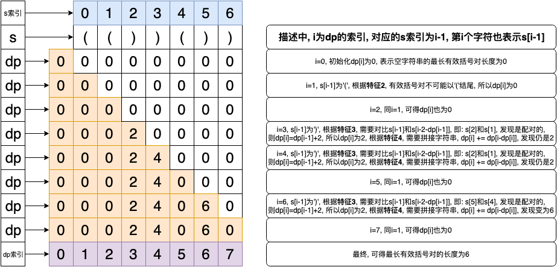

## 题目地址
https://leetcode.com/problems/longest-valid-parentheses/

## 题目描述

```
Given a string containing just the characters '(' and ')', find the length of the longest valid (well-formed) parentheses substring.

Example 1:

Input: "(()"
Output: 2
Explanation: The longest valid parentheses substring is "()"
Example 2:

Input: ")()())"
Output: 4
Explanation: The longest valid parentheses substring is "()()"
```

## 思路(动态规划)

所有的动态规划问题, 首先需要解决的就是如何寻找合适的子问题.
该题需要我们找到最长的有效括号对, 我们首先想到的就是定义**dp[i]为前i个字符串的最长有效括号对长度**, 但是随后我们会发现, 这样的定义, 我们无法找到dp[i]和dp[i-1]的任何关系.
所以, 我们需要重新找一个新的定义: 定义**dp[i]为以第i个字符结尾的最长有效括号对长度**. 然后, 我们通过下面这个例子找一下dp[i]和dp[i-1]之间的关系.

```python
s = '(())())'
```

从上面的例子我们可以观察出一下几点结论(**描述中i为图中的dp数组的下标, 对应s的下标应为i-1, 第i个字符的i从1开始**).
1. base case: 空字符串的最长有效括号对长度肯定为0, 即: dp[0] = 0;
2. s的第**1**个字符结尾的最长有效括号对长度为0, s的第**2**个字符结尾的最长有效括号对长度也为0, 这个时候我们可以得出结论: 最长有效括号对不可能以'('结尾, 即: dp[1] = d[2] = 0;
3. 当i等于3时, 我们可以看出dp[2]=0, dp[3]=2, 因为第2个字符(**s[1]**)和第3个字符(**s[2]**)是配对的;
   当i等于4时, 我们可以看出dp[3]=2, dp[4]=4, 因为我们配对的是第1个字符(**s[0]**)和第4个字符(**s[3]**);
   因此, 我们可以得出结论: 如果第**i**个字符和第<strong>i-1-dp[i-1]</strong>个字符是配对的, 则dp[i] = dp[i-1] + 2, 其中: i-1-dp[i-1] >= 1, 因为第0个字符没有任何意义;
4. 根据第3条规则来计算的话, 我们发现dp[5]=0, dp[6]=2, 但是显然, dp[6]应该为6才对, 但是我们发现可以将"(())"和"()"进行拼接, 即: dp[i] += dp[i-dp[i]], 即: dp[6] = 2 + dp[6-2] = 2 + dp[4] = 6

根据以上规则, 我们求解dp数组的结果为: [0, 0, 0, 2, 4, 0, 6, 0], 其中最长有效括号对的长度为6. 以下为图解:


## 关键点解析

1. 第3点特征, 需要检查的字符是s[i-1]和s[i-2-dp[i-1]], 根据定义可知: i-1 >= dp[i-1], 但是i-2不一定大于dp[i-1], 因此, 需要检查越界;
3. 第4点特征最容易遗漏, 还有就是不需要检查越界, 因为根据定义可知: i >= dp[i], 所以dp[i-dp[i]]的边界情况是dp[0];

## 代码

* 语言支持: Python

Python Code:
```
class Solution:
    def longestValidParentheses(self, s: str) -> int:
        mlen = 0
        slen = len(s)
        dp = [0] * (slen + 1)
        for i in range(1, len(s) + 1):
            # 有效的括号对不可能会以'('结尾的
            if s[i - 1] == '(':
                continue

            left_paren = i - 2 - dp[i - 1]
            if left_paren >= 0 and s[left_paren] == '(':
                dp[i] = dp[i - 1] + 2

                # 拼接有效括号对
                if dp[i - dp[i]]:
                    dp[i] += dp[i - dp[i]]

                # 更新最大有效扩对长度
                if dp[i] > mlen:
                    mlen = dp[i]

        return mlen
```

## 扩展

1. 如果判断的不仅仅只有'('和')', 还有'[', ']', '{'和'}', 该怎么办?
2. 如果输出的不是长度, 而是任意一个最长有效括号对的字符串, 该怎么办?
