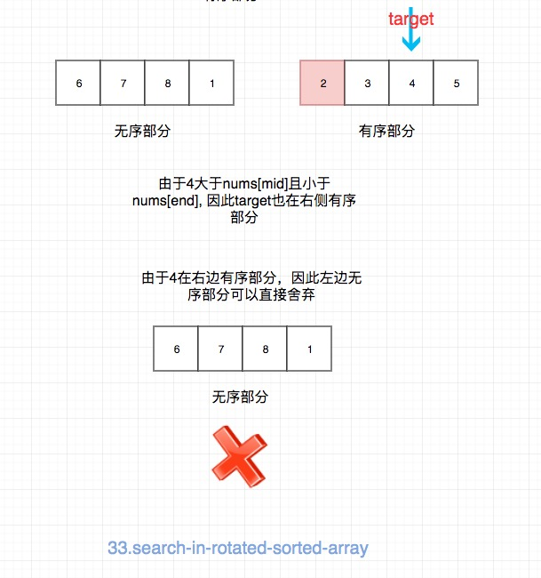

## 题目地址
https://leetcode.com/problems/search-in-rotated-sorted-array/

## 题目描述

```
Suppose an array sorted in ascending order is rotated at some pivot unknown to you beforehand.

(i.e., [0,1,2,4,5,6,7] might become [4,5,6,7,0,1,2]).

You are given a target value to search. If found in the array return its index, otherwise return -1.

You may assume no duplicate exists in the array.

Your algorithm's runtime complexity must be in the order of O(log n).

Example 1:

Input: nums = [4,5,6,7,0,1,2], target = 0
Output: 4
Example 2:

Input: nums = [4,5,6,7,0,1,2], target = 3
Output: -1

```

## 前置知识

- 数组
- 二分法

## 思路

这是一个我在网上看到的前端头条技术终面的一个算法题。

题目要求时间复杂度为logn，因此基本就是二分法了。 这道题目不是直接的有序数组，不然就是easy了。

首先要知道，我们随便选择一个点，将数组分为前后两部分，其中一部分一定是有序的。

具体步骤：

- 我们可以先找出mid，然后根据mid来判断，mid是在有序的部分还是无序的部分

假如mid小于start，则mid一定在右边有序部分。
假如mid大于等于start， 则mid一定在左边有序部分。

> 注意等号的考虑

- 然后我们继续判断target在哪一部分， 我们就可以舍弃另一部分了

我们只需要比较target和有序部分的边界关系就行了。 比如mid在右侧有序部分，即[mid, end]
那么我们只需要判断 target >= mid && target <= end 就能知道target在右侧有序部分，我们就
可以舍弃左边部分了(start = mid + 1)， 反之亦然。

我们以([6,7,8,1,2,3,4,5], 4)为例讲解一下：





## 关键点解析

- 二分法
- 找出有序区间，然后根据target是否在有序区间舍弃一半元素
## 代码

* 语言支持: Javascript，Python3

```js
/*
 * @lc app=leetcode id=33 lang=javascript
 *
 * [33] Search in Rotated Sorted Array
 */
/**
 * @param {number[]} nums
 * @param {number} target
 * @return {number}
 */
var search = function(nums, target) {
  // 时间复杂度：O(logn)
  // 空间复杂度：O(1)
  // [6,7,8,1,2,3,4,5]
  let start = 0;
  let end = nums.length - 1;

  while (start <= end) {
    const mid = start + ((end - start) >> 1);
    if (nums[mid] === target) return mid;

    // [start, mid]有序

    // ️⚠️注意这里的等号
    if (nums[mid] >= nums[start]) {
      //target 在 [start, mid] 之间

      // 其实target不可能等于nums[mid]， 但是为了对称，我还是加上了等号
      if (target >= nums[start] && target <= nums[mid]) {
        end = mid - 1;
      } else {
        //target 不在 [start, mid] 之间
        start = mid + 1;
      }
    } else {
      // [mid, end]有序

      // target 在 [mid, end] 之间
      if (target >= nums[mid] && target <= nums[end]) {
        start = mid + 1;
      } else {
        // target 不在 [mid, end] 之间
        end = mid - 1;
      }
    }
  }

  return -1;
};
```
Python3 Code:
```python
class Solution:
    def search(self, nums: List[int], target: int) -> int:
        """用二分法，先判断左右两边哪一边是有序的，再判断是否在有序的列表之内"""
        if len(nums) <= 0:
            return -1

        left = 0
        right = len(nums) - 1
        while left < right:
            mid = (right - left) // 2 + left
            if nums[mid] == target:
                return mid
            
            # 如果中间的值大于最左边的值，说明左边有序
            if nums[mid] > nums[left]:
                if nums[left] <= target <= nums[mid]:
                    right = mid
                else:
                    # 这里 +1，因为上面是 <= 符号
                    left = mid + 1
            # 否则右边有序
            else:
                # 注意：这里必须是 mid+1，因为根据我们的比较方式，mid属于左边的序列
                if nums[mid+1] <= target <= nums[right]:
                    left = mid + 1
                else:
                    right = mid
                    
        return left if nums[left] == target else -1
```
