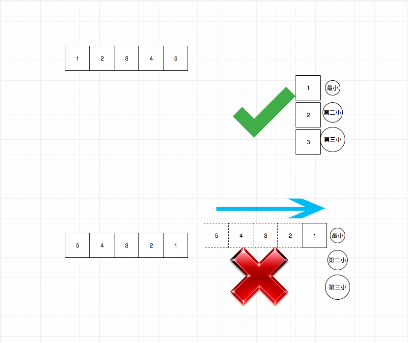

## 题目地址
https://leetcode.com/problems/increasing-triplet-subsequence/description/

## 题目描述

```
Given an unsorted array return whether an increasing subsequence of length 3 exists or not in the array.

Formally the function should:

Return true if there exists i, j, k 
such that arr[i] < arr[j] < arr[k] given 0 ≤ i < j < k ≤ n-1 else return false.
Note: Your algorithm should run in O(n) time complexity and O(1) space complexity.

Example 1:

Input: [1,2,3,4,5]
Output: true
Example 2:

Input: [5,4,3,2,1]
Output: false
```

## 思路
这道题是求解顺序数字是否有三个递增的排列， 注意这里没有要求连续的，因此诸如滑动窗口的思路是不可以的。
题目要求O(n)的时间复杂度和O(1)的空间复杂度，因此暴力的做法就不用考虑了。

我们的目标就是`依次`找到三个数字，其顺序是递增的。因此我们的做法可以是依次遍历，
然后维护三个变量，分别记录最小值，第二小值，第三小值。只要我们能够填满这三个变量就返回true，否则返回false。


## 关键点解析

- 维护三个变量，分别记录最小值，第二小值，第三小值。只要我们能够填满这三个变量就返回true，否则返回false

## 代码
```js


/*
 * @lc app=leetcode id=334 lang=javascript
 *
 * [334] Increasing Triplet Subsequence
 *
 * https://leetcode.com/problems/increasing-triplet-subsequence/description/
 *
 * algorithms
 * Medium (39.47%)
 * Total Accepted:    89.6K
 * Total Submissions: 226.6K
 * Testcase Example:  '[1,2,3,4,5]'
 *
 * Given an unsorted array return whether an increasing subsequence of length 3
 * exists or not in the array.
 * 
 * Formally the function should:
 * 
 * Return true if there exists i, j, k 
 * such that arr[i] < arr[j] < arr[k] given 0 ≤ i < j < k ≤ n-1 else return
 * false.
 * 
 * Note: Your algorithm should run in O(n) time complexity and O(1) space
 * complexity.
 * 
 * 
 * Example 1:
 * 
 * 
 * Input: [1,2,3,4,5]
 * Output: true
 * 
 * 
 *
 * Example 2:
 * 
 * 
 * Input: [5,4,3,2,1]
 * Output: false
 * 
 * 
 * 
 */
/**
 * @param {number[]} nums
 * @return {boolean}
 */
var increasingTriplet = function(nums) {
    if (nums.length < 3) return false;
    let n1 = Number.MAX_VALUE;
    let n2 = Number.MAX_VALUE;

    for(let i = 0; i < nums.length; i++) {
        if (nums[i] <= n1) {
            n1 = nums[i]
        } else if (nums[i] <= n2) {
            n2 = nums[i]
        } else {
            return true;
        }
    }

    return false;
};
```
