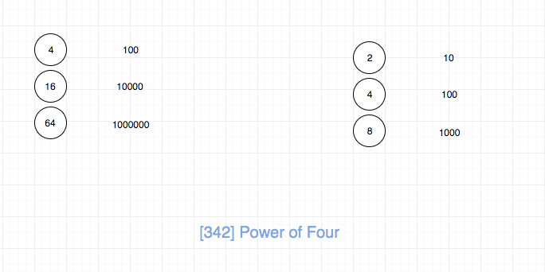
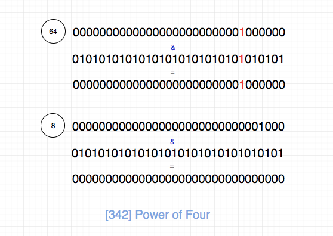
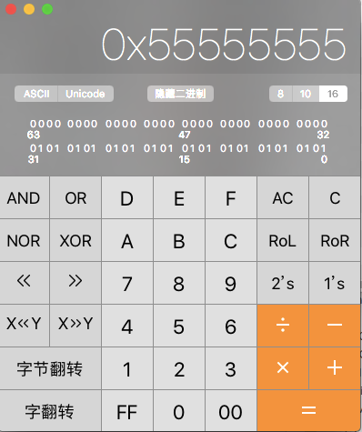

## 题目地址

https://leetcode.com/problems/power-of-four/description/

## 题目描述

```
Given an integer (signed 32 bits), write a function to check whether it is a power of 4.

Example 1:

Input: 16
Output: true
Example 2:

Input: 5
Output: false
Follow up: Could you solve it without loops/recursion?

```

## 思路

符合直觉的做法是不停除以 4 直到不能整除，然后判断是否为 1 即可。 代码如下：

```js
while (num && num % 4 == 0) {
  num /= 4;
}
return num == 1;
```

但是这道题目有一个 follow up: “你是否可以不使用循环/递归完成”。因此我们需要换种思路。

我们先来看下，4 的幂次方用 2 进制表示是什么样的.



发现规律： 4 的幂次方的二进制表示 1 的位置都是在奇数位（且不在最低位），其他位置都为 0

我们还可以发现： 2 的幂次方的特点是最低位之外，其他位置有且仅有一个 1（1 可以在任意位置）

我们进一步分析，如果一个数字是四的幂次方，那么只需要满足：

1. 是 2 的幂次方， 就能保证最低位之外，其他位置有且仅有一个 1
2. 这个 1 不在偶数位置，一定在奇数位置

对于第一点，如果保证一个数字是 2 的幂次方呢？ 显然不能不停除以 2，看结果是否等于 1，这样就循环了。
我们可以使用一个 trick， 如果一个数字 n 是 2 的幂次方，那么 n & (n - 1) 一定等于 0，
这个可以作为思考题，大家思考一下。

对于第二点，我们可以取一个特殊数字，这个特殊数字，奇数位置都是 1，偶数位置都是 0，然后和这个特殊数字
`求与`， 如果等于本身，那么毫无疑问，这个 1 不再偶数位置，一定在奇数位置，因为如果在偶数位置，`求与`的结果就是 0 了
题目要求 n 是 32 位有符号整形，那么我们的特殊数字就应该是`01010101010101010101010101010101`(不用数了，一共 32 位)。



如上图，64和这个特殊数字求与，得到的是本身。 8 是 2的次方，但是不是4的次方，我们求与结果就是0了。

为了体现自己的逼格，我们可以使用计算器，来找一个逼格比较高的数字，这里我选了十六进制，结果是`0x55555555`。



代码见下方代码区。

说实话，这种做法不容易想到，其实还有一种方法。
如果一个数字是 4 的幂次方，那么只需要满足：

1. 是二的倍数
2. 减去 1 是三的倍数

代码如下：

```js
return num > 0 && num & (num - 1 === 0) && (num - 1) % 3 === 0;
```

## 关键点

- 数论
- 2的幂次方特点（数学性质以及二进制表示）
- 4的幂次方特点（数学性质以及二进制表示）
## 代码

```js
/*
 * @lc app=leetcode id=342 lang=javascript
 *
 * [342] Power of Four
 */
/**
 * @param {number} num
 * @return {boolean}
 */
var isPowerOfFour = function(num) {
  // tag: 数论

  if (num === 1) return true;
  if (num < 4) return false;

  if ((num & (num - 1)) !== 0) return false;

  return (num & 0x55555555) === num;
};
```
