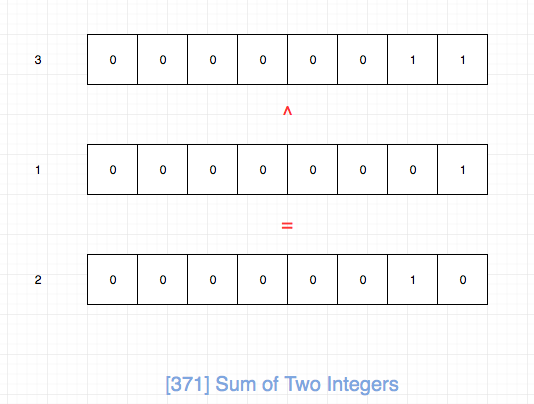
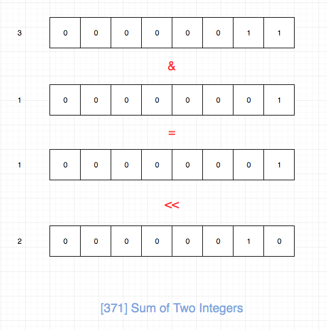

## 题目地址
https://leetcode.com/problems/sum-of-two-integers/description/

## 题目描述

```
Calculate the sum of two integers a and b, but you are not allowed to use the operator + and -.

Example 1:

Input: a = 1, b = 2
Output: 3
Example 2:

Input: a = -2, b = 3
Output: 1

```

## 前置知识

- 位运算
  
## 思路

不能使用加减法来求加法。 我们只能朝着位元算的角度来思考了。

由于`异或`是`相同则位0，不同则位1`，因此我们可以把异或看成是一种不进位的加减法。



由于`与`是`全部位1则位1，否则位0`，因此我们可以求与之后左移一位来表示进位。



然后我们对上述两个元算结果递归求解即可。 递归的结束条件就是其中一个为0，我们直接返回另一个。

## 关键点解析

- 位运算
- 异或是一种不进位的加减法
- 求与之后左移一位来可以表示进位

## 代码
```js
/*
 * @lc app=leetcode id=371 lang=javascript
 *
 * [371] Sum of Two Integers
 */
/**
 * @param {number} a
 * @param {number} b
 * @return {number}
 */
var getSum = function(a, b) {
    if (a === 0) return b;

    if (b === 0) return a;

    return getSum(a ^ b, (a & b) << 1);
};
```

