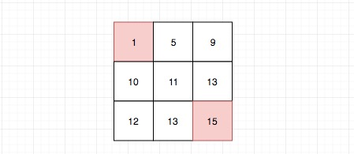
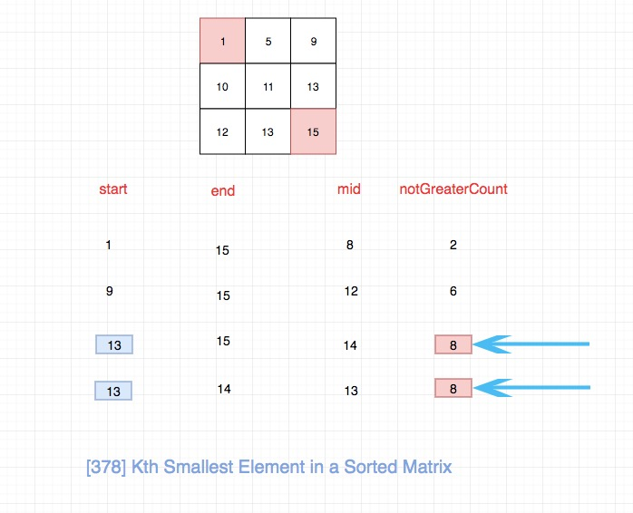

## 题目地址

https://leetcode.com/problems/kth-smallest-element-in-a-sorted-matrix/description/

## 题目描述

```
Given a n x n matrix where each of the rows and columns are sorted in ascending order, find the kth smallest element in the matrix.

Note that it is the kth smallest element in the sorted order, not the kth distinct element.

Example:

matrix = [
   [ 1,  5,  9],
   [10, 11, 13],
   [12, 13, 15]
],
k = 8,

return 13.
Note:
You may assume k is always valid, 1 ≤ k ≤ n2.
```

## 思路

显然用大顶堆可以解决，时间复杂度 Klogn n 为总的数字个数,
但是这种做法没有利用题目中 sorted matrix 的特点，因此不是一种好的做法.

一个巧妙的方法是二分法，我们分别从第一个和最后一个向中间进行扫描，并且计算出中间的数值与数组中的进行比较，
可以通过计算中间值在这个数组中排多少位，然后得到比中间值小的或者大的数字有多少个，然后与 k 进行比较，如果比 k 小则说明中间值太小了，则向后移动，否则向前移动。

这个题目的二分确实很难想，我们来一步一步解释。

最普通的二分法是有序数组中查找指定值（或者说满足某个条件的值）。由于是有序的，我们可以根据索引关系来确定大小关系，
因此这种思路比较直接，但是对于这道题目索引大小和数字大小没有直接的关系，因此这种二分思想就行不通了。


(普通的基于索引判断的二分法)

- 我们能够找到矩阵中最大的元素（右下角）和最小的元素（左上角）。我们可以求出值的中间，而不是上面那种普通二分法的索引的中间。



- 找到中间值之后，我们可以拿这个值去计算有多少元素是小于等于它的。
具体方式就是比较行的最后一列，如果中间值比最后一列大，说明中间元素肯定大于这一行的所有元素。 否则我们从后往前遍历直到不大于。


- 上一步我们会计算一个count，我们拿这个count和k进行比较

- 如果count小于k，说明我们选择的中间值太小了，肯定不符合条件，我们需要调整左区间为mid + 1

- 如果count大于k，说明我们选择的中间值正好或者太大了。我们调整右区间 mid

> 由于count大于k 也可能我们选择的值是正好的， 因此这里不能调整为mid - 1， 否则可能会得不到结果

- 最后直接返回start, end, 或者 mid都可以，因此三者最终会收敛到矩阵中的一个元素，这个元素也正是我们要找的元素。

整个计算过程是这样的：



这里有一个大家普遍都比较疑惑的点，也是我当初非常疑惑，困扰我很久的点， leetcode评论区也有很多人来问，就是“能够确保最终我们找到的元素一定在矩阵中么？”

答案是可以, `相等的时候一定在matrix里面。 因为原问题一定有解，找下界使得start不断的逼近于真实的元素`. 

我是看了评论区一个大神的评论才明白的，以下是[@GabrielaSong](https://leetcode.com/gabrielasong/)的评论原文：

```
The lo we returned is guaranteed to be an element in the matrix is because:
Let us assume element m is the kth smallest number in the matrix, and x is the number of element m in the matrix.
When we are about to reach convergence, if mid=m-1, its count value (the number of elements which are <= mid) would be k-x, 
so we would set lo as (m-1)+1=m, in this case the hi will finally reach lo; 
and if mid=m+1, its count value would be k+x-1, so we would set hi as m+1, in this case the lo will finally reach m.
To sum up, because the number lo found by binary search find is exactly the element which has k number of elements in the matrix that are <= lo,
 The equal sign guarantees there exists and only exists one number in range satisfying this condition. 
 So lo must be the only element satisfying this element in the matrix.

```

更多解释,可以参考[leetcode discuss](https://leetcode.com/problems/kth-smallest-element-in-a-sorted-matrix/discuss/85173/Share-my-thoughts-and-Clean-Java-Code)

> 如果是普通的二分查找，我们是基于索引去找，因此不会有这个问题。


## 关键点解析

- 二分查找

- 有序矩阵的套路（文章末尾还有一道有序矩阵的题目）

- 堆（优先级队列）

## 代码

```js
/*
 * @lc app=leetcode id=378 lang=javascript
 *
 * [378] Kth Smallest Element in a Sorted Matrix
 */
function notGreaterCount(matrix, target) {
  // 等价于在matrix 中搜索mid，搜索的过程中利用有序的性质记录比mid小的元素个数

  // 我们选择左下角，作为开始元素
  let curRow = 0;
  // 多少列
  const COL_COUNT = matrix[0].length;
  // 最后一列的索引
  const LAST_COL = COL_COUNT - 1;
  let res = 0;

  while (curRow < matrix.length) {
    // 比较最后一列的数据和target的大小
    if (matrix[curRow][LAST_COL] < target) {
      res += COL_COUNT;
    } else {
      let i = COL_COUNT - 1;
      while (i < COL_COUNT && matrix[curRow][i] > target) {
        i--;
      }
      // 注意这里要加1
      res += i + 1;
    }
    curRow++;
  }

  return res;
}
/**
 * @param {number[][]} matrix
 * @param {number} k
 * @return {number}
 */
var kthSmallest = function(matrix, k) {
  if (matrix.length < 1) return null;
  let start = matrix[0][0];
  let end = matrix[matrix.length - 1][matrix[0].length - 1];
  while (start < end) {
    const mid = start + ((end - start) >> 1);
    const count = notGreaterCount(matrix, mid);
    if (count < k) start = mid + 1;
    else end = mid;
  }
  // 返回start,mid, end 都一样
  return start;
};
```

## 相关题目

- [240.search-a-2-d-matrix-ii](./240.search-a-2-d-matrix-ii.md)
