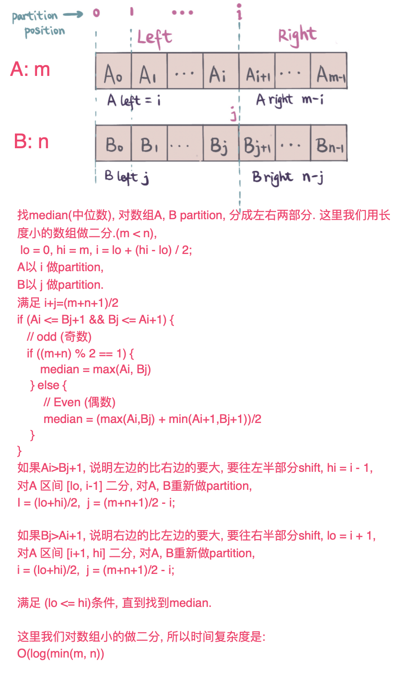
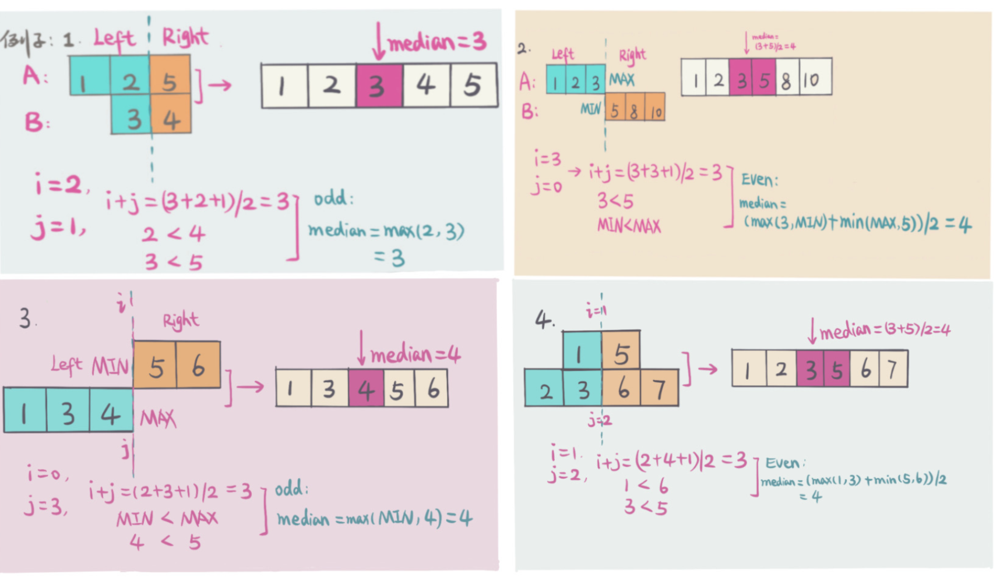

## 题目地址
https://leetcode.com/problems/median-of-two-sorted-arrays/

## 题目描述
```
There are two sorted arrays nums1 and nums2 of size m and n respectively.

Find the median of the two sorted arrays. The overall run time complexity should be O(log (m+n)).

You may assume nums1 and nums2 cannot be both empty.

Example 1:

nums1 = [1, 3]
nums2 = [2]

The median is 2.0
Example 2:

nums1 = [1, 2]
nums2 = [3, 4]

The median is (2 + 3)/2 = 2.5
```

## 思路
首先了解一下Median的概念，一个数组中median就是把数组分成左右等分的中位数。

如下图：


这道题，很容易想到暴力解法，时间复杂度和空间复杂度都是`O(m+n)`, 不符合题中给出`O(log(m+n))`时间复杂度的要求。
我们可以从简单的解法入手，试了一下，暴力解法也是可以被Leetcode Accept的. 分析中会给出两种解法，暴力求解和二分解法。

#### 解法一 - 暴力 （Brute Force）
暴力解主要是要merge两个排序的数组`（A，B）`成一个排序的数组。

用两个`pointer（i，j）`，`i` 从数组`A`起始位置开始，即`i=0`开始，`j` 从数组`B`起始位置， 即`j=0`开始. 
一一比较 `A[i] 和 B[j]`, 
1. 如果`A[i] <= B[j]`, 则把`A[i]` 放入新的数组中，i往后移一位，即 `i+1`.
2. 如果`A[i] > B[j]`, 则把`B[j]` 放入新的数组中，j往后移一位，即 `j+1`.
3. 重复步骤#1 和 #2，直到`i`移到`A`最后，或者`j`移到`B`最后。
4. 如果`j`移动到`B`数组最后，那么直接把剩下的所有`A`依次放入新的数组中. 
5. 如果`i`移动到`A`数组最后，那么直接把剩下的所有`B`依次放入新的数组中.

Merge的过程如下图。


*时间复杂度： `O(m+n) - m is length of A, n is length of B`*

*空间复杂度： `O(m+n)`*

#### 解法二 - 二分查找 （Binary Search）
由于题中给出的数组都是排好序的，在排好序的数组中查找很容易想到可以用二分查找（Binary Search), 这里对数组长度小的做二分，
保证数组A 和 数组B 做partition 之后

`len(Aleft)+len(Bleft)=(m+n+1)/2 - m是数组A的长度， n是数组B的长度`

对数组A的做partition的位置是区间`[0,m]`

如图：


下图给出几种不同情况的例子（注意但左边或者右边没有元素的时候，左边用`INF_MIN`，右边用`INF_MAX`表示左右的元素：


下图给出具体做的partition 解题的例子步骤，


*时间复杂度： `O(log(min(m, n)) - m is length of A, n is length of B`*

*空间复杂度： `O(1)` - 这里没有用额外的空间*

## 关键点分析
1. 暴力求解，在线性时间内merge两个排好序的数组成一个数组。
2. 二分查找，关键点在于
  - 要partition两个排好序的数组成左右两等份，partition需要满足`len(Aleft)+len(Bleft)=(m+n+1)/2 - m是数组A的长度， n是数组B的长度`
 
  - 并且partition后 A左边最大(`maxLeftA`), A右边最小（`minRightA`), B左边最大（`maxLeftB`), B右边最小（`minRightB`) 满足
`(maxLeftA <= minRightB && maxLeftB <= minRightA)`

有了这两个条件，那么median就在这四个数中，根据奇数或者是偶数，
```
奇数：
median = max(maxLeftA, maxLeftB)
偶数：
median = (max(maxLeftA, maxLeftB) + min(minRightA, minRightB)) / 2
```

## 代码（Java code）
*解法一 - 暴力解法（Brute force）*
```java
class MedianTwoSortedArrayBruteForce {
    public double findMedianSortedArrays(int[] nums1, int[] nums2) {
      int[] newArr = mergeTwoSortedArray(nums1, nums2);
      int n = newArr.length;
      if (n % 2 == 0) {
        // even
        return (double) (newArr[n / 2] + newArr[n / 2 - 1]) / 2;
      } else {
        // odd
        return (double) newArr[n / 2];
      }
    }
    private int[] mergeTwoSortedArray(int[] nums1, int[] nums2) {
      int m = nums1.length;
      int n = nums2.length;
      int[] res = new int[m + n];
      int i = 0;
      int j = 0;
      int idx = 0;
      while (i < m && j < n) {
        if (nums1[i] <= nums2[j]) {
          res[idx++] = nums1[i++];
        } else {
          res[idx++] = nums2[j++];
        }
      }
      while (i < m) {
        res[idx++] = nums1[i++];
      }
      while (j < n) {
        res[idx++] = nums2[j++];
      }
      return res;
    }
}
```
*解法二 - 二分查找（Binary Search*
```java
class MedianSortedTwoArrayBinarySearch {
  public static double findMedianSortedArraysBinarySearch(int[] nums1, int[] nums2) {
     // do binary search for shorter length array, make sure time complexity log(min(m,n)).
     if (nums1.length > nums2.length) {
        return findMedianSortedArraysBinarySearch(nums2, nums1);
      }
      int m = nums1.length;
      int n = nums2.length;
      int lo = 0;
      int hi = m;
      while (lo <= hi) {
        // partition A position i
        int i = lo + (hi - lo) / 2;
        // partition B position j
        int j = (m + n + 1) / 2 - i;
        
        int maxLeftA = i == 0 ? Integer.MIN_VALUE : nums1[i - 1];
        int minRightA = i == m ? Integer.MAX_VALUE : nums1[i];
  
        int maxLeftB = j == 0 ? Integer.MIN_VALUE : nums2[j - 1];
        int minRightB = j == n ? Integer.MAX_VALUE : nums2[j];
  
        if (maxLeftA <= minRightB && maxLeftB <= minRightA) {
          // total length is even
          if ((m + n) % 2 == 0) {
            return (double) (Math.max(maxLeftA, maxLeftB) + Math.min(minRightA, minRightB)) / 2;
          } else {
            // total length is odd
            return (double) Math.max(maxLeftA, maxLeftB);
          }
        } else if (maxLeftA > minRightB) {
          // binary search left half
          hi = i - 1;
        } else {
          // binary search right half
          lo = i + 1;
        }
      }
      return 0.0;
    }
}
```
