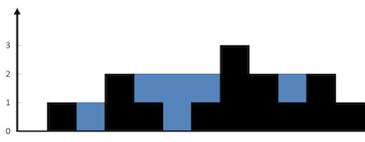

## 题目地址
https://leetcode.com/problems/trapping-rain-water/description/

## 题目描述


```
Given n non-negative integers representing an elevation map where the width of each bar is 1, compute how much water it is able to trap after raining.


The above elevation map is represented by array [0,1,0,2,1,0,1,3,2,1,2,1]. In this case, 6 units of rain water (blue section) are being trapped. Thanks Marcos for contributing this image!


```



```
Example:

Input: [0,1,0,2,1,0,1,3,2,1,2,1]
Output: 6

```

## 思路

这是一道雨水收集的问题， 难度为`hard`. 如图所示，让我们求下过雨之后最多可以积攒多少的水。

如果采用暴力求解的话，思路应该是height数组依次求和，然后相加。

伪代码:

```js

for(let i = 0; i < height.length; i++) {
    area += (h[i] - height[i]) * 1; // h为下雨之后的水位
}

```
问题转化为求h，那么h[i]又等于`左右两侧柱子的最大值中的较小值`，即
`h[i] = Math.min(左边柱子最大值, 右边柱子最大值)`

如上图那么h为 [0, 1, 1, 2, 2, 2 ,2, 3, 2, 2, 2, 1]

问题的关键在于求解`左边柱子最大值`和`右边柱子最大值`,
我们其实可以用两个数组来表示`leftMax`, `rightMax`，
以leftMax为例，leftMax[i]代表i的左侧柱子的最大值，因此我们维护两个数组即可。
## 关键点解析

- 建模 `h[i] = Math.min(左边柱子最大值, 右边柱子最大值)`(h为下雨之后的水位)

## 代码

代码支持 JavaScript，Python3:

JavaScript Code:

```js

/*
 * @lc app=leetcode id=42 lang=javascript
 *
 * [42] Trapping Rain Water
 *
 */
/**
 * @param {number[]} height
 * @return {number}
 */
var trap = function(height) {
    let max = 0;
    let volumn = 0;
    const leftMax = [];
    const rightMax = [];

    for(let i = 0; i < height.length; i++) {
        leftMax[i] = max = Math.max(height[i], max);
    }

    max = 0;

    for(let i = height.length - 1; i >= 0; i--) {
        rightMax[i] = max = Math.max(height[i], max);
    }

    for(let i = 0; i < height.length; i++) {
        volumn = volumn +  Math.min(leftMax[i], rightMax[i]) - height[i]
    }

    return volumn;
};

```

Python Code:

```python
class Solution:
    def trap(self, heights: List[int]) -> int:
        n = len(heights)
        l, r = [0] * (n + 1), [0] * (n + 1)
        ans = 0
        for i in range(1, len(heights) + 1):
            l[i] = max(l[i - 1], heights[i - 1])
        for i in range(len(heights) - 1, 0, -1):
            r[i] = max(r[i + 1], heights[i])
        for i in range(len(heights)):
            ans += max(0, min(l[i + 1], r[i]) - heights[i])
        return ans     
```

## 相关题目

- [84.largest-rectangle-in-histogram](https://github.com/azl397985856/leetcode/blob/master/problems/84.largest-rectangle-in-histogram.md)
