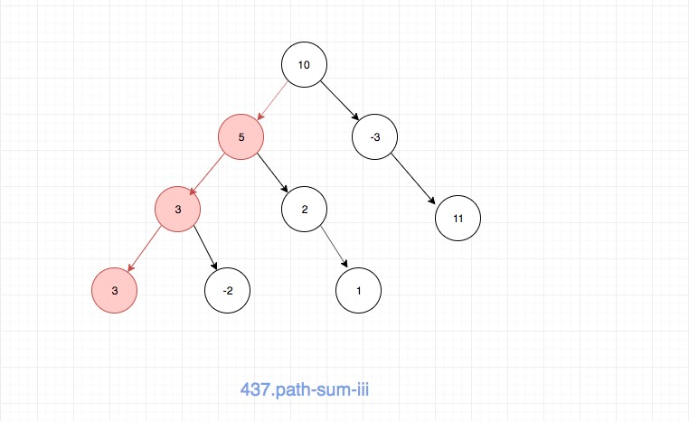
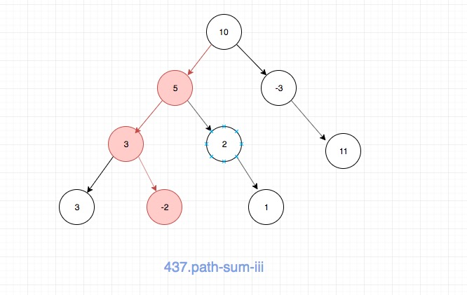

## 题目地址

https://leetcode.com/problems/path-sum-iii/description/

## 题目描述

```
You are given a binary tree in which each node contains an integer value.

Find the number of paths that sum to a given value.

The path does not need to start or end at the root or a leaf, but it must go downwards (traveling only from parent nodes to child nodes).

The tree has no more than 1,000 nodes and the values are in the range -1,000,000 to 1,000,000.

Example:

root = [10,5,-3,3,2,null,11,3,-2,null,1], sum = 8

      10
     /  \
    5   -3
   / \    \
  3   2   11
 / \   \
3  -2   1

Return 3. The paths that sum to 8 are:

1.  5 -> 3
2.  5 -> 2 -> 1
3. -3 -> 11
```

## 思路
这道题目是要我们求解出任何一个节点出发到子孙节点的路径中和为指定值。
注意这里，不一定是从根节点出发，也不一定在叶子节点结束。

一种简单的思路就是直接递归解决，空间复杂度O(n) 时间复杂度介于O(nlogn) 和 O(n^2)，
具体代码：

```js
/**
 * Definition for a binary tree node.
 * function TreeNode(val) {
 *     this.val = val;
 *     this.left = this.right = null;
 * }
 */
// the number of the paths starting from self
function helper(root, sum) {
  if (root === null) return 0;
  const l = helper(root.left, sum - root.val);
  const r = helper(root.right, sum - root.val);

  return l + r + (root.val === sum ? 1 : 0);
}
/**
 * @param {TreeNode} root
 * @param {number} sum
 * @return {number}
 */
var pathSum = function(root, sum) {
// 空间复杂度O(n) 时间复杂度介于O(nlogn) 和 O(n^2)
  // tag: dfs tree
  if (root === null) return 0;
  // the number of the paths starting from self
  const self = helper(root, sum);
  // we don't know the answer, so we just pass it down
  const l = pathSum(root.left, sum);
  // we don't know the answer, so we just pass it down
  const r = pathSum(root.right, sum);

  return self + l + r;
};

```


但是还有一种空间复杂度更加优秀的算法，利用hashmap来避免重复计算，时间复杂度和空间复杂度都是O(n)。
这种思路是`subarray-sum-equals-k`的升级版本，如果那道题目你可以O(n)解决，这道题目难度就不会很大，
只是将数组换成了二叉树。关于具体的思路可以看[这道题目](./560.subarray-sum-equals-k.md)


这里有一个不一样的地方，这里我说明一下，就是为什么要有`hashmap[acc] = hashmap[acc] - 1;`，
原因很简单，就是我们DFS的时候，从底部往上回溯的时候，map的值应该也回溯。如果你对回溯法比较熟悉的话，
应该很容易理解，如果不熟悉可以参考[这道题目](./46.permutations.md)， 这道题目就是通过`tempList.pop()`来完成的。

另外我画了一个图，相信看完你就明白了。

当我们执行到底部的时候：



接着往上回溯：



很容易看出，我们的hashmap不应该有第一张图的那个记录了，因此需要减去。


具体实现见下方代码区。

## 关键点解析

- 通过hashmap，以时间换空间
- 对于这种连续的元素求和问题，有一个共同的思路，可以参考[这道题目](./560.subarray-sum-equals-k.md)

## 代码

* 语言支持：JS

```js


/*
 * @lc app=leetcode id=437 lang=javascript
 *
 * [437] Path Sum III
 */
/**
 * Definition for a binary tree node.
 * function TreeNode(val) {
 *     this.val = val;
 *     this.left = this.right = null;
 * }
 */
function helper(root, acc, target, hashmap) {
  // see also : https://leetcode.com/problems/subarray-sum-equals-k/

  if (root === null) return 0;
  let count = 0;
  acc += root.val;
  if (acc === target) count++;
  if (hashmap[acc - target] !== void 0) {
    count += hashmap[acc - target];
  }
  if (hashmap[acc] === void 0) {
    hashmap[acc] = 1;
  } else {
    hashmap[acc] += 1;
  }
  const res =
    count +
    helper(root.left, acc, target, hashmap) +
    helper(root.right, acc, target, hashmap);

    // 这里要注意别忘记了
    hashmap[acc] = hashmap[acc] - 1;

    return res;
}

var pathSum = function(root, sum) {
  // 时间复杂度和空间复杂度都是O(n)
  const hashmap = {};
  return helper(root, 0, sum, hashmap);
};
```
