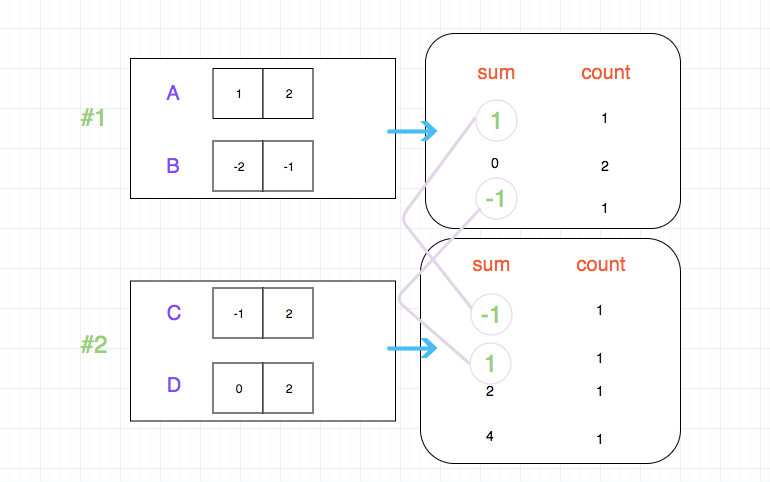

## Problem Address
https://leetcode.com/problems/4sum-ii/description/

## Problem Description

```
Given four lists A, B, C, D of integer values, compute how many tuples (i, j, k, l) there are such that A[i] + B[j] + C[k] + D[l] is zero.

To make problem a bit easier, all A, B, C, D have same length of N where 0 ≤ N ≤ 500. All integers are in the range of -228 to 228 - 1 and the result is guaranteed to be at most 231 - 1.

Example:

Input:
A = [ 1, 2]
B = [-2,-1]
C = [-1, 2]
D = [ 0, 2]

Output:
2

Explanation:
The two tuples are:
1. (0, 0, 0, 1) -> A[0] + B[0] + C[0] + D[1] = 1 + (-2) + (-1) + 2 = 0
2. (1, 1, 0, 0) -> A[1] + B[1] + C[0] + D[0] = 2 + (-1) + (-1) + 0 = 0
```
## Solution

The normal solution to complete the search would require four rounds of traversal, and that would make the time complexity reaches O(n^4), which doesn't work obviously. We have to figure out a more effective algorithm.

My idea is to separate these four lists into two groups and combine them two by two. We then calculate separately `all the sums from these two groups, and the relevant counts`

As the picture shows:




Now that we got two `hashTable`, and the result would appear with some basic calculations.

## Key Point Analysis
- Less time by more space.
- Divide the lists by 2, and calculate all the possible sums from two groups, then combine the result.

## Code

Language Support: `JavaScript`，`Python3`

`JavaScript`: 
```js

/*
 * @lc app=leetcode id=454 lang=javascript
 *
 * [454] 4Sum II
 *
 * https://leetcode.com/problems/4sum-ii/description/
/**
 * @param {number[]} A
 * @param {number[]} B
 * @param {number[]} C
 * @param {number[]} D
 * @return {number}
 */
var fourSumCount = function(A, B, C, D) {
  const sumMapper = {};
  let res = 0;
  for (let i = 0; i < A.length; i++) {
    for (let j = 0; j < B.length; j++) {
        sumMapper[A[i] + B[j]] = (sumMapper[A[i] + B[j]] || 0) + 1;
    }
  }

  for (let i = 0; i < C.length; i++) {
    for (let j = 0; j < D.length; j++) {
        res += sumMapper[- (C[i] + D[j])] || 0;
    }
  }

  return res;
};
```

`Python3`: 

```python
class Solution:
    def fourSumCount(self, A: List[int], B: List[int], C: List[int], D: List[int]) -> int:
        mapper = {}
        res = 0
        for i in A:
            for j in B:
                mapper[i + j] = mapper.get(i + j, 0) + 1
        
        for i in C:
            for j in D:
                res += mapper.get(-1 * (i + j), 0)
        return res
 ```