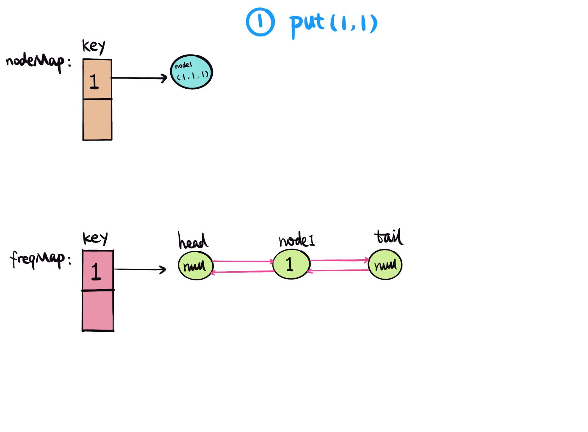
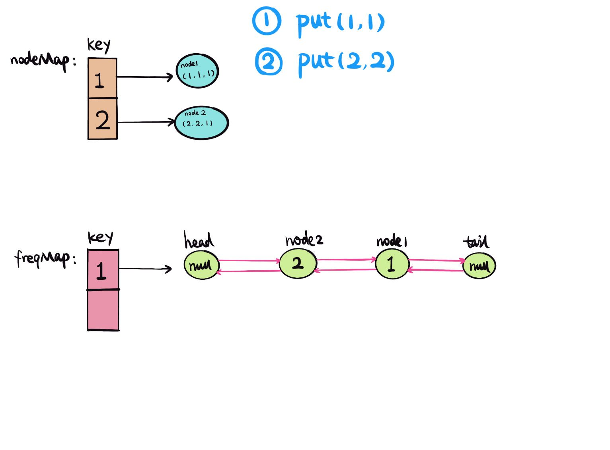
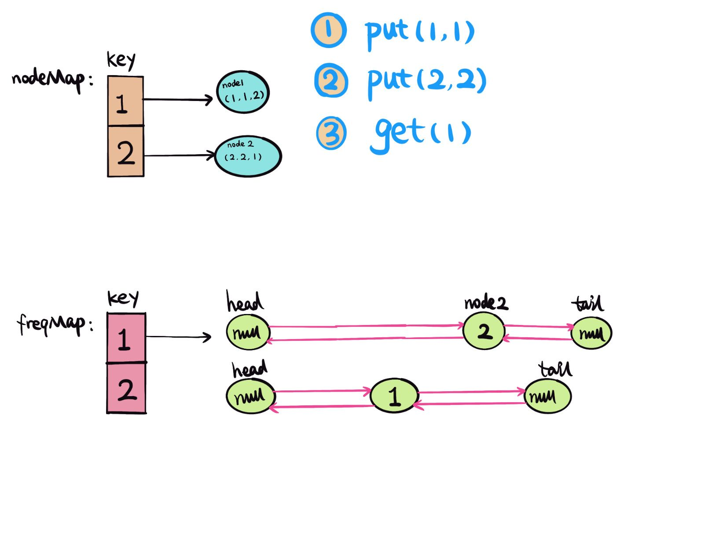
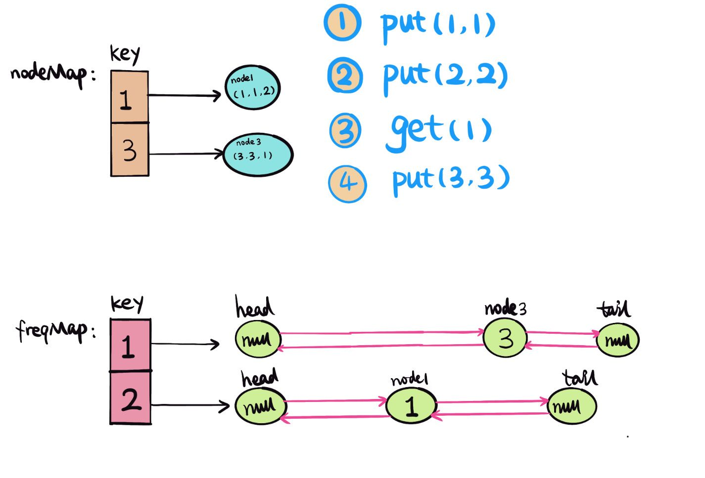
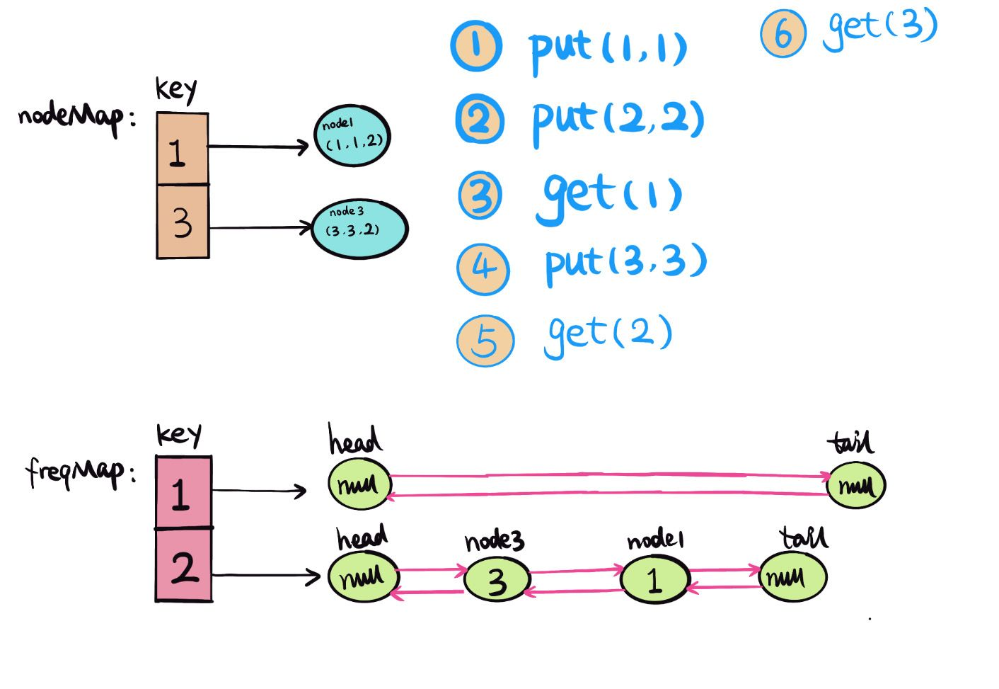
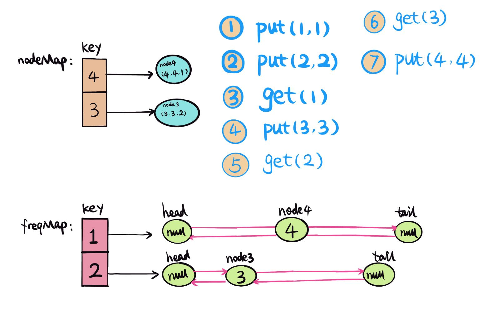
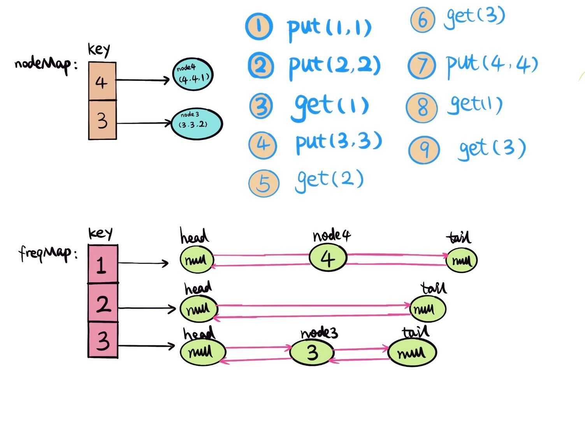
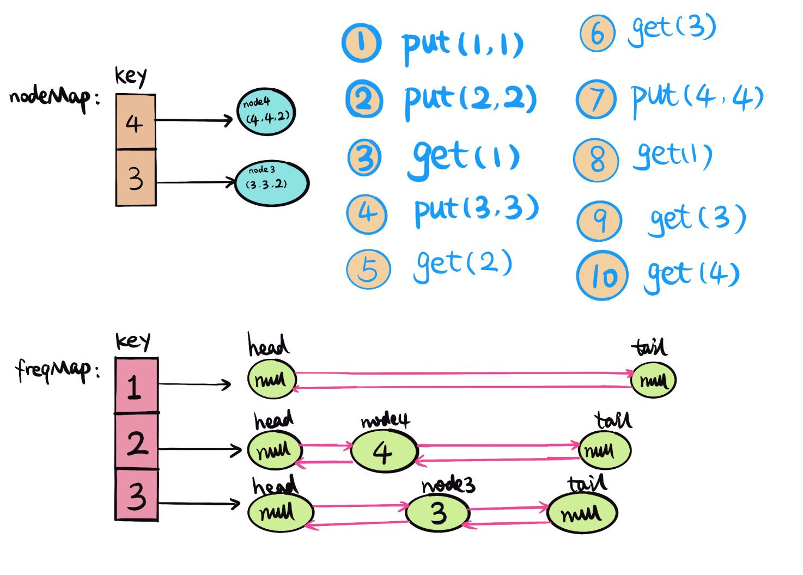

## 题目地址
https://leetcode.com/problems/lfu-cache/

## 题目描述

```
Design and implement a data structure for Least Frequently Used (LFU) cache. It should support the following operations: get and put.

get(key) - Get the value (will always be positive) of the key if the key exists in the cache, otherwise return -1.
put(key, value) - Set or insert the value if the key is not already present. When the cache reaches its capacity, it should invalidate the least frequently used item before inserting a new item. For the purpose of this problem, when there is a tie (i.e., two or more keys that have the same frequency), the least recently used key would be evicted.

Follow up:
Could you do both operations in O(1) time complexity?

Example:

LFUCache cache = new LFUCache( 2 /* capacity */ );

cache.put(1, 1);
cache.put(2, 2);
cache.get(1);       // returns 1
cache.put(3, 3);    // evicts key 2
cache.get(2);       // returns -1 (not found)
cache.get(3);       // returns 3.
cache.put(4, 4);    // evicts key 1.
cache.get(1);       // returns -1 (not found)
cache.get(3);       // returns 3
cache.get(4);       // returns 4
```

## 思路
[LFU（Least frequently used)](https://www.wikiwand.com/en/Least_frequently_used) 但内存容量满的情况下，有新的数据进来，需要更多空间的时候，就需要删除被访问频率最少的元素。

举个例子，比如说cache容量是 3，按顺序依次放入 `1，2，1，2，1，3`， cache已存满 3 个元素 (1，2，3)， 这时如果想放入一个新的元素 4 的时候，就需要腾出一个元素空间。 
用 LFU，这里就淘汰 3， 因为 3 的次数只出现依次， 1 和 2 出现的次数都比 3 多。


题中 `get` 和 `put` 都是 `O(1)`的时间复杂度，那么删除和增加都是`O(1)`，可以想到用双链表，和`HashMap`，用一个`HashMap, nodeMap,` 保存当前`key`，和 `node{key, value, frequent} `的映射。
这样`get(key)`的操作就是`O(1)`. 如果要删除一个元素，那么就需要另一个`HashMap，freqMap，`保存元素出现次数`（frequent）`和双链表`（DoublyLinkedlist）` 映射，
这里双链表存的是frequent相同的元素。每次`get`或`put`的时候，`frequent+1`，然后把`node`插入到双链表的`head node, head.next=node`
每次删除`freqent`最小的双链表的`tail node, tail.prev`。

用给的例子举例说明：
 ```
 1. put(1, 1), 
    - 首先查找nodeMap中有没有key=1对应的value，
        没有就新建node(key, value, freq) -> node1(1, 1, 1), 插入 nodeMap，{[1, node1]}
    - 查找freqMap中有没有freq=1 对应的value，
        没有就新建doublylinkedlist(head, tail), 把node1 插入doublylinkedlist head->next = node1.
    如下图，
 ```

 ```
 2. put(2, 2), 
    - 首先查找nodeMap中有没有key=2对应的value，
        没有就新建node(key, value, freq) -> node2(2, 2, 1), 插入 nodeMap，{[1, node1], [2, node2]}
    - 查找freqMap中有没有freq=1 对应的value，
        没有就新建doublylinkedlist(head, tail), 把node2 插入doublylinkedlist head->next = node2.
    如下图，
 ```

 ```
 3. get(1), 
    - 首先查找nodeMap中有没有key=1对应的value，nodeMap:{[1, node1], [2, node2]},
        找到node1，把node1 freq+1 -> node1(1,1,2)
    - 更新freqMap，删除freq=1，node1
    - 更新freqMap，插入freq=2，node1
    如下图，
 ```

 ```
 4. put(3, 3), 
    - 判断cache的capacity，已满，需要淘汰使用次数最少的元素，找到最小的freq=1，删除双链表tail node.prev 
        如果tailnode.prev != null, 删除。然后从nodeMap中删除对应的key。
    - 首先查找nodeMap中有没有key=3对应的value，
        没有就新建node(key, value, freq) -> node3(3, 3, 1), 插入 nodeMap，{[1, node1], [3, node3]}
    - 查找freqMap中有没有freq=1 对应的value，
        没有就新建doublylinkedlist(head, tail), 把node3 插入doublylinkedlist head->next = node3.
    如下图，
 ```

 ```
 5. get(2) 
    - 查找nodeMap，如果没有对应的key的value，返回 -1。
  
 6. get(3)
    - 首先查找nodeMap中有没有key=3对应的value，nodeMap:{[1, node1], [3, node3]},
        找到node3，把node3 freq+1 -> node3(3,3,2)
    - 更新freqMap，删除freq=1，node3
    - 更新freqMap，插入freq=2，node3
    如下图，
 ```

 ```
 7. put(4, 4), 
    - 判断cache的capacity，已满，需要淘汰使用次数最少的元素，找到最小的freq=1，删除双链表tail node.prev 
        如果tailnode.prev != null, 删除。然后从nodeMap中删除对应的key。
    - 首先查找nodeMap中有没有key=4对应的value，
        没有就新建node(key, value, freq) -> node4(4, 4, 1), 插入 nodeMap，{[4, node4], [3, node3]}
    - 查找freqMap中有没有freq=1 对应的value，
        没有就新建doublylinkedlist(head, tail), 把 node4 插入doublylinkedlist head->next = node4.
    如下图，
 ```

 ```
 8. get(1) 
    - 查找nodeMap，如果没有对应的key的value，返回 -1。
  
 9. get(3)
    - 首先查找nodeMap中有没有key=3对应的value，nodeMap:{[4, node4], [3, node3]},
        找到node3，把node3 freq+1 -> node3(3,3,3)
    - 更新freqMap，删除freq=2，node3
    - 更新freqMap，插入freq=3，node3
    如下图，
 ```

 ```
 10. get(4)
    - 首先查找nodeMap中有没有key=4对应的value，nodeMap:{[4, node4], [3, node3]},
        找到node4，把node4 freq+1 -> node4(4,4,2)
    - 更新freqMap，删除freq=1，node4
    - 更新freqMap，插入freq=2，node4
    如下图，
 ```


## 关键点分析
用两个`Map`分别保存 `nodeMap {key, node}` 和 `freqMap{frequent, DoublyLinkedList}`。
实现`get` 和 `put`操作都是`O(1)`的时间复杂度。

可以用Java自带的一些数据结构，比如HashLinkedHashSet，这样就不需要自己自建Node，DoublelyLinkedList。
可以很大程度的缩减代码量。

## 代码（Java code）
```java
public class LC460LFUCache {
  class Node {
    int key, val, freq;
    Node prev, next;

    Node(int key, int val) {
      this.key = key;
      this.val = val;
      freq = 1;
    }
  }

  class DoubleLinkedList {
    private Node head;
    private Node tail;
    private int size;

    DoubleLinkedList() {
      head = new Node(0, 0);
      tail = new Node(0, 0);
      head.next = tail;
      tail.prev = head;
    }

    void add(Node node) {
      head.next.prev = node;
      node.next = head.next;
      node.prev = head;
      head.next = node;
      size++;
    }

    void remove(Node node) {
      node.prev.next = node.next;
      node.next.prev = node.prev;
      size--;
    }

    // always remove last node if last node exists
    Node removeLast() {
      if (size > 0) {
        Node node = tail.prev;
        remove(node);
        return node;
      } else return null;
    }
  }

  // cache capacity
  private int capacity;
  // min frequent
  private int minFreq;
  Map<Integer, Node> nodeMap;
  Map<Integer, DoubleLinkedList> freqMap;
  public LC460LFUCache(int capacity) {
    this.minFreq = 0;
    this.capacity = capacity;
    nodeMap = new HashMap<>();
    freqMap = new HashMap<>();
  }

  public int get(int key) {
    Node node = nodeMap.get(key);
    if (node == null) return -1;
    update(node);
    return node.val;
  }

  public void put(int key, int value) {
    if (capacity == 0) return;
    Node node;
    if (nodeMap.containsKey(key)) {
      node = nodeMap.get(key);
      node.val = value;
      update(node);
    } else {
      node = new Node(key, value);
      nodeMap.put(key, node);
      if (nodeMap.size() == capacity) {
        DoubleLinkedList lastList = freqMap.get(minFreq);
        nodeMap.remove(lastList.removeLast().key);
      }
      minFreq = 1;
      DoubleLinkedList newList = freqMap.getOrDefault(node.freq, new DoubleLinkedList());
      newList.add(node);
      freqMap.put(node.freq, newList);
    }
  }

  private void update(Node node) {
    DoubleLinkedList oldList = freqMap.get(node.freq);
    oldList.remove(node);
    if (node.freq == minFreq && oldList.size == 0) minFreq++;
    node.freq++;
    DoubleLinkedList newList = freqMap.getOrDefault(node.freq, new DoubleLinkedList());
    newList.add(node);
    freqMap.put(node.freq, newList);
  }
 }
```

## 参考（References）
1. [LFU(Least frequently used) Cache](https://www.wikiwand.com/en/Least_frequently_used)
2. [Leetcode discussion mylzsd](https://leetcode.com/problems/lfu-cache/discuss/94547/Java-O(1)-Solution-Using-Two-HashMap-and-One-DoubleLinkedList)
3. [Leetcode discussion aaaeeeo](https://leetcode.com/problems/lfu-cache/discuss/94547/Java-O(1)-Solution-Using-Two-HashMap-and-One-DoubleLinkedList)
