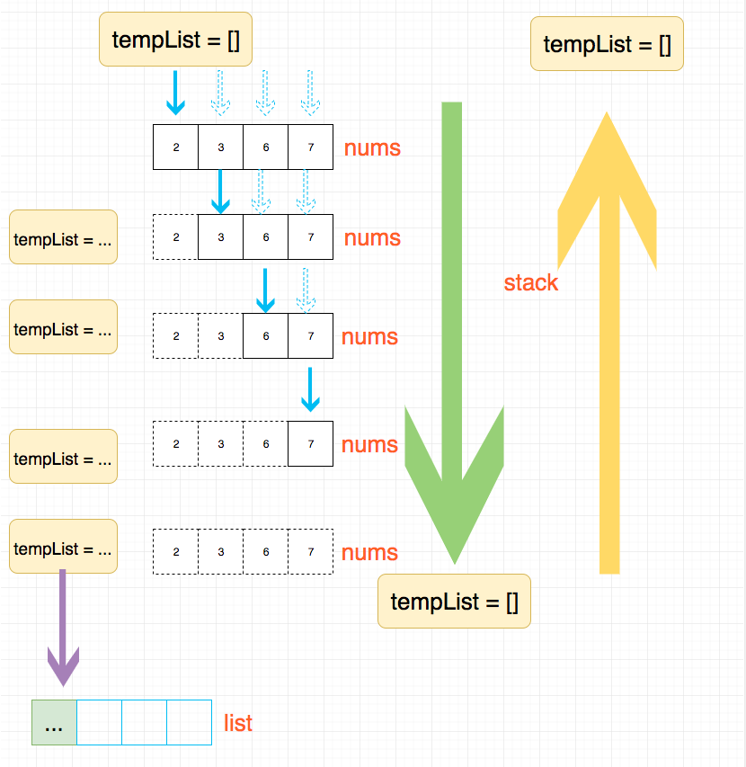

## 题目地址
https://leetcode.com/problems/permutations-ii/description/

## 题目描述
```
Given a collection of numbers that might contain duplicates, return all possible unique permutations.

Example:

Input: [1,1,2]
Output:
[
  [1,1,2],
  [1,2,1],
  [2,1,1]
]

```

## 思路

这道题目是求集合，并不是`求极值`，因此动态规划不是特别切合，因此我们需要考虑别的方法。

这种题目其实有一个通用的解法，就是回溯法。
网上也有大神给出了这种回溯法解题的
[通用写法](https://leetcode.com/problems/combination-sum/discuss/16502/A-general-approach-to-backtracking-questions-in-Java-(Subsets-Permutations-Combination-Sum-Palindrome-Partitioning))，这里的所有的解法使用通用方法解答。
除了这道题目还有很多其他题目可以用这种通用解法，具体的题目见后方相关题目部分。

我们先来看下通用解法的解题思路，我画了一张图：



通用写法的具体代码见下方代码区。

## 关键点解析

- 回溯法
- backtrack 解题公式


## 代码

```js
/*
 * @lc app=leetcode id=47 lang=javascript
 *
 * [47] Permutations II
 *
 * https://leetcode.com/problems/permutations-ii/description/
 *
 * algorithms
 * Medium (39.29%)
 * Total Accepted:    234.1K
 * Total Submissions: 586.2K
 * Testcase Example:  '[1,1,2]'
 *
 * Given a collection of numbers that might contain duplicates, return all
 * possible unique permutations.
 *
 * Example:
 *
 *
 * Input: [1,1,2]
 * Output:
 * [
 * ⁠ [1,1,2],
 * ⁠ [1,2,1],
 * ⁠ [2,1,1]
 * ]
 *
 *
 */
function backtrack(list, nums, tempList, visited) {
  if (tempList.length === nums.length) return list.push([...tempList]);
  for (let i = 0; i < nums.length; i++) {
    // 和46.permutations的区别是这道题的nums是可以重复的
    // 我们需要过滤这种情况
    if (visited[i]) continue; // 不能用tempList.includes(nums[i])了，因为有重复
    // visited[i - 1] 这个判断容易忽略
    if (i > 0 && nums[i] === nums[i - 1] && visited[i - 1]) continue;

    visited[i] = true;
    tempList.push(nums[i]);
    backtrack(list, nums, tempList, visited);
    visited[i] = false;
    tempList.pop();
  }
}
/**
 * @param {number[]} nums
 * @return {number[][]}
 */
var permuteUnique = function(nums) {
  const list = [];
  backtrack(list, nums.sort((a, b) => a - b), [], []);
  return list;
};
```

## 相关题目

- [31.next-permutation](./31.next-permutation.md)
- [39.combination-sum](./39.combination-sum.md)
- [40.combination-sum-ii](./40.combination-sum-ii.md)
- [46.permutations](./46.permutations.md)
- [60.permutation-sequence](./60.permutation-sequence.md)(TODO)
- [78.subsets](./78.subsets.md)
- [90.subsets-ii](./90.subsets-ii.md)
- [113.path-sum-ii](./113.path-sum-ii.md)
- [131.palindrome-partitioning](./131.palindrome-partitioning.md)
