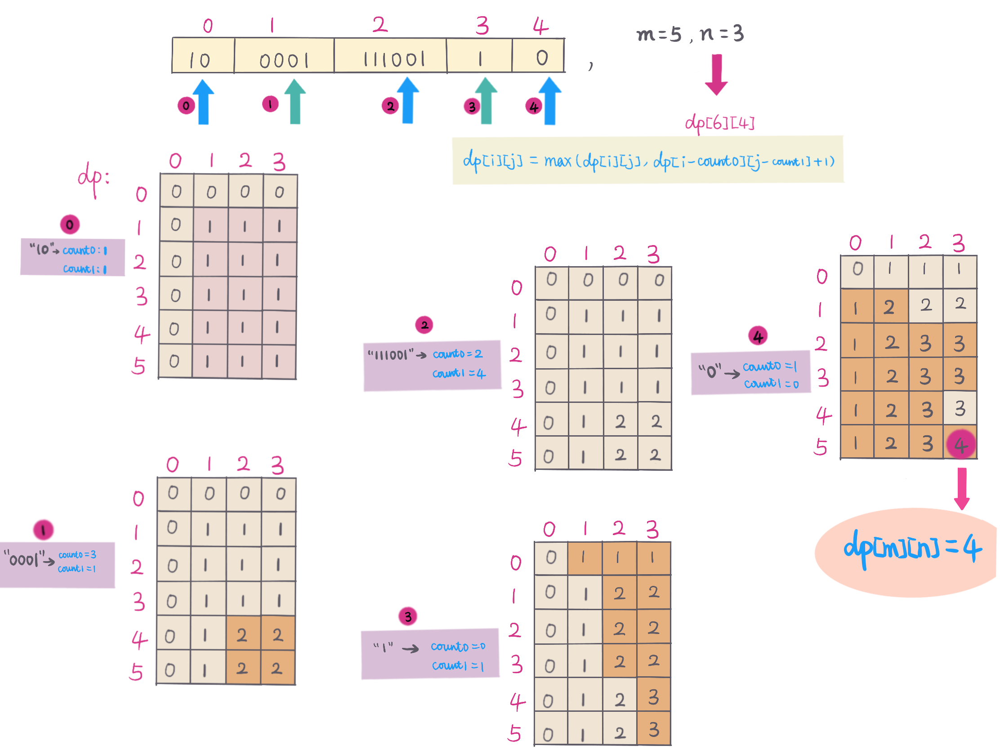

## Problem
https://leetcode.com/problems/ones-and-zeroes/

## Problem Description
```
In the computer world, use restricted resource you have to generate maximum benefit is what we always want to pursue.

For now, suppose you are a dominator of m 0s and n 1s respectively. On the other hand, there is an array with strings consisting of only 0s and 1s.

Now your task is to find the maximum number of strings that you can form with given m 0s and n 1s. Each 0 and 1 can be used at most once.

Note:

The given numbers of 0s and 1s will both not exceed 100
The size of given string array won't exceed 600.
 
Example 1:

Input: Array = {"10", "0001", "111001", "1", "0"}, m = 5, n = 3
Output: 4

Explanation: This are totally 4 strings can be formed by the using of 5 0s and 3 1s, which are “10,”0001”,”1”,”0”

Example 2:

Input: Array = {"10", "0", "1"}, m = 1, n = 1
Output: 2

Explanation: You could form "10", but then you'd have nothing left. Better form "0" and "1".
```


## Solution

When see the requirement of returning maximum number, length etc, and not require to list all possible value. Usually it can
be solved by DP. 

This problem we can see is a `0-1 backpack` issue, either take current string or not take current string. 

And during interview, DP problem is hard to come up with immediately, recommend starting from Brute force, then optimize the solution step by step, until interviewer is happy, :-)

Below give 4 solutions based on complexities analysis.

#### Solution #1 - Brute Force (Recursively)

Brute force solution is to calculate all possible subsets. Then count `0s` and `1s` for each subset, use global variable `max` to keep track of maximum number.
if `count(0) <= m && count(1) <= n;`, then current string can be taken into counts. 

for `strs` length `len`, total subsets are `2^len`, Time Complexity is too high in this solution.

#### Complexity Analysis
- *Time Complexity:* `O(2^len * s) - len is Strs length, s is the average string length `
- *Space Complexity:* `O(1)`

#### Solution #2 - Memorization + Recursive
In Solution #1, brute force, we used recursive to calculate all subsets, in reality, many cases are duplicate, so that we can use
memorization to record those subsets which realdy been calculated, avoid dup calculation. Use a memo array, if already calculated, 
then return memo value, otherwise, set the max value into memo.

`memo[i][j][k] - maximum number of strings can be formed by j 0s and k 1s in range [0, i] strings`

`helper(strs, i, j, k, memo)` recursively：
1. if `memo[i][j][k] != 0`, meaning already checked for j 0s and k 1s case, return value.
2. if not checked, then check condition `count0 <= j && count1 <= k`，
    a. if true，take current strings `strs[i]`, so` 0s -> j-count0`, and `1s -> k-count1`,
     check next string `helper(strs, i+1, j-count0, k-count1, memo)`
3. not take current string `strs[i]`, check next string `helper(strs, i+1, j, k, memo)`
4. save max value into`memo[i][j][k]`
5. recursively 

#### Complexity Analysis
- *Time Complexity:* `O(l * m * n) - l is length of strs, m is number of 0s, n is number of 1s`
- *Space Complexity:* `O(l * m * n) - memo 3D Array`

#### Solution #3 - 3D DP
In Solution #2, used memorization + recursive, this Solution use 3D DP to represent iterative way

`dp[i][j][k] - the maximum number of strings can be formed using j 0s and k 1s in range [0, i] strings`

DP Formula：
`dp[i][j][k] = max(dp[i][j][k], dp[i - 1][j - count0][k - count1])` - `count0 - number of 0s in strs[i]`  and  `count1 - number of 1s in strs[i]`

 compare `j` and `count0`, `k` and `count1`, based on taking current string or not, DP formula as below：
- `j >= count0 && k >= count1`, 

    `dp[i][j][k] = max(dp[i - 1][j][k], dp[i - 1][j - count0][k - count1] + 1)`

- not meet condition, not take current string

    `dp[i][j][k] = dp[i - 1][j][k]`

`dp[l][m][n]` is result.

#### Complexity Analysis
- *Time Complexity:* `O(l * m * n) - l is strs length, m is number of 0s, n is number of 1s`
- *Space Complexity:* `O(l * m * n) - dp 3D array`

#### Solution #4 - 2D DP

In Solution #3, we kept track all state value, but we only need previous state, so we can reduce 3 dimention to 2 dimention array,
here we use `dp[2][m][n]`, rotate track previous and current values. Further observation, we notice that first row (track previous state), 
we don't need the whole row values, we only care about 2 position value: `dp[i - 1][j][k]` and `dp[i - 1][j - count0][k - count1]`.
so it can be reduced to 2D array. `dp[m][n]`.

2D DP definition:

`dp[m+1][n+1] - maximum counts, m is number of 0, n is number of 1`

DP formula：

`dp[i][j] = max(dp[i][j], dp[i - count0][j - count1] + 1)`

For example：



#### 
- *Time Complexity:* `O(l * m * n) - l is strs length，m is number of 0，n number of 1`
- *Space Complexity:* `O(m * n) - dp 2D array`

## Key Points Analysis

## Code (`Java/Python3`)
#### Solution #1 - Recursive (TLE)
*Java code*
```java
class OnesAndZerosBFRecursive {
 public int findMaxForm2(String[] strs, int m, int n) {
    return helper(strs, 0, m, n);
 }
 private int helper(String[] strs, int idx, int j, int k) {
    if (idx == strs.length) return 0;
    // count current idx string number of zeros and ones
    int[] counts = countZeroOnes(strs[idx]);
    // if j >= count0 && k >= count1, take current index string
    int takeCurrStr = j - counts[0] >= 0 && k - counts[1] >= 0
        ? 1 + helper(strs, idx + 1, j - counts[0], k - counts[1])
        : -1;
    // don't take current index string strs[idx], continue next string
    int notTakeCurrStr = helper(strs, idx + 1, j, k);
    return Math.max(takeCurrStr, notTakeCurrStr);
 }
 private int[] countZeroOnes(String s) {
    int[] res = new int[2];
    for (char ch : s.toCharArray()) {
      res[ch - '0']++;
    }
    return res;
 }
}
```

*Python3 code*
```python
class Solution:
    def findMaxForm(self, strs: List[str], m: int, n: int) -> int:
        return self.helper(strs, m, n, 0)
    
    def helper(self, strs, m, n, idx):
        if idx == len(strs):
            return 0
        take_curr_str = -1
        count0, count1 = strs[idx].count('0'), strs[idx].count('1')
        if m >= count0 and n >= count1:
            take_curr_str = max(take_curr_str, self.helper(strs, m - count0, n - count1, idx + 1) + 1)
        not_take_curr_str = self.helper(strs, m, n, idx + 1)
        return max(take_curr_str, not_take_curr_str)
        
```

#### Solution #2 - Memorization + Recursive
*Java code*
```java
class OnesAndZerosMemoRecur {
  public int findMaxForm4(String[] strs, int m, int n) {
      return helper(strs, 0, m, n, new int[strs.length][m + 1][n + 1]);
  }
  private int helper(String[] strs, int idx, int j, int k, int[][][] memo) {
      if (idx == strs.length) return 0;
      // check if already calculated, return value
      if (memo[idx][j][k] != 0) {
        return memo[idx][j][k];
      }
      int[] counts = countZeroOnes(strs[idx]);
      // if satisfy condition, take current string, strs[idx], update count0 and count1
      int takeCurrStr = j - counts[0] >= 0 && k - counts[1] >= 0
          ? 1 + helper(strs, idx + 1, j - counts[0], k - counts[1], memo)
          : -1;
      // not take current string
      int notTakeCurrStr = helper(strs, idx + 1, j, k, memo);
      // always keep track the max value into memory
      memo[idx][j][k] = Math.max(takeCurrStr, notTakeCurrStr);
      return memo[idx][j][k];
  }
  private int[] countZeroOnes(String s) {
       int[] res = new int[2];
       for (char ch : s.toCharArray()) {
         res[ch - '0']++;
       }
       return res;
  }
}
```

*Python3 code* - (TLE)
```python
class Solution:
    def findMaxForm(self, strs: List[str], m: int, n: int) -> int:
        memo = {k:[[0]*(n+1) for _ in range(m+1)] for k in range(len(strs)+1)}
        return self.helper(strs, 0, m, n, memo)
    
    def helper(self, strs, idx, m, n, memo):
        if idx == len(strs):
            return 0
        if memo[idx][m][n] != 0:
            return memo[idx][m][n]
        take_curr_str = -1
        count0, count1 = strs[idx].count('0'), strs[idx].count('1')
        if m >= count0 and n >= count1:
            take_curr_str = max(take_curr_str, self.helper(strs, idx + 1, m - count0, n - count1, memo) + 1)
        not_take_curr_str = self.helper(strs, idx + 1, m, n, memo)
        memo[idx][m][n] = max(take_curr_str, not_take_curr_str)
        return memo[idx][m][n]
```


#### Solution #3 - 3D DP
*Java code*
```java
class OnesAndZeros3DDP {
  public int findMaxForm(String[] strs, int m, int n) {
      int l = strs.length;
      int [][][] d = new int[l + 1][m + 1][n + 1];
      for (int i = 0; i <= l; i ++){
        int [] nums = new int[]{0,0};
        if (i > 0){
          nums = countZeroOnes(strs[i - 1]);
        }
        for (int j = 0; j <= m; j ++){
          for (int k = 0; k <= n; k ++){
            if (i == 0) {
              d[i][j][k] = 0;
            } else if (j >= nums[0] && k >= nums[1]){
              d[i][j][k] = Math.max(d[i - 1][j][k], d[i - 1][j - nums[0]][k - nums[1]] + 1);
            } else {
              d[i][j][k] = d[i - 1][j][k];
            }
          }
        }
      }
      return d[l][m][n];
  }
}
```
#### Solution #4 - 2D DP
*Java code*
```java
class OnesAndZeros2DDP {
  public int findMaxForm(String[] strs, int m, int n) {
      int[][] dp = new int[m + 1][n + 1];
      for (String s : strs) {
        int[] counts = countZeroOnes(s);
        for (int i = m; i >= counts[0]; i--) {
          for (int j = n; j >= counts[1]; j--) {
            dp[i][j] = Math.max(1 + dp[i - counts[0]][j - counts[1]], dp[i][j]);
          }
        }
      }
      return dp[m][n];
  }
  private int[] countZeroOnes(String s) {
       int[] res = new int[2];
       for (char ch : s.toCharArray()) {
         res[ch - '0']++;
       }
       return res;
  }
}

```
*Python3 code* 
```python
class Solution:
    def findMaxForm(self, strs: List[str], m: int, n: int) -> int:
        l = len(strs)
        dp = [[0]*(n+1) for _ in range(m+1)]
        for i in range(1, l + 1):
              count0, count1 = strs[i - 1].count('0'), strs[i - 1].count('1')
              for i in reversed(range(count0, m + 1)):
                for j in reversed(range(count1, n + 1)):
                    dp[i][j] = max(dp[i][j], 1 + dp[i - count0][j - count1])
        return dp[m][n]
```

## Similar problems

- [Leetcode 600. Non-negative Integers without Consecutive Ones](https://leetcode.com/problems/non-negative-integers-without-consecutive-ones/)
- [Leetcode 322. Coin Change](https://leetcode.com/problems/coin-change/)

