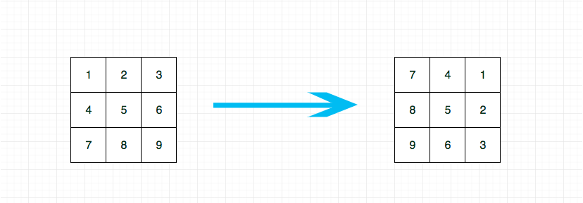
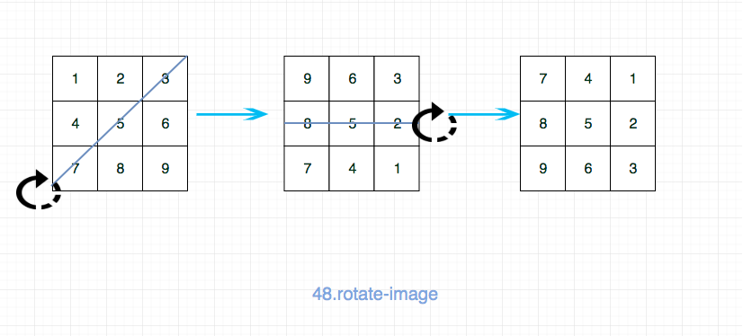

## 题目地址

https://leetcode.com/problems/rotate-image/description/

## 题目描述

```
You are given an n x n 2D matrix representing an image.

Rotate the image by 90 degrees (clockwise).

Note:

You have to rotate the image in-place, which means you have to modify the input 2D matrix directly. DO NOT allocate another 2D matrix and do the rotation.

Example 1:

Given input matrix =
[
  [1,2,3],
  [4,5,6],
  [7,8,9]
],

rotate the input matrix in-place such that it becomes:
[
  [7,4,1],
  [8,5,2],
  [9,6,3]
]
Example 2:

Given input matrix =
[
  [ 5, 1, 9,11],
  [ 2, 4, 8,10],
  [13, 3, 6, 7],
  [15,14,12,16]
],

rotate the input matrix in-place such that it becomes:
[
  [15,13, 2, 5],
  [14, 3, 4, 1],
  [12, 6, 8, 9],
  [16, 7,10,11]
]

```

## 前置知识

- 原地算法
- 矩阵

## 思路

这道题目让我们 in-place，也就说空间复杂度要求 O(1)，如果没有这个限制的话，很简单。

通过观察发现，我们只需要将第 i 行变成第 n - i - 1 列， 因此我们只需要保存一个原有矩阵，然后按照这个规律一个个更新即可。



代码：

```js
var rotate = function (matrix) {
  // 时间复杂度O(n^2) 空间复杂度O(n)
  const oMatrix = JSON.parse(JSON.stringify(matrix)); // clone
  const n = oMatrix.length;
  for (let i = 0; i < n; i++) {
    for (let j = 0; j < n; j++) {
      matrix[j][n - i - 1] = oMatrix[i][j];
    }
  }
};
```

如果要求空间复杂度是 O(1)的话，我们可以用一个 temp 记录即可，这个时候就不能逐个遍历了。
比如遍历到 1 的时候，我们把 1 存到 temp，然后更新 1 的值为 7。 1 被换到了 3 的位置，我们再将 3 存到 temp，依次类推。
但是这种解法写起来比较麻烦，这里我就不写了。

事实上有一个更加巧妙的做法，我们可以巧妙地利用对称轴旋转达到我们的目的，如图，我们先进行一次以对角线为轴的翻转，然后
再进行一次以水平轴心线为轴的翻转即可。



这种做法的时间复杂度是 O(n^2) ，空间复杂度是 O(1)

## 关键点解析

- 矩阵旋转操作

## 代码

- 语言支持: Javascript，Python3

```js
/*
 * @lc app=leetcode id=48 lang=javascript
 *
 * [48] Rotate Image
 */
/**
 * @param {number[][]} matrix
 * @return {void} Do not return anything, modify matrix in-place instead.
 */
var rotate = function (matrix) {
  // 时间复杂度O(n^2) 空间复杂度O(1)

  // 做法： 先沿着对角线翻转，然后沿着水平线翻转
  const n = matrix.length;
  function swap(arr, [i, j], [m, n]) {
    const temp = arr[i][j];
    arr[i][j] = arr[m][n];
    arr[m][n] = temp;
  }
  for (let i = 0; i < n - 1; i++) {
    for (let j = 0; j < n - i; j++) {
      swap(matrix, [i, j], [n - j - 1, n - i - 1]);
    }
  }

  for (let i = 0; i < n / 2; i++) {
    for (let j = 0; j < n; j++) {
      swap(matrix, [i, j], [n - i - 1, j]);
    }
  }
};
```

Python3 Code:

```Python
class Solution:
    def rotate(self, matrix: List[List[int]]) -> None:
        """
        Do not return anything, modify matrix in-place instead.
        先做矩阵转置（即沿着对角线翻转），然后每个列表翻转；
        """
        n = len(matrix)
        for i in range(n):
            for j in range(i, n):
                matrix[i][j], matrix[j][i] = matrix[j][i], matrix[i][j]
        for m in matrix:
            m.reverse()

    def rotate2(self, matrix: List[List[int]]) -> None:
        """
        Do not return anything, modify matrix in-place instead.
        通过内置函数zip，可以简单实现矩阵转置，下面的代码等于先整体翻转，后转置；
        不过这种写法的空间复杂度其实是O(n);
        """
        matrix[:] = map(list, zip(*matrix[::-1]))
```
