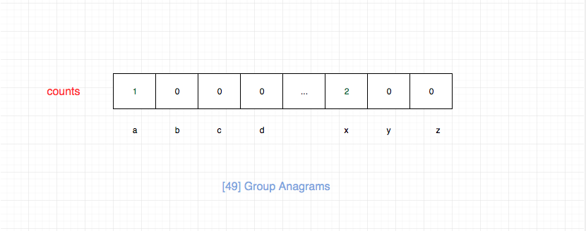

## 题目地址

https://leetcode.com/problems/group-anagrams/description/

## 题目描述

```
Given an array of strings, group anagrams together.

Example:

Input: ["eat", "tea", "tan", "ate", "nat", "bat"],
Output:
[
  ["ate","eat","tea"],
  ["nat","tan"],
  ["bat"]
]
Note:

All inputs will be in lowercase.
The order of your output does not matter.
```

## 思路

一个简单的解法就是遍历数组，然后对每一项都进行排序，然后将其添加到 hashTable 中，最后输出 hashTable 中保存的值即可。

这种做法空间复杂度 O(n)， 假设排序算法用的快排，那么时间复杂度为 O(n \* klogk), n 为数组长度，k 为字符串的平均长度

代码：

```js
var groupAnagrams = function(strs) {
  const hashTable = {};

  function sort(str) {
    return str
      .split("")
      .sort()
      .join("");
  }

  // 这个方法需要排序，因此不是很优，但是很直观，容易想到
  for (let i = 0; i < strs.length; i++) {
    const str = strs[i];
    const key = sort(str);
    if (!hashTable[key]) {
      hashTable[key] = [str];
    } else {
      hashTable[key].push(str);
    }
  }

  return Object.values(hashTable);
};
```

下面我们介绍另外一种方法，我们建立一个 26 长度的 counts 数组（如果区分大小写，我们可以建立 52 个，如果支持其他字符依次类推）。
然后我们给每一个字符一个固定的数组下标，然后我们只需要更新每个字符出现的次数。 最后形成的 counts 数组如果一致，则说明他们可以通过
交换顺序得到。这种算法空间复杂度 O(n), 时间复杂度 O(n \* k), n 为数组长度，k 为字符串的平均长度.



## 关键点解析

- 桶排序

## 代码

```js
/*
 * @lc app=leetcode id=49 lang=javascript
 *
 * [49] Group Anagrams
 */
/**
 * @param {string[]} strs
 * @return {string[][]}
 */
var groupAnagrams = function(strs) {
  // 类似桶排序

  let counts = [];
  const hashTable = {};
  for (let i = 0; i < strs.length; i++) {
    const str = strs[i];
    counts = Array(26).fill(0);
    for (let j = 0; j < str.length; j++) {
      counts[str[j].charCodeAt(0) - "a".charCodeAt(0)]++;
    }
    const key = counts.join("");
    if (!hashTable[key]) {
      hashTable[key] = [str];
    } else {
      hashTable[key].push(str);
    }
  }

  return Object.values(hashTable);
};
```
