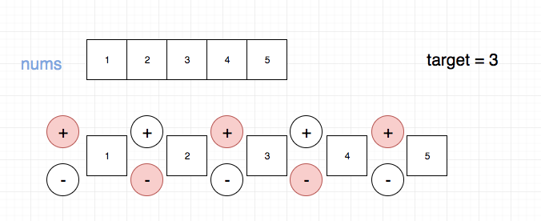
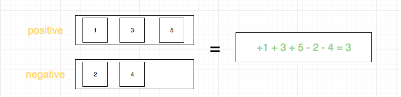
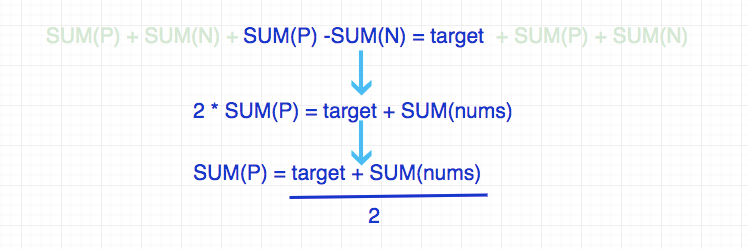

## 题目地址
https://leetcode.com/problems/target-sum/description/

## 题目描述

```
You are given a list of non-negative integers, a1, a2, ..., an, and a target, S. Now you have 2 symbols + and -. For each integer, you should choose one from + and - as its new symbol.

Find out how many ways to assign symbols to make sum of integers equal to target S.

Example 1:
Input: nums is [1, 1, 1, 1, 1], S is 3. 
Output: 5
Explanation: 

-1+1+1+1+1 = 3
+1-1+1+1+1 = 3
+1+1-1+1+1 = 3
+1+1+1-1+1 = 3
+1+1+1+1-1 = 3

There are 5 ways to assign symbols to make the sum of nums be target 3.
Note:
The length of the given array is positive and will not exceed 20.
The sum of elements in the given array will not exceed 1000.
Your output answer is guaranteed to be fitted in a 32-bit integer.

```
## 思路

题目是给定一个数组，让你在数字前面添加 `+`或者`-`，使其和等于target.



暴力法的时间复杂度是指数级别的，因此我们不予考虑。我们需要换种思路.

我们将最终的结果分成两组，一组是我们添加了`+`的，一组是我们添加了`-`的。



如上图，问题转化为如何求其中一组，我们不妨求前面标`+`的一组

> 如果求出一组，另一组实际就已知了，即总集和这一组的差集。

通过进一步分析，我们得到了这样的关系：



因此问题转化为，求解`sumCount(nums, target)`,即nums数组中能够组成
target的总数一共有多少种，这是一道我们之前做过的题目，使用动态规划可以解决。

## 关键点解析

- 对元素进行分组，分组的依据是符号， 是`+` 或者 `-`
- 通过数学公式推导可以简化我们的求解过程，这需要一点`数学知识和数学意识`

## 代码
```js
/*
 * @lc app=leetcode id=494 lang=javascript
 *
 * [494] Target Sum
 *
 * https://leetcode.com/problems/target-sum/description/
 *
 * algorithms
 * Medium (44.86%)
 * Total Accepted:    89.3K
 * Total Submissions: 198.5K
 * Testcase Example:  '[1,1,1,1,1]\n3'
 *
 *
 * You are given a list of non-negative integers, a1, a2, ..., an, and a
 * target, S. Now you have 2 symbols + and -. For each integer, you should
 * choose one from + and - as its new symbol.
 * ⁠
 *
 * Find out how many ways to assign symbols to make sum of integers equal to
 * target S.
 *
 *
 * Example 1:
 *
 * Input: nums is [1, 1, 1, 1, 1], S is 3.
 * Output: 5
 * Explanation:
 *
 * -1+1+1+1+1 = 3
 * +1-1+1+1+1 = 3
 * +1+1-1+1+1 = 3
 * +1+1+1-1+1 = 3
 * +1+1+1+1-1 = 3
 *
 * There are 5 ways to assign symbols to make the sum of nums be target 3.
 *
 *
 *
 * Note:
 *
 * The length of the given array is positive and will not exceed 20.
 * The sum of elements in the given array will not exceed 1000.
 * Your output answer is guaranteed to be fitted in a 32-bit integer.
 *
 *
 */
// 这个是我们熟悉的问题了
// 我们这里需要求解的是nums里面有多少种可以组成target的方式
var sumCount = function(nums, target) {
  // 这里通过观察，我们没必要使用二维数组去存储这些计算结果
  // 使用一维数组可以有效节省空间
  const dp = Array(target + 1).fill(0);
  dp[0] = 1;
  for (let i = 0; i < nums.length; i++) {
    for (let j = target; j >= nums[i]; j--) {
      dp[j] += dp[j - nums[i]];
    }
  }
  return dp[target];
};
const add = nums => nums.reduce((a, b) => (a += b), 0);
/**
 * @param {number[]} nums
 * @param {number} S
 * @return {number}
 */
var findTargetSumWays = function(nums, S) {
  const sum = add(nums);
  if (sum < S) return 0;
  if ((S + sum) % 2 === 1) return 0;
  return sumCount(nums, (S + sum) >> 1);
};
```

## 扩展

如果这道题目并没有限定所有的元素以及target都是正数怎么办？